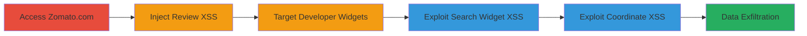

---
tags:
  - xss
  - web
  - javascript-injection
  - session-hijacking
type: attack_chain
tools: []
tactics:
  - '[[Execution]]'
  - '[[Collection]]'
verified: false
platforms:
  - Web
submitted: true
complexity: medium
procedures:
  - '[[procedures/XSS-via-Restaurant-Review-Injection-on-Zomato-com]]'
  - '[[procedures/XSS-in-Restaurant-Search-Widget-on-Developers-Zomato-com]]'
  - >-
    [[procedures/XSS-in-Foodie-Index-Widget-Coordinate-Fields-on-Developers-Zomato-com]]
step_count: 3
techniques:
  - '[[JavaScript]]'
description: >-
  A series of stored and reflected XSS vulnerabilities in Zomato's web
  applications allowing arbitrary JavaScript execution to steal user sessions or
  data.
skill_level: intermediate
impact_level: high
id: fc683a72-deac-4797-b379-f1e092582434
created_at: '2025-12-14T03:16:07.894Z'
updated_at: '2025-12-14T03:16:07.894Z'
validated: true
mitre_tactics:
  - '[[Execution]]'
  - '[[Collection]]'
mitre_techniques:
  - '[[JavaScript]]'
---
# Cross-Site Scripting Attacks on Zomato.com Reviews and Developer Widgets

Multi-stage attack chain demonstrating the exploitation of multiple XSS vulnerabilities in Zomato's platforms, enabling JavaScript execution to potentially steal cookies, session data, or perform other malicious actions on affected users.

## Chain Metrics Dashboard

| Metric | Value |
|--------|-------|
| Chain Status | Unverified |
| Total Steps | 3 |
| Execution Time | ~5 minutes |
| Skill Level | Intermediate |
| Complexity | Medium |
| Impact Level | High |

## Attack Flow Visualization



## Prerequisites & Requirements

### Required Tools

- Web browser (e.g., Chrome with developer tools)

### Target Environment

- Web platform
- Access to zomato.com and developers.zomato.com
- No special services or ports required beyond standard HTTP/HTTPS

### Initial Access Requirements

- Public internet access
- No credentials needed for reproduction
- Ability to submit reviews or access developer widgets

## Detailed Attack Procedures

### Step 1: Exploit XSS in Restaurant Review
procedure: [[procedures/XSS-via-Restaurant-Review-Injection-on-Zomato-com]]

**Objective**: Inject malicious JavaScript into a restaurant review to execute when viewed by others, enabling session theft.

**Instructions**: Navigate to zomato.com in a web browser, search for any restaurant, click 'Write review', and enter the payload in the review text field. Then publish the review and view it to trigger execution.

Payload example:

```html

```

**Expected Output**: An alert popup displaying the document domain upon viewing the published review.

**Success Indicators**:
- JavaScript alert triggers
- Potential for cookie theft if payload is modified (e.g., to exfiltrate document.cookie)

### Step 2: Exploit XSS in Restaurant Search Widget
procedure: [[procedures/XSS-in-Restaurant-Search-Widget-on-Developers-Zomato-com]]

**Objective**: Inject JavaScript via the search input in the developer widget interface to execute immediately in the context of the page.

**Instructions**: Go to developers.zomato.com, navigate to the 'widgets' tab, select 'Restaurant Search' widget, click 'Add Widget', and enter the payload in the search bar for restaurant, cuisine, or dish. Submit to trigger execution.

Payload example:

```html

```

**Expected Output**: Immediate JavaScript alert popup in the widget interface.

**Success Indicators**:
- Alert executes on input submission
- Affects developers or users embedding the widget

### Step 3: Exploit XSS in Foodie Index Widget Coordinates
procedure: [[procedures/XSS-in-Foodie-Index-Widget-Coordinate-Fields-on-Developers-Zomato-com]]

**Objective**: Use unsanitized coordinate fields to inject HTML with event handlers, executing JavaScript upon widget loading.

**Instructions**: On developers.zomato.com, go to 'widgets' tab, select 'Foodie Index Widget', click 'Add widget', and enter the payload in the longitude and latitude fields. Save or load the widget to trigger.

Payload example:

```html
<svg onload=prompt(document.domain)>
```

**Expected Output**: Prompt or alert displaying the domain when the onload handler fires.

**Success Indicators**:
- JavaScript executes on widget interaction
- Compromises interactions with the embedded widget

## Attack Chain Summary

### Key Achievements

1. Demonstrated stored XSS in user-generated reviews affecting viewers.
2. Exposed reflected XSS in developer widget search inputs.
3. Highlighted persistent XSS risks in coordinate parameters for widgets.

## Technique & Tactic Coverage

### MITRE ATT&CK Techniques

- [[JavaScript]]

### MITRE ATT&CK Tactics

- [[Execution]]
- [[Collection]]

---
*Last updated: 2023-10-01*
