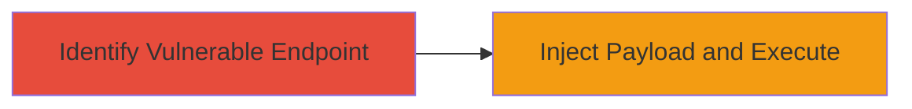

# Cross-Site Scripting Vulnerability Exploitation in Deriv.com Subdomain

Multi-stage attack chain demonstrating a complete attack workflow.

## Chain Metrics Dashboard

| Metric | Value |
|--------|-------|
| Chain Status | Unverified |
| Total Steps | 1 |
| Execution Time | ~5 minutes |
| Skill Level | Beginner |
| Complexity | Low |
| Impact Level | Medium |

## Attack Flow Visualization

## Prerequisites & Requirements

### Required Tools

- Browser Developer Tools
- Proxy tool like Burp Suite (optional for interception)

### Target Environment

- Web application on Deriv.com subdomain
- HTTP/HTTPS access to the vulnerable page
- No specific ports required beyond standard web (80/443)

### Initial Access Requirements

- Public access to the subdomain
- No credentials needed for reflected/stored XSS testing
- Ability to submit input (e.g., forms, URL parameters)

## Detailed Attack Procedures

### Step 1: Identify and Exploit XSS Vulnerability
procedure: [[procedures/Inject-and-Execute-Malicious-JavaScript-via-XSS]]

**Objective**: Locate an input point in the Deriv.com subdomain that fails to sanitize user input, allowing injection of malicious JavaScript to execute in the victim's browser context.

**Instructions**: Navigate to the vulnerable subdomain and test input fields or URL parameters for XSS. Use a simple payload like `` in a search box or reflected parameter. If the payload executes, it confirms the vulnerability. For exploitation, replace with a more impactful payload, such as stealing cookies via `document.cookie` sent to an attacker-controlled server.

**Expected Output**: Alert box pops up or script executes, confirming control over the page's JavaScript execution.

**Success Indicators**:
- Payload executes without sanitization
- Arbitrary JavaScript runs in the browser
- Potential for data exfiltration if payload includes network requests

## Attack Chain Summary

### Key Achievements

1. Confirmed XSS vulnerability in Deriv.com subdomain via HackerOne report
2. Demonstrated potential for script injection leading to session hijacking or data theft
3. Highlighted impact on user trust and site integrity

## Technique & Tactic Coverage

### MITRE ATT&CK Techniques

- [[JavaScript]]

### MITRE ATT&CK Tactics

- [[Execution]]

---
*Last updated: 2023-10-01T12:00:00Z*
