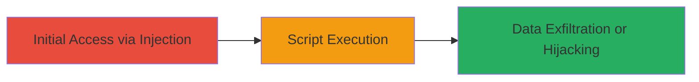

# Cross-Site Scripting in GoCD Package Repository Creation

Multi-stage attack chain demonstrating a complete attack workflow exploiting XSS in GoCD.

## Chain Metrics Dashboard

| Metric | Value |
|--------|-------|
| Chain Status | Unverified |
| Total Steps | 1 |
| Execution Time | ~5 minutes |
| Skill Level | Intermediate |
| Complexity | Medium |
| Impact Level | High |

## Attack Flow Visualization

## Prerequisites & Requirements

### Required Tools

- Browser with developer tools
- Optional: [[tools/Burp-Suite]]

### Target Environment

- GoCD web application (version prior to patch for CVE-2016-1000217 or similar)
- Access to the package repository creation interface
- Network access to the GoCD server

### Initial Access Requirements

- Valid user credentials for GoCD (authenticated session)
- No special privileges required beyond basic user access

## Detailed Attack Procedures

### Step 1: Inject Malicious Payload
procedure: [[procedures/Exploit-XSS-in-GoCD-Package-Repository-Creation]]

**Objective**: Inject a malicious JavaScript payload into the package repository creation form to trigger XSS when the page is rendered or viewed by other users.

**Instructions**: Log in to the GoCD web interface, navigate to the package repository creation section, and submit a form field (e.g., repository name or description) with a payload such as ``. For more advanced exploitation, use a payload that steals cookies or exfiltrates data, like ``.

**Expected Output**: The injected script executes in the victim's browser, displaying an alert or sending data to the attacker's server.

**Success Indicators**:
- Alert box appears or network request to attacker's domain is observed
- Browser console shows JavaScript execution errors or successful payload run

## Attack Chain Summary

### Key Achievements

1. Successful injection of XSS payload into GoCD package repository form
2. Execution of arbitrary JavaScript in the context of other users' sessions
3. Potential for session hijacking, data theft, or phishing attacks

## Technique & Tactic Coverage

### MITRE ATT&CK Techniques

- [[JavaScript]]

### MITRE ATT&CK Tactics

- [[Execution]]
- [[Collection]]

---
*Last updated: 2023-10-01T12:00:00Z*
