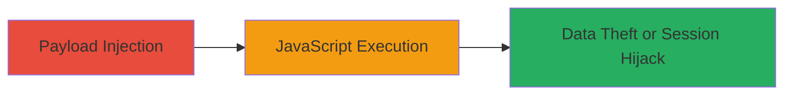

# Cross-Site Scripting on Uber Partners Portal via Unsanitized User Input

Multi-stage attack chain demonstrating a complete attack workflow.

## Chain Metrics Dashboard

| Metric | Value |
|--------|-------|
| Chain Status | Unverified |
| Total Steps | 1 |
| Execution Time | ~1 minutes |
| Skill Level | Beginner |
| Complexity | Low |
| Impact Level | High |

## Attack Flow Visualization

## Prerequisites & Requirements

### Required Tools

- Web browser with developer tools

### Target Environment

- Web platform
- Access to partners.uber.com
- No specific services/ports required beyond standard HTTPS (443)

### Initial Access Requirements

- Valid user session or public access to input fields on partners.uber.com
- Network access to the internet
- No prior credentials needed for reflected XSS testing

## Detailed Attack Procedures

### Step 1: Inject Malicious Payload
procedure: [[procedures/Exploit-Reflected-XSS-via-Unsanitized-Input]]

**Objective**: Inject a JavaScript payload into an unsanitized input field on partners.uber.com to execute arbitrary code in the victim's browser.

**Instructions**: Navigate to partners.uber.com and locate a user input field (e.g., search or form field) that reflects input directly into the page without escaping. Use the browser's address bar or a form to submit a payload like ``. For more advanced exploitation, craft a payload to steal cookies: ``.

**Expected Output**: The payload executes, displaying an alert or sending data to the attacker's server.

**Success Indicators**:
- Alert box appears confirming XSS
- Network request to attacker's domain with stolen data

## Attack Chain Summary

### Key Achievements

1. Successful payload injection and reflection
2. Arbitrary JavaScript execution in browser context
3. Potential for session hijacking or data exfiltration

## Technique & Tactic Coverage

### MITRE ATT&CK Techniques

- [[JavaScript]]

### MITRE ATT&CK Tactics

- [[Execution]]

---
*Last updated: 2023-10-01T00:00:00Z*
