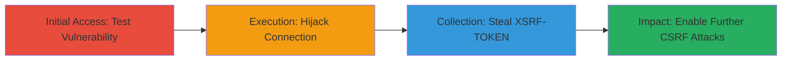

---
tags:
  - cswsh
  - websocket
  - csrf
  - xsrf-token
  - hijacking
type: attack_chain
tools:
  - '[[tools/PortSwigger-WebSocket-Lab]]'
tactics:
  - '[[Initial Access]]'
  - '[[Execution]]'
  - '[[Collection]]'
verified: false
platforms:
  - Web
submitted: true
complexity: medium
created_at: '2023-10-01T00:00:00Z'
procedures:
  - '[[procedures/Test-WebSocket-for-CSWSH-Vulnerability]]'
  - '[[procedures/Hijack-WebSocket-Connection]]'
  - '[[procedures/Steal-XSRF-TOKEN-via-Hijacked-Connection]]'
step_count: 3
techniques:
  - '[[Drive-by Compromise]]'
  - '[[JavaScript]]'
  - '[[Steal Web Session Cookie]]'
updated_at: '2025-12-14T17:27:42.281Z'
description: >-
  A multi-stage attack exploiting CSWSH vulnerability in WebSocket handshakes to
  hijack connections and steal sensitive tokens like XSRF-TOKEN, enabling
  further CSRF attacks.
skill_level: intermediate
impact_level: high
id: 0a75010e-31bf-4782-821f-4211118e0bba
validated: true
mitre_tactics:
  - '[[Initial Access]]'
  - '[[Execution]]'
  - '[[Collection]]'
mitre_techniques:
  - '[[Drive-by Compromise]]'
  - '[[JavaScript]]'
  - '[[Steal Web Session Cookie]]'
---
---
id: 123e4567-e89b-12d3-a456-426614174000
name: Cross-Site WebSocket Hijacking to Steal XSRF-TOKEN
type: attack_chain
description: A multi-stage attack exploiting CSWSH vulnerability in WebSocket handshakes to hijack connections and steal sensitive tokens like XSRF-TOKEN, enabling further CSRF attacks.
verified: false
submitted: false
step_count: 3
created_at: 2023-10-01T00:00:00Z
updated_at: 2023-10-01T00:00:00Z
procedures: [[procedures/Test-WebSocket-for-CSWSH-Vulnerability]], [[procedures/Hijack-WebSocket-Connection]], [[procedures/Steal-XSRF-TOKEN-via-Hijacked-Connection]]
techniques: [[Drive-by Compromise]], [[JavaScript]], [[Steal Web Session Cookie]]
tactics: [[Initial Access]], [[Execution]], [[Collection]]
tags: cswsh, websocket, csrf, xsrf-token, hijacking
platforms: Web
tools: [[tools/PortSwigger-WebSocket-Lab]]
---

# Cross-Site WebSocket Hijacking to Steal XSRF-TOKEN

Multi-stage attack chain demonstrating a complete attack workflow exploiting Cross-Site WebSocket Hijacking (CSWSH) in a web application, similar to the PortSwigger Lab scenario. An attacker crafts a malicious webpage that initiates a WebSocket connection to the victim's authenticated session without CSRF protections, hijacks the connection, and intercepts sensitive data like the XSRF-TOKEN transmitted over it. This token can then be used for further CSRF attacks on the user's behalf, potentially leading to account takeover or data exfiltration.

## Chain Metrics Dashboard

| Metric | Value |
|--------|-------|
| Chain Status | Unverified |
| Total Steps | 3 |
| Execution Time | ~5 minutes |
| Skill Level | Intermediate |
| Complexity | Medium |
| Impact Level | High |

## Attack Flow Visualization

## Prerequisites & Requirements

### Required Tools

- [[tools/PortSwigger-WebSocket-Lab]]
- Browser Developer Tools (e.g., Chrome DevTools for WebSocket inspection)

### Target Environment

- Web application using WebSockets for real-time communication
- No CSRF tokens or origin checks on WebSocket handshakes
- Services: Web server on standard HTTP/HTTPS ports (80/443)
- Tech stack: WebSocket protocol

### Initial Access Requirements

- Victim must be authenticated in the target application
- Attacker controls a malicious website (e.g., via phishing or drive-by compromise)
- Network access: Same-origin policy bypass via CSWSH

## Detailed Attack Procedures

### Step 1: Test WebSocket for CSWSH Vulnerability
procedure: [[procedures/Test-WebSocket-for-CSWSH-Vulnerability]]

**Objective**: Verify if the WebSocket handshake lacks CSRF protections, allowing cross-origin connections.

**Instructions**: Use browser developer tools or a JavaScript snippet on a malicious page to attempt a WebSocket connection to the target endpoint. Reference the PortSwigger Lab for setup. Open the browser console on a test page and execute a WebSocket constructor pointing to the target's ws:// or wss:// URL.

**Expected Output**: Successful handshake without origin validation errors, confirming vulnerability.

**Success Indicators**:
- WebSocket connection establishes from a cross-origin context
- No CSRF token required in the upgrade request

### Step 2: Hijack WebSocket Connection
procedure: [[procedures/Hijack-WebSocket-Connection]]

**Objective**: From a malicious site, initiate a hijacked WebSocket connection using the victim's cookies.

**Instructions**: Embed JavaScript in the attacker's webpage to create a new WebSocket object with the target's URL. The browser will include authentication cookies automatically, bypassing same-origin policy for WebSockets. Monitor the connection for incoming messages.

**Expected Output**: Active hijacked connection relaying data from the victim's session.

**Success Indicators**:
- Connection opens and receives real-time messages
- Attacker's page logs WebSocket events without errors

### Step 3: Steal XSRF-TOKEN via Hijacked Connection
procedure: [[procedures/Steal-XSRF-TOKEN-via-Hijacked-Connection]]

**Objective**: Intercept and exfiltrate the XSRF-TOKEN and other sensitive data transmitted over the hijacked WebSocket.

**Instructions**: Listen for messages on the hijacked WebSocket using the onmessage event handler in JavaScript. Parse incoming data for tokens and send them to the attacker's server via a separate HTTP request.

**Expected Output**: Captured XSRF-TOKEN value, usable for subsequent CSRF exploits.

**Success Indicators**:
- Token extracted from WebSocket messages
- Token validated by using it in a test CSRF request

## Attack Chain Summary

### Key Achievements

1. Confirmed CSWSH vulnerability in WebSocket handshake
2. Successfully hijacked real-time connection from cross-origin site
3. Stolen XSRF-TOKEN enabling escalation to full CSRF attacks

## Technique & Tactic Coverage

### MITRE ATT&CK Techniques

- [[Drive-by Compromise]]
- [[JavaScript]]
- [[Steal Web Session Cookie]]

### MITRE ATT&CK Tactics

- [[Initial Access]]
- [[Execution]]
- [[Collection]]

---
*Last updated: 2023-10-01T00:00:00Z*
