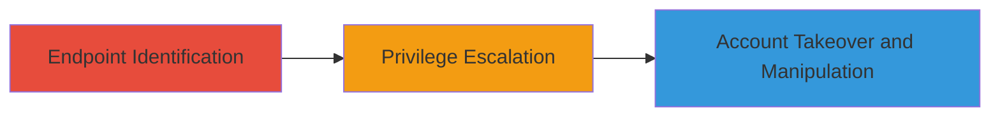

---
tags:
  - idor
  - privilege-escalation
  - cross-tenant
  - uber
  - web
type: attack_chain
tools: []
tactics:
  - '[[Privilege Escalation]]'
commands:
  - '[[commands/curl-update-employees-request]]'
platforms:
  - Web
complexity: medium
procedures:
  - '[[procedures/Identify-UpdateEmployees-RPC-Endpoint]]'
  - '[[procedures/Exploit-Cross-Tenant-IDOR-for-Privilege-Escalation]]'
step_count: 2
techniques:
  - '[[Exploitation for Privilege Escalation]]'
  - '[[Exploit Public-Facing Application]]'
description: >-
  Attack chain exploiting a cross-tenant IDOR in Uber's Business platform to
  escalate privileges from regular employee to admin, enabling takeover of
  invitations and unauthorized employee edits across tenants.
skill_level: intermediate
impact_level: high
id: bd5fb1c9-ffdb-4824-9e53-690ac30499e4
created_at: '2025-12-14T17:29:44.922Z'
updated_at: '2025-12-14T17:29:44.922Z'
verified: false
validated: true
submitted: true
mitre_tactics:
  - '[[Privilege Escalation]]'
mitre_techniques:
  - '[[Exploitation for Privilege Escalation]]'
  - '[[Exploit Public-Facing Application]]'
---
# Cross-Tenant IDOR in Uber Business Platform for Privilege Escalation and Employee Manipulation

Multi-stage attack chain demonstrating a complete attack workflow exploiting insecure direct object references in Uber's Business platform.

## Chain Metrics Dashboard

| Metric | Value |
|--------|-------|
| Chain Status | Unverified |
| Total Steps | 2 |
| Execution Time | ~5 minutes |
| Skill Level | Intermediate |
| Complexity | Medium |
| Impact Level | High |

## Attack Flow Visualization



## Prerequisites & Requirements

### Required Tools

- None (uses standard HTTP client like curl or browser dev tools)

### Target Environment

- Web platform: Uber Business (https://business.uber.com)
- Required services/ports: HTTPS (443)
- Network access requirements: Authenticated access as a regular employee user

### Initial Access Requirements

- Valid employee credentials for any Uber Business tenant
- Browser or HTTP client for request crafting
- Knowledge of a target employeeUuid from another tenant

## Detailed Attack Procedures

### Step 1: Endpoint Identification
procedure: [[procedures/Identify-UpdateEmployees-RPC-Endpoint]]

**Objective**: Locate and examine the updateEmployees RPC endpoint for authorization vulnerabilities, identifying potential cross-tenant access flaws.

**Instructions**: Access the Uber Business platform and inspect network traffic or directly navigate to the RPC endpoint to check for improper authorization on employee updates.

**Expected Output**: Confirmation of the endpoint URL and observation of missing tenant boundary checks.

**Success Indicators**:
- Endpoint responds without tenant-specific validation
- Ability to view or interact with employee data

### Step 2: Privilege Escalation
procedure: [[procedures/Exploit-Cross-Tenant-IDOR-for-Privilege-Escalation]]

**Objective**: Craft and send a modified request using a known employeeUuid from another tenant to escalate the role from user to admin, bypassing isolation.

**Instructions**: Use an HTTP client to send a POST request to the updateEmployees endpoint, modifying the role field for the target employeeUuid. Example using [[commands/curl-update-employees-request]]:

```bash
curl -X POST 'https://business.uber.com/_rpc?rpc=updateEmployees' \
  -H 'Authorization: Bearer YOUR_TOKEN' \
  -H 'Content-Type: application/json' \
  -d '{"employeeUuid": "TARGET_EMPLOYEE_UUID", "role": "admin"}'
```

Verify the change by checking the employee's updated role in the platform.

**Expected Output**: Successful response indicating role update, with the employee now having admin privileges.

**Success Indicators**:
- Role changed to admin
- Ability to access admin-only features or manipulate other tenants' invitations and employees

## Attack Chain Summary

### Key Achievements

1. Identified authorization flaw in cross-tenant employee updates
2. Escalated privileges to admin level across tenants
3. Enabled takeover of business invitations and unauthorized employee editing, compromising account security

## Technique & Tactic Coverage

### MITRE ATT&CK Techniques

- [[Exploitation for Privilege Escalation]]
- [[Exploit Public-Facing Application]]

### MITRE ATT&CK Tactics

- [[Privilege Escalation]]

---
*Last updated: 2023-10-01*
