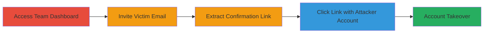

# CrowdSignal Account Takeover via Unverified Invitation Confirmation Links

Multi-stage attack chain demonstrating a complete attack workflow exploiting a logic flaw in CrowdSignal's team account invitation system, allowing unauthorized account takeover.

## Chain Metrics Dashboard

| Metric | Value |
|--------|-------|
| Chain Status | Unverified |
| Total Steps | 4 |
| Execution Time | ~5 minutes |
| Skill Level | Intermediate |
| Complexity | Medium |
| Impact Level | High |

## Attack Flow Visualization

## Prerequisites & Requirements

### Required Tools

- Web browser (e.g., Chrome or Firefox with developer tools for inspecting links)

### Target Environment

- CrowdSignal web application (https://app.crowdsignal.com)
- Attacker must have a valid CrowdSignal team account
- Victim must have an existing CrowdSignal account

### Initial Access Requirements

- Attacker's team account credentials
- Knowledge of victim's email address
- No network position restrictions; accessible via public internet

## Detailed Attack Procedures

### Step 1: Access the Users List Page
procedure: [[procedures/Exploit-CrowdSignal-Invitation-Link-Bypass]]

**Objective**: Gain access to the team dashboard to initiate the invitation process.

**Instructions**: Log in to the attacker's CrowdSignal team account and navigate to the users management section.

**Expected Output**: The users list page loads at https://app.crowdsignal.com/users/list-users.php, displaying options to invite new users.

**Success Indicators**:
- Dashboard accessible without errors
- Invitation form visible

### Step 2: Invite the Victim's Email Address
procedure: [[procedures/Exploit-CrowdSignal-Invitation-Link-Bypass]]

**Objective**: Generate an invitation confirmation link for the victim's email, which remains visible in the dashboard even for existing users.

**Instructions**: On the users list page, enter the victim's existing email address into the invitation form and submit it. The system generates a confirmation link without sending an email or verifying existence.

**Expected Output**: Invitation appears in the dashboard with a clickable confirmation link.

**Success Indicators**:
- No error for existing email
- Confirmation link generated and displayed

### Step 3: Extract and Click the Confirmation Link
procedure: [[procedures/Exploit-CrowdSignal-Invitation-Link-Bypass]]

**Objective**: Use the unverified link to bypass authentication checks.

**Instructions**: Copy the confirmation link from the dashboard. Ensure the attacker is logged out or using their own account, then click the link in a browser.

**Expected Output**: The link redirects without email verification, authenticating the session as the victim.

**Success Indicators**:
- No email mismatch error
- Access granted to victim's account features

### Step 4: Access and Control the Victim's Account
procedure: [[procedures/Exploit-CrowdSignal-Invitation-Link-Bypass]]

**Objective**: Confirm full takeover and perform actions as the victim.

**Instructions**: After clicking the link, navigate to account settings or sensitive areas to verify control. No additional login or verification is required.

**Expected Output**: Full access to victim's dashboard, polls, and data without prompts.

**Success Indicators**:
- Victim's account data visible
- Ability to modify or export content

## Attack Chain Summary

### Key Achievements

1. Bypassed email verification in invitation process
2. Achieved authentication as victim using attacker's session
3. Gained complete control over victim's CrowdSignal account
4. No user interaction or credentials required from victim

## Technique & Tactic Coverage

### MITRE ATT&CK Techniques

- [[Valid Accounts]]

### MITRE ATT&CK Tactics

- [[Initial Access]]

---
*Last updated: 2023-10-01T12:00:00Z*
