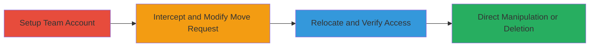

# CrowdSignal IDOR for Unauthorized Content Relocation and Manipulation

Multi-stage attack chain demonstrating exploitation of an Insecure Direct Object Reference (IDOR) vulnerability in the CrowdSignal dashboard's content moving feature. By intercepting POST requests with Burp Suite and manipulating the 'actionable[]' parameter with predictable sequential content IDs, an attacker can relocate victim polls or surveys to their own account, enabling full takeover including viewing responses, editing, deletion, or status changes. This is particularly impactful with team accounts, allowing complete control, while free accounts enable limited direct actions like deletion.

## Chain Metrics Dashboard

| Metric | Value |
|--------|-------|
| Chain Status | Unverified |
| Total Steps | 3 |
| Execution Time | ~10 minutes |
| Skill Level | Intermediate |
| Complexity | Medium |
| Impact Level | High |

## Attack Flow Visualization

## Prerequisites & Requirements

### Required Tools

- [[tools/Burp-Suite]]

### Target Environment

- Web platform (CrowdSignal dashboard at https://app.crowdsignal.com)
- PHP-based application
- Attacker requires a valid CrowdSignal account (free or team)

### Initial Access Requirements

- Valid login credentials to CrowdSignal
- Knowledge of victim's sequential content ID (predictable and enumerable)
- Network access to the dashboard
- Burp Suite proxy configured for browser traffic

## Detailed Attack Procedures

### Step 1: Setup Team Account
procedure: [[procedures/Setup-Team-Account-for-IDOR-Exploitation]]

**Objective**: Create a team account to enable full content takeover capabilities post-relocation.

**Instructions**: Navigate to the users management page and add a secondary email, then confirm it to establish a team user for receiving relocated content.

**Expected Output**: Confirmation of team account setup with access to multiple users.

**Success Indicators**:
- Second email added and confirmed
- Ability to switch between team accounts in dashboard

### Step 2: Relocate Victim's Content
procedure: [[procedures/Exploit-IDOR-to-Relocate-Victim-Content]]

**Objective**: Intercept a legitimate move request, modify the content ID to the victim's, and relocate their poll/survey to the attacker's team account.

**Instructions**: Access the dashboard, select own content to initiate a move, intercept the POST request with Burp Suite, alter the 'actionable[]' parameter to the victim's ID, and forward the request. Switch to the target team account to verify.

**Expected Output**: Victim's content appears in the attacker's dashboard with full edit/view access.

**Success Indicators**:
- Intercepted request modified successfully
- Victim's content visible and editable in team account
- Responses and details accessible

### Step 3: Direct Content Manipulation
procedure: [[procedures/Exploit-IDOR-for-Direct-Content-Manipulation]]

**Objective**: Perform unauthorized actions like deletion or status changes on victim's content without relocation, using similar ID manipulation.

**Instructions**: From the dashboard, initiate a delete or close action on own content, intercept the request with Burp Suite, change 'actionable[]' to victim's ID, and forward to execute the action.

**Expected Output**: Victim's content deleted or status altered (e.g., closed).

**Success Indicators**:
- Action performed on victim's content
- No ownership validation errors
- Content no longer accessible to victim

## Attack Chain Summary

### Key Achievements

1. Unauthorized relocation of victim content to attacker control
2. Full takeover enabling response viewing, editing, and deletion
3. Direct manipulation for disruption without full move

## Technique & Tactic Coverage

### MITRE ATT&CK Techniques

- [[Account Discovery]]
- [[Exploit Public-Facing Application]]

### MITRE ATT&CK Tactics

- [[Discovery]]
- [[Initial Access]]

---
*Last updated: 2023-10-01T00:00:00Z*
