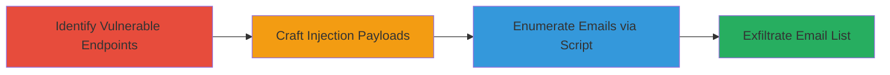

---
tags:
  - nosql-injection
  - mongodb
  - email-enumeration
  - blind-injection
  - express-cart
type: attack_chain
tools:
  - '[[tools/Python]]'
  - '[[tools/requests-Library]]'
tactics:
  - '[[Discovery]]'
  - '[[Collection]]'
verified: false
platforms:
  - Web
  - Node.js
submitted: true
complexity: medium
created_at: '2023-10-01T00:00:00Z'
procedures:
  - '[[procedures/Identify-MongoDB-Injection-in-Login-Endpoints]]'
  - '[[procedures/Craft-NoSQL-Injection-Payloads-for-Email-Enumeration]]'
  - '[[procedures/Execute-Blind-Email-Enumeration-Script]]'
step_count: 3
techniques:
  - '[[Exploit Public-Facing Application]]'
  - '[[Account Discovery]]'
updated_at: '2025-12-14T17:28:51.985Z'
description: >-
  A multi-stage attack exploiting NoSQL injection in express-cart login
  endpoints to enumerate all customer and admin emails through blind $regex
  queries.
skill_level: intermediate
impact_level: high
id: 418a96c4-940d-46a7-a6db-385c726896f6
validated: true
mitre_tactics:
  - '[[Discovery]]'
  - '[[Collection]]'
mitre_techniques:
  - '[[Exploit Public-Facing Application]]'
  - '[[Account Discovery]]'
---
# Customer and Admin Email Enumeration via MongoDB NoSQL Injection in Express-Cart

Multi-stage attack chain demonstrating a complete workflow to exploit NoSQL injection vulnerabilities in the express-cart (v1.1.7) application, allowing blind enumeration of all customer and admin emails from the MongoDB database. The attack leverages unsanitized user input in login handlers to inject MongoDB operators like $regex, enabling character-by-character email guessing. This leads to full email leakage, facilitating phishing, spam, and GDPR-violating data exposure.

## Chain Metrics Dashboard

| Metric | Value |
|--------|-------|
| Chain Status | Unverified |
| Total Steps | 3 |
| Execution Time | ~30 minutes |
| Skill Level | Intermediate |
| Complexity | Medium |
| Impact Level | High |

## Attack Flow Visualization



## Prerequisites & Requirements

### Required Tools

- [[tools/Python]]
- [[tools/requests-Library]]

### Target Environment

- Web application running Node.js with Express framework
- MongoDB backend (version unspecified, but compatible with $regex operator)
- Access to customer/admin login endpoints (e.g., POST /login)
- Network access to the target server (no authentication required for injection testing)

### Initial Access Requirements

- No credentials needed; public-facing login endpoints
- Basic HTTP access (e.g., via browser or script)
- Knowledge of target URL and endpoint paths

## Detailed Attack Procedures

### Step 1: Identify Vulnerable Login Endpoints
procedure: [[procedures/Identify-MongoDB-Injection-in-Login-Endpoints]]

**Objective**: Analyze the application's login handlers to confirm direct insertion of user-supplied email parameters into MongoDB queries without sanitization.

**Instructions**: Review the source code or use debugging tools to inspect the customer and admin login routes. Look for patterns like `db.customers.findOne({email: req.body.loginEmail})` where `req.body.loginEmail` is unsanitized JSON input.

**Expected Output**: Confirmation of injection point, e.g., query logs showing raw user input passed to MongoDB.

**Success Indicators**:
- Unsanitized input detected in query construction
- Ability to send test payloads that alter query behavior

### Step 2: Craft Payloads Using MongoDB $regex Operator
procedure: [[procedures/Craft-NoSQL-Injection-Payloads-for-Email-Enumeration]]

**Objective**: Develop JSON payloads that inject the $regex operator to perform blind checks for email characters, enabling iterative guessing.

**Instructions**: Use [[tools/requests-Library]] in Python to send POST requests to the login endpoint. Start with simple payloads like `{ "loginEmail": { "$regex": "^a" } }` to test for emails starting with 'a'. Iterate over possible characters (a-z, 0-9, @, ., etc.) to build strings recursively.

```python
import requests

data = { "loginEmail": { "$regex": "^a" } }
response = requests.post('http://target.com/login', json=data)
if response.status_code == 200:  # Or check for error indicating match
    print("Match found")
```

**Expected Output**: HTTP responses indicating successful matches (e.g., no error or specific status for invalid login).

**Success Indicators**:
- Payload alters login response behavior
- Character matches confirmed via blind response analysis

### Step 3: Run Exploit Script to Enumerate All Emails
procedure: [[procedures/Execute-Blind-Email-Enumeration-Script]]

**Objective**: Automate the blind enumeration process to reconstruct full email addresses for all customers and admins.

**Instructions**: Execute the Python exploit script that recursively queries the endpoint, building email strings character by character until no more matches are found. Target both customer and admin endpoints sequentially.

Use [[commands/run-mongodb-injection-exploit]]:

```bash
python exploit.py
```

**Expected Output**: A list of enumerated emails, e.g., alan.k@example.com, alice.r@hotmail.com, ben76543@gmail.com, bob@test.com.

**Success Indicators**:
- Complete list of emails outputted
- No further character matches, indicating enumeration complete
- Validation by cross-checking against known emails if available

## Attack Chain Summary

### Key Achievements

1. Identified NoSQL injection points in login handlers
2. Crafted blind $regex payloads for character enumeration
3. Fully enumerated customer and admin emails, enabling downstream attacks like phishing

## Technique & Tactic Coverage

### MITRE ATT&CK Techniques

- [[Exploit Public-Facing Application]]
- [[Account Discovery]]

### MITRE ATT&CK Tactics

- [[Discovery]]
- [[Collection]]

---
*Last updated: 2023-10-01T00:00:00Z*
