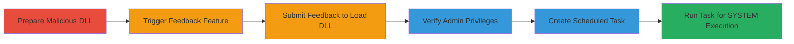

# DLL Hijacking in Acronis True Image 2021 Leading to SYSTEM Privilege Escalation

Multi-stage attack chain demonstrating DLL hijacking in Acronis True Image 2021 to gain Administrator privileges and escalate to NT AUTHORITY\SYSTEM.

## Chain Metrics Dashboard

| Metric | Value |
|--------|-------|
| Chain Status | Unverified |
| Total Steps | 6 |
| Execution Time | ~5 minutes |
| Skill Level | Intermediate |
| Complexity | Medium |
| Impact Level | High |

## Attack Flow Visualization



## Prerequisites & Requirements

### Required Tools

- [[tools/schtasks-exe]]
- C++ compiler (e.g., Visual Studio) for DLL creation

### Target Environment

- Windows OS
- Acronis True Image 2021 installed
- User account with write access to %USERPROFILE%\AppData\Local\Microsoft\WindowsApps

### Initial Access Requirements

- Local user access to the target machine
- No elevated privileges required initially
- Acronis True Image application accessible

## Detailed Attack Procedures

### Step 1: Prepare Malicious DLL
procedure: [[procedures/Prepare-Malicious-DLL-for-Hijacking]]

**Objective**: Create and place a malicious DLL in a user-writable PATH directory to hijack loading by report_sender.exe.

**Instructions**: Compile a C++ DLL that spawns cmd.exe upon loading, targeting names like ubsec.dll, and copy it to the writable directory.

**Expected Output**: Malicious DLL placed successfully, ready for loading.

**Success Indicators**:
- DLL file exists in %USERPROFILE%\AppData\Local\Microsoft\WindowsApps
- No errors during compilation or copy

### Step 2: Trigger Feedback Feature
procedure: [[procedures/Trigger-DLL-Hijacking-via-Feedback]]

**Objective**: Open the Acronis application and initiate the feedback process to prepare for DLL loading.

**Instructions**: Launch Acronis True Image, navigate to Help, and select Send feedback.

**Expected Output**: Feedback form opens.

**Success Indicators**:
- Application opens without issues
- Feedback interface is accessible

### Step 3: Submit Feedback to Load DLL
procedure: [[procedures/Trigger-DLL-Hijacking-via-Feedback]]

**Objective**: Submit the feedback to execute report_sender.exe and load the malicious DLL, spawning an elevated cmd.exe.

**Instructions**: Fill in feedback details and click Send, triggering the DLL load.

**Expected Output**: Elevated cmd.exe window appears.

**Success Indicators**:
- cmd.exe spawns with Administrator privileges
- No crashes in the application

### Step 4: Verify Administrator Privileges
procedure: [[procedures/Verify-Admin-Privileges-and-Escalate-to-SYSTEM]]

**Objective**: Confirm the spawned shell has Administrator rights using a privilege check.

**Instructions**: In the elevated cmd.exe, execute [[commands/net-session-check-admin]]:

```cmd
net session
```

**Expected Output**: "There are no entries in this list" indicating success.

**Success Indicators**:
- Command succeeds without "Access denied"
- Confirms elevated context

### Step 5: Create Scheduled Task for Escalation
procedure: [[procedures/Verify-Admin-Privileges-and-Escalate-to-SYSTEM]]

**Objective**: Use Administrator access to create a scheduled task that runs as SYSTEM.

**Instructions**: From the elevated cmd.exe, use [[tools/schtasks-exe]] with [[commands/schtasks-create-system-task]]:

```cmd
schtasks /create /SC WEEKLY /RU "NT AUTHORITY\SYSTEM" /TN EOP /TR C:\Windows\System32\winver.exe /IT /RL HIGHEST
```

**Expected Output**: "SUCCESS: The scheduled task \"EOP\" has successfully been created."

**Success Indicators**:
- Task created without errors
- Task visible in Task Scheduler

### Step 6: Run Scheduled Task for SYSTEM Execution
procedure: [[procedures/Verify-Admin-Privileges-and-Escalate-to-SYSTEM]]

**Objective**: Trigger the task to execute code as NT AUTHORITY\SYSTEM.

**Instructions**: From the elevated cmd.exe, run [[commands/schtasks-run-task]]:

```cmd
schtasks /run /I /TN EOP
```

**Expected Output**: "SUCCESS: Attempted to run the scheduled task \"EOP\"." and winver.exe launches as SYSTEM.

**Success Indicators**:
- Task runs successfully
- Execution confirmed as SYSTEM (e.g., via process explorer)

## Attack Chain Summary

### Key Achievements

1. Achieved DLL hijacking for Administrator code execution without user interaction beyond feedback.
2. Verified and confirmed elevated privileges.
3. Escalated to full SYSTEM control via scheduled tasks.

## Technique & Tactic Coverage

### MITRE ATT&CK Techniques

- [[Hijack Execution Flow]] Hijack Execution Flow: DLL Search Order Hijacking
- [[Scheduled Task]] Scheduled Task/Job: Scheduled Task

### MITRE ATT&CK Tactics

- [[Execution]] Execution
- [[Privilege Escalation]] Privilege Escalation

---
*Last updated: 2023-10-01T00:00:00Z*
