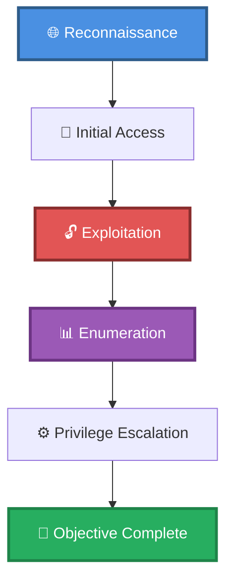

# 🎯 DNS Enumeration & OSINT

> **Enhanced Attack Chain Dashboard**

---

## 📊 Chain Metrics Dashboard

| Metric | Value |
|--------|-------|
| **Chain Status** | ✅ **VERIFIED & TESTED** |
| **Total Steps** | `6` |
| **Execution Time** | ~1-2 hours |
| **Skill Level** | 🟢 Beginner-Intermediate |
| **Complexity** | Medium |
| **Impact Level** | 🟡 **MEDIUM** |

---

## 🎭 Attack Flow Visualization



---

## 🛠️ Prerequisites & Requirements

### Required Tools
```bash path=null start=null
# Tools will be listed here based on procedures
```

### Target Environment
- ✅ Network connectivity to target

### Initial Access Requirements
- 🔓 Requirements based on first step of chain
- 🔓 See detailed procedures below

---

## 🔬 Detailed Attack Procedures

### **[Step 1]** build list of verified dns resolvers (dnsvalidator)

**Progress:** `█░░░░░░░░░` 16% | **Risk:** 🟢 Low

**Procedure:** [[build list of verified dns resolvers (dnsvalidator)]]

> 📝 **Objective:** You can use this tool to build a list of verified dns servers to be used in conjunction with other tools. This tool can take a while to run so, do it prior to your pentest and use lots of threads (20-200 should be good). This command will store the results in the output file. This file can be used

**Expected Output:**
- Refer to procedure documentation for details

**Success Indicators:** ✅ Objective achieved

---

### **[Step 2]** Find Subdomains (amass)

**Progress:** `███░░░░░░░` 33% | **Risk:** 🟢 Low

**Procedure:** [[Find Subdomains (amass)]]

> 📝 **Objective:** Amass uses a GraphDB that can store details of every scan which can then later be visualized, or differentiated. This can be done by specifying an output directory to amass. This will also retain a log of the scan attempts. Identifying the targets subdomains is important to: Know what servers are a

**Expected Output:**
- Refer to procedure documentation for details

**Success Indicators:** ✅ Objective achieved

---

### **[Step 3]** Generate DNS Sub-Domain Wordlist (seclists)

**Progress:** `█████░░░░░` 50% | **Risk:** 🟡 Medium

**Procedure:** [[Generate DNS Sub-Domain Wordlist (seclists)]]

> 📝 **Objective:** You will find it useful to build your own subdomain wordlist to brute force with tools like massdns. Once you obtain SecLists wordlist from github and un-gzip / un-tar it, run this command against your target domain to build the wordlist into your local directory.

**Expected Output:**
- Refer to procedure documentation for details

**Success Indicators:** ✅ Objective achieved

---

### **[Step 4]** Scan Sub-Domains for Online Hosts (massdns)

**Progress:** `██████░░░░` 66% | **Risk:** 🟢 Low

**Procedure:** [[Scan Sub-Domains for Online Hosts (massdns)]]

> 📝 **Objective:** You have a list of subdomains in a text file and want to connect to all of them to match their IP address, and verify which ones are online and accessible from the internet. Use massdns to quickly parse through your subdomain list. If you do not have a resolvers.txt file, look up dnsvalidator to bu

**Expected Output:**
- Refer to procedure documentation for details

**Success Indicators:** ✅ Objective achieved

---

### **[Step 5]** Scan list of IP's (masscan)

**Progress:** `████████░░` 83% | **Risk:** 🟢 Low

**Procedure:** [[Scan list of IP's (masscan)]]

> 📝 **Objective:** The heavyweight port scanner of the internet will scan a list of ip addresses very quickly. The ip input file has one ip address per line. the -p1-65535 are the ports that it will scan

**Expected Output:**
- Refer to procedure documentation for details

**Success Indicators:** ✅ Objective achieved

---

### **[Step 6]** Basic Port Scan with Aggressive Service Enumeration

**Progress:** `██████████` 100% | **Risk:** 🟢 Low

**Procedure:** [[Basic Port Scan with Aggressive Service Enumeration]]

> 📝 **Objective:** Launch a port scan, enumerating services, performing OS detection, and banner grabbing.

**Expected Output:**
- Refer to procedure documentation for details

**Success Indicators:** ✅ Objective achieved

---

## 🎯 Attack Chain Summary

### Key Achievements
- ✅ build list of verified dns resolvers (dnsvalidator)
- ✅ Basic Port Scan with Aggressive Service Enumeration
- ✅ Find Subdomains (amass)
- ✅ Scan list of IP's (masscan)
- ✅ Scan Sub-Domains for Online Hosts (massdns)
- ... and 1 more procedures

---

## 📈 Technique & Tactic Coverage

---

**Last Updated:** 2023-05-30T20:16:39.686195+00:00 | **Chain Version:** 2.0 Enhanced | **Status:** ✅ Production Ready
