# DNS-Enumeration-and-OSINT-Reconnaissance

This attack chain outlines a comprehensive reconnaissance workflow using DNS enumeration and OSINT techniques to identify subdomains, resolve hosts, validate online assets, and scan for open ports. It targets public-facing domains to map the attack surface without requiring initial access, making it ideal for early-stage penetration testing or red team engagements.

## Chain Metrics Dashboard

| Metric | Value |
|--------|-------|
| Chain Status | Verified |
| Total Steps | 6 |
| Execution Time | ~1-2 hours |
| Skill Level | Beginner-Intermediate |
| Complexity | Medium |
| Impact Level | Medium |

## Attack Flow Visualization

```mermaid
graph TD
    A[Prepare DNS Resolvers] --> B[Enumerate Subdomains]
    B --> C[Generate Wordlist]
    C --> D[Resolve and Validate Hosts]
    D --> E[Scan IP Ports]
    E --> F[Aggressive Service Scan]
    F --> G[Recon Complete]

    style A fill:#3498db
    style B fill:#9b59b6
    style C fill:#e74c3c
    style D fill:#f39c12
    style E fill:#1abc9c
    style F fill:#34495e
    style G fill:#27ae60
```



## Prerequisites & Requirements

### Required Tools

- [[tools/dnsvalidator]]
- [[tools/amass]]
- [[tools/SecLists]]
- [[tools/massdns]]
- [[tools/masscan]]
- [[tools/Nmap]]

### Target Environment

- Publicly resolvable target domain (e.g., example.com)
- Internet connectivity for OSINT queries and DNS resolution
- No special privileges required; runs from a standard Linux host

### Initial Access Requirements

- None; this is passive/active reconnaissance from external network position
- Target domain name or IP range

## Detailed Attack Procedures

### Step 1: Prepare Verified DNS Resolvers
procedure: [[procedures/Build-Verified-DNS-Resolvers-List]]

**Objective**: Create a reliable list of DNS resolvers to improve accuracy and speed in subsequent enumeration tools, reducing reliance on potentially unreliable public resolvers.

**Instructions**: Use [[tools/dnsvalidator]] to fetch and validate resolvers from a public list. Run the validation with multiple threads for efficiency, then sort and limit the output to 25-100 resolvers for optimal performance.

Execute [[commands/dnsvalidator-fetch-and-validate-resolvers]]:

```bash
dnsvalidator -tL https://public-dns.info/nameservers.txt -threads $_THREADS -o $_OUTPUT_FILE
```

If using Docker, use [[commands/dnsvalidator-docker-fetch-and-validate-resolvers]]:

```bash
docker run -v $(pwd):$_OUTPUT_DIRECTORY -t dnsvalidator -tL https://public-dns.info/nameservers.txt -threads $_THREADS -o $_OUTPUT_DIRECTORY/$_OUTPUT_RESULTS
```

Finally, limit the list with [[commands/sort-and-limit-resolvers-list]]:

```bash
cat $_FILE | sort | tail -n 25 > resolvers-limited.txt
```

**Expected Output**: A text file containing validated IP addresses of DNS resolvers, e.g., one IP per line like 1.1.1.1, 8.8.8.8.

**Success Indicators**:
- Output file generated with 25+ valid resolvers
- No errors in validation logs indicating network issues

### Step 2: Enumerate Subdomains
procedure: [[procedures/Enumerate-Subdomains-with-Amass]]

**Objective**: Discover subdomains associated with the target domain using passive OSINT sources and active DNS queries to expand the attack surface.

**Instructions**: Run Amass enumeration with IP resolution enabled. For better accuracy, use the custom resolvers list from Step 1 and limit queries to avoid rate limiting.

Start with basic enumeration using [[commands/amass-enumerate-subdomains-with-ip-resolution]]:

```bash
amass enum -ip -d $_TARGET_DOMAIN -o $_OUTPUT_FILE
```

For advanced use with resolvers, execute [[commands/amass-enumerate-subdomains-with-custom-resolvers]]:

```bash
amass enum -rf $_RESOLVERS_FILE -src -ip -d $_TARGET_DOMAIN -max-dns-queries $_MAX_QUERIES_NUM -o $_OUTPUT_FILE
```

Post-process to extract domains and IPs: Use [[commands/extract-domains-from-amass-output]] and [[commands/extract-ips-from-amass-output]]:

```bash
cat $_RESULTS_FILE | cut -d']' -f2 | awk '{print $1}' | sort -u > domains.txt
cat $_RESULTS_FILE | cut -d']' -f2 | awk '{print $2}' | sort -u > ips.txt
```

**Expected Output**: A file with discovered subdomains and their resolved IPs, e.g., www.example.com 192.0.2.1.

**Success Indicators**:
- At least 5-10 subdomains discovered
- IPs resolved without excessive failures in logs

### Step 3: Generate Subdomain Wordlist
procedure: [[procedures/Generate-Subdomain-Wordlist-from-SecLists]]

**Objective**: Create a targeted wordlist of potential subdomains by appending the target domain to common subdomain names for brute-force resolution.

**Instructions**: Download SecLists if not present, then use sed to generate the wordlist from the top subdomains file.

Execute [[commands/build-subdomain-wordlist-with-sed]]:

```bash
sed 's/$/.$_TARGET_DOMAIN/' $_SECLISTS_WORDLIST > $_OUTPUT_FILE
```

**Expected Output**: A text file with one potential subdomain per line, e.g., www.example.com, mail.example.com.

**Success Indicators**:
- Wordlist file created with thousands of entries
- No sed errors; file readable and formatted correctly

### Step 4: Resolve and Validate Subdomains
procedure: [[procedures/Resolve-and-Validate-Subdomains-with-MassDNS]]

**Objective**: Brute-force resolve the generated wordlist against DNS to identify live subdomains and their IPs, filtering for online hosts.

**Instructions**: Use the resolvers from Step 1 to query A records for the subdomain list, then extract online hosts and IPs.

Run resolution with [[commands/massdns-resolve-subdomains-for-a-records]]:

```bash
massdns -r $_DNS_RESOLVERS -t A -o S -w $_OUTPUT_FILE $_HOST_WORDLIST
```

Extract online hosts using [[commands/extract-online-hosts-from-massdns-output]] and IPs with [[commands/extract-ips-from-massdns-output]]:

```bash
cat $_MASSDNS_OUTPUT | awk '{print $1}' | sed 's/.$//' | sort -u > online-hosts.txt
cat $_MASSDNS_OUTPUT | awk '{print $3}' | sort -u | grep -oE "\\b([0-9]{1,3}\\.){3}[0-9]{1,3}\\b" > ips-online.txt
```

**Expected Output**: Files listing resolved subdomains (e.g., sub.example.com) and corresponding IPs.

**Success Indicators**:
- High success rate in massdns logs (>90% OK responses)
- At least a few online hosts identified

### Step 5: Port Scan IP List
procedure: [[procedures/Port-Scan-IP-List-with-Masscan]]

**Objective**: Rapidly scan the discovered IPs for open ports to identify potential entry points.

**Instructions**: Feed the IP list from previous steps into Masscan for a full port range scan at high speed.

Execute [[commands/masscan-scan-ip-list-for-ports]]:

```bash
masscan -iL $_IPS_FILE --rate $_RATE -p$_LOW_PORT-$_HIGH_PORT -oL $_OUTPUT_FILE
```

**Expected Output**: List format output with open ports, e.g., open tcp 80 192.0.2.1.

**Success Indicators**:
- Scan completes without crashes
- Open ports discovered on at least some IPs

### Step 6: Aggressive Service Enumeration
procedure: [[procedures/Perform-Aggressive-Port-Scan-with-Nmap]]

**Objective**: Perform detailed service detection, version scanning, OS fingerprinting, and script execution on open ports from the Masscan results.

**Instructions**: Target individual IPs or the full list with Nmap's aggressive mode (-A) for comprehensive enumeration.

Run [[commands/nmap-aggressive-scan-with-version-detection]] on a target IP:

```bash
nmap -A $_TARGET_IP -oN $_OUTPUT_FILE
```

**Expected Output**: Detailed report with services, versions, OS details, e.g., 80/tcp open http Apache 2.4.41.

**Success Indicators**:
- Services and versions identified
- No scan errors; traceroute and scripts complete

## Attack Chain Summary

### Key Achievements

- Verified DNS resolvers prepared for reliable queries
- Subdomains enumerated via OSINT and brute-force
- Live hosts and IPs validated
- Ports scanned and services enumerated
- Full attack surface mapped for further exploitation

---

*Last updated: 2023-05-30T20:16:39.686195+00:00*
