# DOM-Based XSS via Reblog and Inbox Features Leading to Arbitrary JavaScript Execution

Multi-stage attack chain demonstrating DOM-Based XSS exploitation in Tumblr.com's reblog and inbox features, allowing attackers to execute arbitrary JavaScript in victims' browsers for session theft or unauthorized actions.

## Chain Metrics Dashboard

| Metric | Value |
|--------|-------|
| Chain Status | Unverified |
| Total Steps | 11 |
| Execution Time | ~5 minutes |
| Skill Level | Intermediate |
| Complexity | Medium |
| Impact Level | High |

## Attack Flow Visualization

```mermaid
graph LR
    A[Navigate to Reblog Page] --> B[Click Malicious Link]
    B --> C[Confirm and Execute Payload]
    C --> D[XSS Triggered - Reblog]
    D --> E[Submit Malicious Post to Inbox]
    E --> F[Victim Views Inbox]
    F --> G[Victim Edits Post]
    G --> H[Interact with Malicious Link]
    H --> I[Confirm and Execute Payload]
    I --> J[XSS Triggered - Inbox]
    J --> K[Account Compromise]

    style A fill:#e74c3c
    style B fill:#f39c12
    style C fill:#f39c12
    style D fill:#27ae60
    style E fill:#e74c3c
    style F fill:#3498db
    style G fill:#3498db
    style H fill:#f39c12
    style I fill:#f39c12
    style J fill:#27ae60
    style K fill:#e74c3c
```

## Prerequisites & Requirements

### Required Tools

- Web browser (e.g., Chrome, Firefox)

### Target Environment

- Tumblr.com web application
- Victim must be logged into Tumblr account
- For stored variant: Target blog must allow user submissions

### Initial Access Requirements

- Attacker access to craft malicious links/posts
- Victim interaction required (clicking links or editing posts)
- No special credentials needed beyond normal user access

## Detailed Attack Procedures

### Step 1: Navigate to Reblog Page
procedure: [[procedures/DOM-Based-XSS-in-Reblog-Feature]]

**Objective**: Access the vulnerable reblog page containing a malicious javascript: URL link.

**Instructions**: Open a web browser and navigate to the reblog URL, such as `https://www.tumblr.com/reblog/620008931446652928/JBuEvzz5`, which embeds a malicious link exploiting the lack of CSP.

**Expected Output**: Page loads with a 'click me' link visible.

**Success Indicators**:
- Reblog page loads successfully
- Malicious link is present on the page

### Step 2: Click on the Malicious Link
procedure: [[procedures/DOM-Based-XSS-in-Reblog-Feature]]

**Objective**: Initiate the DOM-based XSS by interacting with the javascript: URL.

**Instructions**: Locate and click the 'click me' element on the page, which processes the embedded javascript: payload.

**Expected Output**: Browser prompts to handle the javascript: URL.

**Success Indicators**:
- Link click triggers URL processing
- No immediate block by CSP

### Step 3: Confirm the Action
procedure: [[procedures/DOM-Based-XSS-in-Reblog-Feature]]

**Objective**: Allow the javascript: URL to execute.

**Instructions**: In the browser dialog, click 'open' or 'allow' to proceed with the payload execution.

**Expected Output**: JavaScript begins executing.

**Success Indicators**:
- Dialog confirmation succeeds
- Payload starts running

### Step 4: XSS is Triggered
procedure: [[procedures/DOM-Based-XSS-in-Reblog-Feature]]

**Objective**: Achieve arbitrary JavaScript execution in the victim's context.

**Instructions**: Observe the payload execution, such as `alert(document.domain)`, due to improper URL handling.

**Expected Output**: Alert box or console output showing domain.

**Success Indicators**:
- JavaScript alert or action performs
- Access to victim's session confirmed

### Step 5: Navigate to Victim's Blog Submit Post Page
procedure: [[procedures/Stored-DOM-Based-XSS-in-Inbox-Edit]]

**Objective**: Prepare to submit a stored payload to the victim's inbox.

**Instructions**: Go to the target's Tumblr blog and access the 'suggest a post' or submission page, ensuring the blog allows user submissions.

**Expected Output**: Submission form loads.

**Success Indicators**:
- Submission enabled on blog
- Form accessible

### Step 6: Create and Submit Malicious Post
procedure: [[procedures/Stored-DOM-Based-XSS-in-Inbox-Edit]]

**Objective**: Inject a javascript: URL into a post for later execution.

**Instructions**: In the post content, add a link with payload like `javascript://x.com%0aalert(1);//` and submit it to the inbox.

**Expected Output**: Post submitted successfully.

**Success Indicators**:
- Post appears in victim's inbox
- Payload embedded without sanitization

### Step 7: Victim Accesses Inbox
procedure: [[procedures/Stored-DOM-Based-XSS-in-Inbox-Edit]]

**Objective**: Victim views the malicious post.

**Instructions**: Victim navigates to `https://www.tumblr.com/inbox` to check submissions.

**Expected Output**: Inbox loads with submitted post.

**Success Indicators**:
- Victim sees the post
- No immediate execution

### Step 8: Victim Edits the Post
procedure: [[procedures/Stored-DOM-Based-XSS-in-Inbox-Edit]]

**Objective**: Load the post content into the edit interface, exposing the payload.

**Instructions**: Victim clicks 'edit' on the submitted post, which renders the content including the malicious link.

**Expected Output**: Edit page with 'click me' link.

**Success Indicators**:
- Edit mode activates
- Malicious link visible

### Step 9: Interact with the Malicious Link
procedure: [[procedures/Stored-DOM-Based-XSS-in-Inbox-Edit]]

**Objective**: Trigger the stored payload in the edit context.

**Instructions**: Victim clicks 'click me' on the edit page.

**Expected Output**: Browser handles the javascript: URL.

**Success Indicators**:
- Click processes the payload
- No CSP block

### Step 10: Confirm the Action
procedure: [[procedures/Stored-DOM-Based-XSS-in-Inbox-Edit]]

**Objective**: Execute the javascript: payload.

**Instructions**: Victim clicks 'open' in the confirmation dialog.

**Expected Output**: Payload executes.

**Success Indicators**:
- Confirmation allows execution
- JavaScript runs

### Step 11: XSS is Triggered
procedure: [[procedures/Stored-DOM-Based-XSS-in-Inbox-Edit]]

**Objective**: Perform malicious actions in victim's account.

**Instructions**: Observe execution, e.g., `alert(1)`, enabling session theft or modifications.

**Expected Output**: Alert or malicious action completes.

**Success Indicators**:
- JavaScript executes successfully
- Victim's account compromised

## Attack Chain Summary

### Key Achievements

1. Exploited missing CSP in reblog feature for DOM-XSS
2. Stored XSS payload in inbox for persistent execution on edit
3. Achieved arbitrary JS execution leading to account takeover

## Technique & Tactic Coverage

### MITRE ATT&CK Techniques

- [[Exploit Public-Facing Application]]
- [[JavaScript]]

### MITRE ATT&CK Tactics

- [[Initial Access]]
- [[Execution]]
- [[Collection]]

---
*Last updated: 2023-10-01T00:00:00Z*
