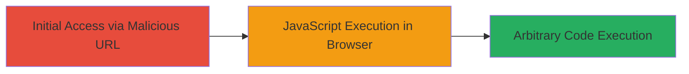

# DOM-Based XSS via vsid Parameter in JetBlue Web Application

Multi-stage attack chain demonstrating a complete attack workflow.

## Chain Metrics Dashboard

| Metric | Value |
|--------|-------|
| Chain Status | Unverified |
| Total Steps | 1 |
| Execution Time | ~1 minute |
| Skill Level | Beginner |
| Complexity | Low |
| Impact Level | Low |

## Attack Flow Visualization

## Prerequisites & Requirements

### Required Tools

- Web browser (e.g., Chrome, Firefox)
- URL crafting tool (optional, like browser dev tools)

### Target Environment

- Web application (JetBlue site)
- Client-side JavaScript processing
- No specific ports or services beyond standard HTTP/HTTPS

### Initial Access Requirements

- Ability to send a malicious URL to a victim (e.g., via phishing or social engineering)
- Victim must visit the crafted URL in their browser
- No prior credentials or network access needed

## Detailed Attack Procedures

### Step 1: Craft and Deliver Malicious URL
procedure: [[procedures/Exploiting-DOM-Based-XSS-in-vsid-Parameter]]

**Objective**: Inject a payload into the vsid URL parameter to trigger DOM-based XSS, leading to arbitrary JavaScript execution in the victim's browser.

**Instructions**: Construct a URL with the vulnerable vsid parameter by appending the payload to the target endpoint. For example, if the base URL is https://example.jetblue.com/page, modify it to https://example.jetblue.com/page?vsid=# ');alert(1);//. The payload exploits the URL hash handling in client-side JavaScript, which lacks proper sanitization, causing the script to execute upon page load.

Deliver the URL to the victim via email, link sharing, or embedding in a phishing site. When the victim navigates to the URL, the browser processes the hash, injecting and executing the JavaScript.

**Expected Output**: An alert box pops up in the victim's browser displaying "1", confirming code execution.

**Success Indicators**:
- Alert or other payload effect (e.g., console log) appears in the browser
- No server-side errors; execution is purely client-side
- Victim's session remains active, allowing potential follow-on attacks like session hijacking

## Attack Chain Summary

### Key Achievements

1. Successful injection and execution of arbitrary JavaScript via URL parameter
2. Demonstration of low-severity impact with potential for phishing or data theft
3. Identification of client-side validation flaw in URL hash processing

## Technique & Tactic Coverage

### MITRE ATT&CK Techniques

- [[Exploit Public-Facing Application]]
- [[JavaScript]]

### MITRE ATT&CK Tactics

- [[Initial Access]]
- [[Execution]]

---
*Last updated: 2023-10-01T00:00:00Z*
