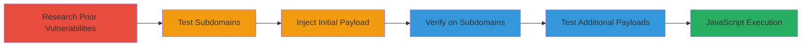

# DOM XSS Exploitation on DuckDuckGo Proxy Error Page via ATB Parameter

Multi-stage attack chain demonstrating the discovery and exploitation of a DOM-based Cross-Site Scripting (XSS) vulnerability on the 50x.html error page of proxy.duckduckgo.com and its subdomains. The chain begins with research inspired by a prior vulnerability report and progresses to payload injection, verification across subdomains, and testing for cross-browser compatibility. Successful exploitation enables arbitrary JavaScript execution in the victim's browser, potentially leading to session hijacking, cookie theft, or data exfiltration.

## Chain Metrics Dashboard

| Metric | Value |
|--------|-------|
| Chain Status | Unverified |
| Total Steps | 5 |
| Execution Time | ~10 minutes |
| Skill Level | Intermediate |
| Complexity | Low |
| Impact Level | High |

## Attack Flow Visualization

## Prerequisites & Requirements

### Required Tools

- Web browser (e.g., Chrome, Firefox) for manual testing
- Optional: [[tools/curl]] for automated URL fetching

### Target Environment

- Web platform
- Access to public internet
- No specific ports or services required beyond HTTP/HTTPS

### Initial Access Requirements

- No credentials needed
- Public network access to DuckDuckGo proxy domains
- Prior knowledge of similar vulnerabilities (e.g., from HackerOne reports)

## Detailed Attack Procedures

### Step 1: Research Prior Vulnerabilities
procedure: [[procedures/Research-Similar-Vulnerabilities-from-Past-Reports]]

**Objective**: Identify potential unpatched issues by reviewing historical vulnerability reports on similar endpoints.

**Instructions**: Access and read the HackerOne report #405191 detailing a DOM XSS on duckduckgo.com's 50x.html page to understand the original vulnerability and fix.

**Expected Output**: Insight into the 'atb' parameter's role in attribute injection and awareness that subdomains may remain vulnerable.

**Success Indicators**:
- Understood the original payload and breakout technique
- Identified proxy subdomains as potential targets

### Step 2: Test Subdomains for Unpatched XSS
procedure: [[procedures/Test-Subdomains-for-Unpatched-XSS]]

**Objective**: Probe proxy subdomains to check if the fix from the prior report was applied.

**Instructions**: Navigate to or fetch https://proxy.duckduckgo.com/50x.html?e=&atb= in a browser or using curl to simulate an error page load and observe if the 'atb' value is reflected without sanitization.

**Expected Output**: The error page loads with the 'atb' parameter visible in the HTML source, indicating no fix applied.

**Success Indicators**:
- Parameter reflection confirmed in page source
- No JavaScript errors or sanitization observed

### Step 3: Inject XSS Payload into ATB Parameter
procedure: [[procedures/Inject-XSS-Payload-into-ATB-Parameter]]

**Objective**: Break out of the HTML attribute using a crafted payload to execute JavaScript.

**Instructions**: Construct and load the URL https://proxy.duckduckgo.com/50x.html?e=&atb=test%22/%3E%3Cimg%20src=x%20onerror=alert(%27test%27);%3E. The payload "test"/>  escapes the attribute and triggers an alert on load failure.

**Expected Output**: Browser alert box displaying 'test' upon page load.

**Success Indicators**:
- Alert executed successfully
- JavaScript code runs in the context of the error page

### Step 4: Verify XSS on Proxy Subdomains
procedure: [[procedures/Verify-XSS-on-Proxy-Subdomains]]

**Objective**: Confirm the vulnerability persists across all proxy subdomains.

**Instructions**: Repeat the payload injection on proxy1.duckduckgo.com, proxy2.duckduckgo.com, proxy3.duckduckgo.com, and proxy4.duckduckgo.com using the same URL structure: https://[subdomain].duckduckgo.com/50x.html?e=&atb=test%22/%3E%3Cimg%20src=x%20onerror=alert(%27test%27);%3E.

**Expected Output**: Alert triggers on each subdomain's error page.

**Success Indicators**:
- Consistent execution across all four subdomains
- No variations in behavior

### Step 5: Test Additional XSS Payloads for Browser Compatibility
procedure: [[procedures/Test-Additional-XSS-Payloads-for-Browser-Compatibility]]

**Objective**: Validate exploit reliability across different browsers and payload variations.

**Instructions**: Test alternative payloads such as https://proxy.duckduckgo.com/50x.html?e=&atb=test%22/%3E%3Csvg%0Conload=alert(1)%3E for SVG onload, https://proxy.duckduckgo.com/50x.html?e=&atb=test%22/%3E%3Cdetails/open/ontoggle=%22alert%601%60%22%3E for details toggle, and https://proxy.duckduckgo.com/50x.html?e=&atb=test%22/%3E%3Cvideo%3E%3Csource%20onerror=%22javascript:alert(1)%22%3E for video source error in multiple browsers.

**Expected Output**: Alerts or equivalent JavaScript execution in Chrome, Firefox, and Safari.

**Success Indicators**:
- Payloads work without browser-specific blocks
- Arbitrary code execution confirmed

## Attack Chain Summary

### Key Achievements

1. Discovered unpatched DOM XSS on proxy subdomains inspired by prior report.
2. Achieved JavaScript execution via attribute breakout in 'atb' parameter.
3. Verified exploit across multiple subdomains and payload types for reliability.

## Technique & Tactic Coverage

### MITRE ATT&CK Techniques

- [[JavaScript]]

### MITRE ATT&CK Tactics

- [[Execution]]
- [[Collection]]

---
*Last updated: 2023-10-01T00:00:00Z*
