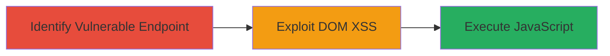

# DOM XSS in Outdated Swagger UI for Arbitrary JavaScript Execution

Multi-stage attack chain demonstrating a complete attack workflow exploiting a DOM-based XSS in Swagger UI.

## Chain Metrics Dashboard

| Metric | Value |
|--------|-------|
| Chain Status | Unverified |
| Total Steps | 2 |
| Execution Time | ~5 minutes |
| Skill Level | Intermediate |
| Complexity | Medium |
| Impact Level | High |

## Attack Flow Visualization

## Prerequisites & Requirements

### Required Tools

- Web browser (e.g., Chrome Developer Tools)

### Target Environment

- Web platform
- GitHub Pages hosting Swagger UI
- Outdated Swagger UI version vulnerable to DOM XSS

### Initial Access Requirements

- Public access to the Swagger UI URL
- No authentication required
- Victim interaction with the malicious link

## Detailed Attack Procedures

### Step 1: Identify Vulnerable Endpoint
procedure: [[procedures/Identify-Swagger-UI-Endpoint-for-External-Configuration]]

**Objective**: Locate and analyze the Swagger UI instance to identify the external configuration loading feature.

**Instructions**: Access the target URL https://adobedocs.github.io/OAE_PartnerAPI/ using a web browser. Inspect the page source or use developer tools to confirm the presence of Swagger UI and the ?configUrl= parameter, which allows loading YAML or JSON API specs from arbitrary URLs.

**Expected Output**: Confirmation of Swagger UI version and the ?configUrl= parameter support.

**Success Indicators**:
- Swagger UI loads successfully
- ?configUrl= parameter is functional for external loads

### Step 2: Exploit DOM XSS
procedure: [[procedures/Exploit-DOM-XSS-via-Malicious-configUrl]]

**Objective**: Inject and execute arbitrary JavaScript by supplying a malicious URL via the configUrl parameter, leveraging the lack of sanitization in the outdated Swagger UI.

**Instructions**: Append a malicious URL to the ?configUrl= parameter, such as https://adobedocs.github.io/OAE_PartnerAPI/?configUrl=javascript:alert('XSS'). Use browser developer tools to observe the execution. In a real attack, the payload could fetch and execute remote scripts for session hijacking or data theft.

**Expected Output**: JavaScript alert or console execution confirming XSS.

**Success Indicators**:
- Arbitrary JavaScript executes in the browser context
- Potential for data exfiltration or session manipulation

## Attack Chain Summary

### Key Achievements

1. Identified vulnerable Swagger UI configuration loading mechanism
2. Exploited DOM XSS to execute JavaScript in victim browser
3. Demonstrated potential for session hijacking and data theft

## Technique & Tactic Coverage

### MITRE ATT&CK Techniques

- [[JavaScript]]
- [[Drive-by Compromise]]

### MITRE ATT&CK Tactics

- [[Initial Access]]
- [[Execution]]
- [[Collection]]

---
*Last updated: 2024-01-01T12:00:00Z*
