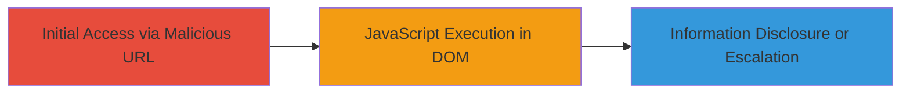

---
tags:
  - dom-xss
  - xss
  - siteminder
  - authentication
  - dod
  - information-disclosure
type: attack_chain
tools: []
tactics:
  - '[[Initial Access]]'
  - '[[Execution]]'
commands: []
platforms:
  - Web
complexity: low
procedures:
  - '[[procedures/Exploit-DOM-XSS-in-SiteMinder-USERNAME-Parameter]]'
step_count: 1
techniques:
  - '[[Exploit Public-Facing Application]]'
  - '[[JavaScript]]'
description: >-
  A single-stage attack exploiting a DOM-based XSS vulnerability in the
  SiteMinder authentication system on a U.S. Department of Defense subdomain,
  allowing arbitrary JavaScript execution in the victim's browser.
skill_level: intermediate
impact_level: high
id: 528127e5-610b-450f-8546-a64db033ec68
created_at: '2025-12-14T03:16:25.682Z'
updated_at: '2025-12-14T03:16:25.682Z'
verified: false
validated: true
submitted: true
mitre_tactics:
  - '[[Initial Access]]'
  - '[[Execution]]'
mitre_techniques:
  - '[[Exploit Public-Facing Application]]'
  - '[[JavaScript]]'
---
# DOM-XSS in SiteMinder Authentication Leading to JavaScript Execution and Information Disclosure

Multi-stage attack chain demonstrating a complete attack workflow.

## Chain Metrics Dashboard

| Metric | Value |
|--------|-------|
| Chain Status | Unverified |
| Total Steps | 1 |
| Execution Time | ~1 minutes |
| Skill Level | Intermediate |
| Complexity | Low |
| Impact Level | High |

## Attack Flow Visualization



## Prerequisites & Requirements

### Required Tools

- Web browser (e.g., Chrome, Firefox)

### Target Environment

- Web platform with SiteMinder (CA Single Sign-On) authentication
- Access to the vulnerable subdomain (https://███/siteminderagent/forms/smpwservices.fcc)
- No specific ports required beyond standard HTTPS (443)

### Initial Access Requirements

- Network access to the DoD subdomain
- No prior credentials needed; the vulnerability triggers on URL access
- Victim must interact with the crafted URL (e.g., via phishing or direct access)

## Detailed Attack Procedures

### Step 1: Trigger DOM-XSS via Malicious USERNAME Payload
procedure: [[procedures/Exploit-DOM-XSS-in-SiteMinder-USERNAME-Parameter]]

**Objective**: Inject a JavaScript payload into the USERNAME parameter to execute arbitrary code in the browser's DOM, leading to information leaks or further exploitation.

**Instructions**: Construct and access the vulnerable URL with the encoded payload in the USERNAME parameter. The payload decodes to an  tag that triggers onerror to execute JavaScript, such as confirming the document domain.

Navigate to the URL in a browser:

```url
https://███/siteminderagent/forms/smpwservices.fcc?SMAUTHREASON=7&USERNAME=%5C%u003cimg%5C%u0020src%5C%u003dx%5C%u0020onerror%5C%u003d%5C%u0022confirm(document.domain)%5C%u0022%5C%u003e
```

The payload `%5C%u003cimg%5C%u0020src%5C%u003dx%5C%u0020onerror%5C%u003d%5C%u0022confirm(document.domain)%5C%u0022%5C%u003e` decodes to ``, which executes on DOM parsing without server reflection.

**Expected Output**: A browser dialog confirming the document domain (e.g., alert box showing the subdomain), indicating successful JavaScript execution.

**Success Indicators**:
- JavaScript alert or confirm dialog appears in the browser
- No server-side errors; execution happens client-side in the DOM
- Potential for further payloads to steal cookies, session data, or escalate privileges

## Attack Chain Summary

### Key Achievements

1. Successful injection and execution of JavaScript via DOM-XSS in SiteMinder's USERNAME parameter
2. Demonstration of information disclosure (e.g., document domain confirmation)
3. Potential for broader impacts like session hijacking or denial of service on authenticated users

## Technique & Tactic Coverage

### MITRE ATT&CK Techniques

- [[Exploit Public-Facing Application]]
- [[JavaScript]]

### MITRE ATT&CK Tactics

- [[Initial Access]]
- [[Execution]]

---
*Last updated: 2023-10-01T00:00:00Z*
