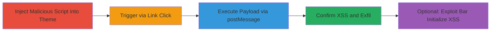

# DOM XSS via Shopify API remoteRedirect in Apple Business Chat

Multi-stage attack chain demonstrating a complete attack workflow exploiting DOM-based XSS in Shopify's Apple Business Chat app.

## Chain Metrics Dashboard

| Metric | Value |
|--------|-------|
| Chain Status | Unverified |
| Total Steps | 3 |
| Execution Time | ~2 minutes |
| Skill Level | Intermediate |
| Complexity | Medium |
| Impact Level | High |

## Attack Flow Visualization



## Prerequisites & Requirements

### Required Tools

- Browser developer tools for script injection and testing
- Access to Shopify store admin for theme modification

### Target Environment

- Shopify store with Apple Business Chat integration enabled
- Web browser (e.g., Chrome) for execution
- No specific ports; operates over HTTPS

### Initial Access Requirements

- Administrative access to the target Shopify store to modify theme code
- Network access to the store frontend
- No prior credentials needed beyond store admin

## Detailed Attack Procedures

### Step 1: Modify Store Theme
procedure: [[procedures/Modify-Store-Theme-to-Inject-Malicious-Script]]

**Objective**: Inject a malicious script into the store's theme to set up the XSS exploit vector using postMessage to the Apple Business Chat domain.

**Instructions**: Access the Shopify admin panel, navigate to Online Store > Themes, edit the current theme's code (e.g., in layout/theme.liquid), and insert the script block defining the attack function. Include an anchor tag to trigger it. Save and publish the theme.

Use [[commands/define-attack-function]] to define the core logic:

```javascript
let attack = function() { ... }; // Full function as per command
```

Add the trigger link with [[commands/invoke-attack]]:

```html
<a href="javascript:attack()">click me start attack</a>
```

**Expected Output**: Theme updated without errors; malicious script and link present on the frontend.

**Success Indicators**:
- Script loads in browser console without syntax errors
- Anchor tag visible on store page

### Step 2: Trigger the Attack
procedure: [[procedures/Trigger-XSS-by-Visiting-and-Clicking-Link]]

**Objective**: Visit the store frontend and click the injected link to open a window and send postMessages exploiting remoteRedirect.

**Instructions**: Load the store's homepage in a browser. Locate and click the "click me start attack" link. Monitor the browser console for interval messages and success logs.

The click invokes [[commands/invoke-attack]]:

```javascript
attack();
```

This triggers [[commands/open-window-shopify-chat]] and [[commands/set-interval-postmessage]]:

```javascript
let ctx = window.open('https://apple-business-chat-commerce.shopifycloud.com');
interval = setInterval(() => { ... }, 500);
```

Handle response with [[commands/onmessage-success-handler]]:

```javascript
window.onmessage = (e) => { ... };
```

**Expected Output**: New window opens; console shows repeated postMessages; eventual "attack success" log and alert popping document.domain.

**Success Indicators**:
- Alert box displays the domain (e.g., shopify.com)
- Console logs "attack success"
- Interval clears after success

### Step 3: Exploit Additional XSS
procedure: [[procedures/Exploit-Additional-XSS-in-Bar-Initialize]]

**Objective**: Demonstrate a secondary XSS in Shopify.API.Bar.initialize by sending postMessages with malicious javascript: hrefs in pagination.

**Instructions**: In a similar setup or console, send a postMessage targeting the Bar.initialize API with tainted hrefs. This can be chained after the primary exploit or tested independently.

Use [[commands/postmessage-bar-initialize-xss]]:

```javascript
postMessage({ "message":"Shopify.API.Bar.initialize", "data":{ pagination: { next: { href: "javascript:alert(document.domain)", target: "new" }, previous: { href: "javascript:alert(document.domain)", target: "new" } } } });
```

**Expected Output**: When pagination links are activated (e.g., next/previous), alert pops showing document.domain.

**Success Indicators**:
- Alert executes on href click
- Confirms lack of protocol validation in Bar.initialize

## Attack Chain Summary

### Key Achievements

1. Successful injection and execution of arbitrary JS in Shopify's Apple Business Chat context
2. Confirmation of XSS via alert and postMessage success handling
3. Identification of chained vulnerability in Bar.initialize for broader exploitation

## Technique & Tactic Coverage

### MITRE ATT&CK Techniques

- [[JavaScript]] JavaScript
- [[Drive-by Compromise]] Drive-by Compromise
- [[Exploit Public-Facing Application]] Exploit Public-Facing Application

### MITRE ATT&CK Tactics

- [[Initial Access]] Initial Access
- [[Execution]] Execution
- [[Collection]] Collection

---
*Last updated: 2023-10-01T00:00:00Z*
