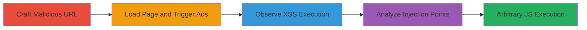

---
tags:
  - xss
  - dom-xss
  - ads
  - javascript-injection
type: attack_chain
tools:
  - '[[tools/Eval-Villain]]'
tactics:
  - '[[Execution]]'
  - '[[Initial Access]]'
verified: false
platforms:
  - Web
submitted: true
complexity: medium
created_at: '2023-10-01T00:00:00Z'
procedures:
  - '[[procedures/Craft-Malicious-URL-for-DOM-XSS-Trigger]]'
  - '[[procedures/Trigger-Ad-Loading-for-Injection]]'
  - '[[procedures/Observe-and-Execute-XSS-Payload]]'
  - '[[procedures/Analyze-Injection-with-Eval-Villain]]'
step_count: 4
techniques:
  - '[[JavaScript]]'
  - '[[Exploit Public-Facing Application]]'
updated_at: '2025-12-14T00:11:15.786Z'
description: >-
  A multi-step attack exploiting a DOM-based XSS vulnerability in Urban
  Dictionary's ad integration, where third-party ads inject the page URL into
  JavaScript without escaping single quotes, allowing arbitrary code execution
  in the site's context.
skill_level: intermediate
impact_level: high
id: 33129349-597a-4a0f-bca8-3a503bdad457
validated: true
mitre_tactics:
  - '[[Execution]]'
  - '[[Initial Access]]'
mitre_techniques:
  - '[[JavaScript]]'
  - '[[Exploit Public-Facing Application]]'
---
# DOM XSS via Unescaped URL Injection in Third-Party Ads on Urban Dictionary

Multi-stage attack chain demonstrating a complete attack workflow exploiting a DOM-based XSS in Urban Dictionary's third-party ad scripts.

## Chain Metrics Dashboard

| Metric | Value |
|--------|-------|
| Chain Status | Unverified |
| Total Steps | 4 |
| Execution Time | ~2 minutes |
| Skill Level | Intermediate |
| Complexity | Medium |
| Impact Level | High |

## Attack Flow Visualization

## Prerequisites & Requirements

### Required Tools

- [[tools/Eval-Villain]]

### Target Environment

- Web platform (browser-based)
- Urban Dictionary website (www.urbandictionary.com)
- Third-party ad services (e.g., lijit.com, sovrn)
- No specific ports required; standard HTTPS/80

### Initial Access Requirements

- Public access to the website
- Firefox browser with Eval Villain extension installed
- No authentication needed for basic exploitation

## Detailed Attack Procedures

### Step 1: Craft Malicious URL
procedure: [[procedures/Craft-Malicious-URL-for-DOM-XSS-Trigger]]

**Objective**: Create a URL parameter that includes a single quote to escape the ad script's string context and inject a payload.

**Instructions**: Construct the URL by appending a term parameter with a payload like '#asdf'-alert(document.domain)-'asdf' to break out of the single-quoted string in the ad's document.write.

**Expected Output**: A visitable URL such as https://www.urbandictionary.com/define.php?term=#asdf'-alert(document.domain)-'asdf.

**Success Indicators**:
- URL is formed without syntax errors
- Page loads successfully in the browser

### Step 2: Load Page and Trigger Ads
procedure: [[procedures/Trigger-Ad-Loading-for-Injection]]

**Objective**: Load the crafted page to initiate ad scripts that inject the vulnerable URL.

**Instructions**: Navigate to the crafted URL in Firefox with Eval Villain enabled. Wait for the page to fully load, allowing ad providers like lijit.com to fetch and execute pwt.js.

**Expected Output**: Ad scripts load, injecting the URL into JavaScript via document.write, e.g., url='https://...&loc=https://www.urbandictionary.com/define.php?term=#asdf'-alert(document.domain)-'asdf'.

**Success Indicators**:
- Ads appear on the page
- No immediate errors in browser console

### Step 3: Observe XSS Execution
procedure: [[procedures/Observe-and-Execute-XSS-Payload]]

**Objective**: Monitor for the payload execution as the escaped quote triggers arbitrary JavaScript.

**Instructions**: Refresh the page if needed to cycle through different ads. Observe the alert box popping up with 'www.urbandictionary.com' upon successful injection.

**Expected Output**: Alert dialog executes, confirming domain 'www.urbandictionary.com'.

**Success Indicators**:
- Alert box appears
- JavaScript executes in the site's origin context

### Step 4: Analyze Injection
procedure: [[procedures/Analyze-Injection-with-Eval-Villain]]

**Objective**: Capture and log the injected strings to identify and refine the vulnerability.

**Instructions**: Use Eval Villain to intercept strings passed to document.write or similar functions. Review logs for full ad content and escape points.

**Expected Output**: Logged strings revealing the injection, e.g., in attachments like adstring1.txt showing the unescaped URL.

**Success Indicators**:
- Logs capture vulnerable document.write calls
- Injection points are clearly identified

## Attack Chain Summary

### Key Achievements

1. Successful breakout from ad script strings using a single quote in the URL parameter.
2. Execution of arbitrary JavaScript in the Urban Dictionary origin, demonstrating potential for user actions or content injection.
3. Analysis confirming the vulnerability in third-party ad integration without proper URL escaping.

## Technique & Tactic Coverage

### MITRE ATT&CK Techniques

- [[JavaScript]]
- [[Exploit Public-Facing Application]]

### MITRE ATT&CK Tactics

- [[Execution]]
- [[Initial Access]]

---

*Last updated: 2023-10-01T00:00:00Z*
