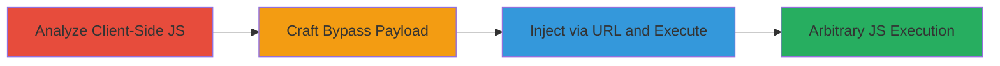

# DOM-based XSS Bypass via Malformed Encoded HTML Tags on Grab.com

Multi-stage attack chain demonstrating a complete DOM-based XSS exploitation workflow on https://www.grab.com/.

## Chain Metrics Dashboard

| Metric | Value |
|--------|-------|
| Chain Status | Unverified |
| Total Steps | 3 |
| Execution Time | ~5 minutes |
| Skill Level | Intermediate |
| Complexity | Medium |
| Impact Level | High |

## Attack Flow Visualization

## Prerequisites & Requirements

### Required Tools

- Web browser with developer tools (e.g., Chrome DevTools)

### Target Environment

- Web platform
- Access to https://www.grab.com/ pages
- No specific services/ports required beyond standard HTTPS (443)

### Initial Access Requirements

- Public access to the website
- No credentials needed
- Ability to manipulate URL parameters

## Detailed Attack Procedures

### Step 1: Analyze Client-Side JavaScript
procedure: [[procedures/Identify-Vulnerable-HTML-Stripping-Function-in-JS]]

**Objective**: Locate and analyze the flawed HTML stripping function to understand the vulnerability.

**Instructions**: Open the target page in a browser, inspect the network requests to download and review client-side JavaScript files for functions like stripHtml.

**Expected Output**: Identification of the regex pattern /<\/?\w+\[^>\]*\/?>/g that fails on malformed tags.

**Success Indicators**:
- Regex pattern extracted
- Confirmation of innerHTML and textContent usage

### Step 2: Craft Payload
procedure: [[procedures/Craft-Regex-Bypass-Payload-for-DOM-XSS]]

**Objective**: Develop a payload that evades the regex filter using encoding and malformed tags.

**Instructions**: Construct the payload <a/:<"a">img src=# onerror=confirm('XSSED')> and URL-encode it to %3C%3Ca/%3A%3C%22a%22%3Eimg%20src%3D%23%20onerror%3Dconfirm%28%27XSSED%27%29%3E.

**Expected Output**: Encoded payload ready for injection.

**Success Indicators**:
- Payload evades regex in local testing
- onerror handler intact

### Step 3: Inject and Execute
procedure: [[procedures/Inject-XSS-Payload-via-URL-Parameter-on-Target-Site]]

**Objective**: Deliver the payload to trigger JavaScript execution on the victim’s browser.

**Instructions**: Append the encoded payload to a URL parameter like ?xss= on a page such as https://www.grab.com/sg/partnerships/ and load it.

**Expected Output**: Confirm dialog with 'XSSED' appears, indicating execution.

**Success Indicators**:
- Alert/confirm dialog triggers
- No stripping of scriptable elements

## Attack Chain Summary

### Key Achievements

1. Bypassed client-side HTML sanitization regex
2. Achieved arbitrary JS execution across all site pages
3. Demonstrated potential for session hijacking or data theft

## Technique & Tactic Coverage

### MITRE ATT&CK Techniques

- [[JavaScript]]
- [[Drive-by Compromise]]

### MITRE ATT&CK Tactics

- [[Execution]]
- [[Collection]]

---
*Last updated: 2023-10-01T00:00:00Z*
