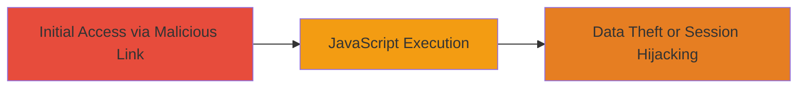

# DOM-based XSS Exploitation in Glassdoor Job Search Parameter

Multi-stage attack chain demonstrating a complete attack workflow targeting a DOM-based XSS vulnerability in Glassdoor's job search functionality.

## Chain Metrics Dashboard

| Metric | Value |
|--------|-------|
| Chain Status | Unverified |
| Total Steps | 1 |
| Execution Time | ~5 minutes |
| Skill Level | Intermediate |
| Complexity | Medium |
| Impact Level | Medium |

## Attack Flow Visualization



## Prerequisites & Requirements

### Required Tools

- Browser developer tools (e.g., Chrome DevTools)

### Target Environment

- Web platform
- JavaScript-enabled browser
- Access to Glassdoor's job search page

### Initial Access Requirements

- Ability to craft and distribute malicious URLs (e.g., via phishing)
- No prior credentials needed; public-facing application
- Victim must visit the crafted URL

## Detailed Attack Procedures

### Step 1: Identify and Exploit DOM-based XSS
procedure: [[procedures/Exploit-DOM-based-XSS-in-URL-Parameter]]

**Objective**: Test and confirm the DOM-based XSS vulnerability in the sc.keyword parameter, then inject a payload to execute arbitrary JavaScript for potential data exfiltration or session manipulation.

**Instructions**: Construct a test URL with the vulnerable parameter and append a JavaScript payload. Use the browser to navigate to the URL and observe reflection in the DOM via developer tools. For exploitation, replace 'test' with a payload like '<script>alert(document.cookie)</script>' to demonstrate cookie theft.

First, test the basic reflection:

```bash
# No command needed; use browser URL bar
https://www.glassdoor.com/Job/jobs.htm?sc.keyword=test
```

Then, inject payload using browser or curl to simulate:

```bash
curl "https://www.glassdoor.com/Job/jobs.htm?sc.keyword=%3Cscript%3Ealert('XSS')%3C%2Fscript%3E"
```

Verify in browser console that the script executes.

**Expected Output**: The parameter value appears unsanitized in client-side JavaScript, leading to alert popup or console log of stolen data.

**Success Indicators**:
- Payload reflected in DOM without encoding
- JavaScript executes (e.g., alert fires)
- Access to victim's cookies or session data

## Attack Chain Summary

### Key Achievements

1. Confirmed DOM-based XSS in public-facing web parameter
2. Demonstrated arbitrary JS execution for client-side attacks
3. Highlighted potential for session hijacking and data theft

## Technique & Tactic Coverage

### MITRE ATT&CK Techniques

- [[JavaScript]]

### MITRE ATT&CK Tactics

- [[Execution]]
- [[Collection]]

---
*Last updated: 2023-10-01T00:00:00Z*
