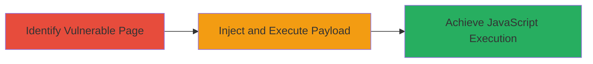

---
tags:
  - xss
  - dom-xss
  - ibm
  - aspera
  - web
type: attack_chain
tools: []
tactics:
  - '[[Execution]]'
commands: []
platforms:
  - Web
complexity: medium
procedures:
  - '[[procedures/Exploit-DOM-based-XSS]]'
step_count: 1
techniques:
  - '[[JavaScript]]'
description: >-
  A single-stage attack exploiting a DOM-based Cross-Site Scripting
  vulnerability in the IBM Aspera documentation website, allowing arbitrary
  JavaScript execution in victims' browsers.
skill_level: intermediate
impact_level: medium
id: 758d86bb-f985-485b-a244-698c97c4f3de
created_at: '2025-12-13T23:52:44.490Z'
updated_at: '2025-12-13T23:52:44.490Z'
verified: false
validated: true
submitted: true
mitre_tactics:
  - '[[Execution]]'
mitre_techniques:
  - '[[JavaScript]]'
---
# DOM-based XSS Exploitation in IBM Aspera Documentation Website

## Overview

This attack chain demonstrates the exploitation of a DOM-based Cross-Site Scripting (XSS) vulnerability in IBM's Aspera documentation website. Discovered by an external researcher and reported via HackerOne on January 8, 2024, the flaw allowed attackers to inject and execute malicious JavaScript in the context of a victim's browser. The vulnerability stemmed from insufficient input sanitization or output encoding in client-side code, leading to medium severity impacts such as session hijacking, data theft, or phishing. IBM triaged and remediated the issue by February 21, 2024. This chain focuses on the core exploitation step, assuming the attacker has identified the vulnerable endpoint through reconnaissance.

## Chain Metrics Dashboard

| Metric | Value |
|--------|-------|
| Chain Status | Unverified |
| Total Steps | 1 |
| Execution Time | ~2 minutes |
| Skill Level | Intermediate |
| Complexity | Medium |
| Impact Level | Medium |

## Attack Flow Visualization

## Prerequisites & Requirements

### Required Tools

- Web browser with developer tools (e.g., Chrome DevTools)

### Target Environment

- Target: IBM Aspera documentation website (publicly accessible web application)
- Required services/ports: HTTP/HTTPS on standard ports (80/443)
- Network access requirements: Internet access to the target site

### Initial Access Requirements

- No credentials required (public-facing site)
- Attacker positioned externally
- Prior access: None, but knowledge of the site's structure from public documentation

## Detailed Attack Procedures

### Step 1: Exploit DOM-based XSS
procedure: [[procedures/Exploit-DOM-based-XSS]]

**Objective**: Inject a malicious JavaScript payload via a DOM-manipulating input source, such as a URL parameter or fragment identifier, to execute arbitrary code in the victim's browser context.

**Instructions**: Identify a page on the Aspera documentation site where client-side JavaScript unsafely processes user input from the DOM (e.g., document.location.hash or URLSearchParams). Craft a URL with a payload like 'javascript:alert(document.cookie)' in the hash or a parameter that gets evaluated. Open the URL in a browser to trigger execution. Use developer tools to inspect the DOM and confirm the injection point, such as an innerHTML assignment without encoding.

For testing, navigate to the vulnerable page (e.g., a search or documentation viewer) and append the payload:

Example URL: https://docs.aspera.com/#payload=

Monitor the browser console for execution.

**Expected Output**: Alert box or console log displaying the payload execution, potentially revealing cookies or session data.

**Success Indicators**:
- Malicious script executes without errors
- Victim's session data (e.g., cookies) is accessible via the payload
- No server-side blocking observed

## Attack Chain Summary

### Key Achievements

1. Successful injection and execution of JavaScript in browser context
2. Potential for data exfiltration or session hijacking
3. Demonstration of medium-impact vulnerability leading to remediation

## Technique & Tactic Coverage

### MITRE ATT&CK Techniques

- [[JavaScript]]

### MITRE ATT&CK Tactics

- [[Execution]]

---
*Last updated: 2024-03-01T00:00:00Z*
