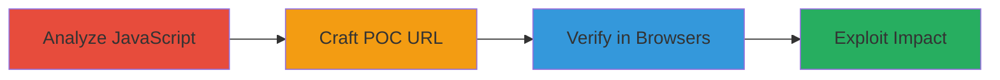

---
tags:
  - xss
  - dom-xss
  - web-vulnerability
  - javascript
type: attack_chain
tools:
  - '[[tools/Internet-Explorer]]'
  - '[[tools/Microsoft-Edge]]'
tactics:
  - '[[Initial Access]]'
  - '[[Execution]]'
commands: []
platforms:
  - Web
complexity: medium
procedures:
  - '[[procedures/Analyze-JavaScript-for-Vulnerabilities]]'
  - '[[procedures/Craft-POC-URL-for-XSS-Injection]]'
  - '[[procedures/Verify-XSS-Exploit-in-Browsers]]'
step_count: 3
techniques:
  - '[[JavaScript]]'
description: >-
  Multi-stage attack chain exploiting a DOM-based XSS vulnerability on a web
  careers page by analyzing JavaScript, crafting a POC URL, and verifying in
  specific browsers.
skill_level: intermediate
impact_level: medium
id: c8d1b967-7fbf-45d8-8a64-0ba295ff70dc
created_at: '2025-12-13T23:56:20.511Z'
updated_at: '2025-12-13T23:56:20.511Z'
verified: false
validated: true
submitted: true
mitre_tactics:
  - '[[Initial Access]]'
  - '[[Execution]]'
mitre_techniques:
  - '[[JavaScript]]'
---
# DOM-based XSS Exploitation on Careers Page via Unsanitized URL Parameters

## Overview

This attack chain demonstrates the discovery and exploitation of a DOM-based Cross-site Scripting (XSS) vulnerability on the HackerOne careers page at https://www.hackerone.com/careers. The vulnerability arises from improper handling of URL parameters in JavaScript without sanitization, allowing injection of arbitrary HTML and scripts. The chain involves analyzing the JavaScript code, crafting a proof-of-concept URL to inject a script, and verifying the exploit in browsers like Internet Explorer and Microsoft Edge, where it succeeds due to lack of URL encoding. While Content Security Policy (CSP) limits full exploitation, it enables HTML injection and potential XSS on affected browsers, which could lead to stealing user data or performing actions on behalf of the user.

## Attack Flow Visualization

## Prerequisites & Requirements

### Required Tools
- [[tools/Internet-Explorer]]
- [[tools/Microsoft-Edge]]

### Target Environment
- Web platform
- Services: Lever (job posting service)
- Tech stack: JavaScript, jQuery, Masonry JS

### Initial Access Requirements
- Access to the target URL: https://www.hackerone.com/careers
- No credentials required; public-facing page
- Browser capable of not encoding URLs (IE or Edge)

## Detailed Attack Procedures

### Step 1: Analyze JavaScript for Vulnerabilities
procedure: [[procedures/Analyze-JavaScript-for-Vulnerabilities]]

**Objective**: Identify vulnerabilities in the JavaScript code handling URL parameters.

**Instructions**: Examine the Masonry JS file to find where URL parameters starting with 'lever-' are extracted and appended to job links without sanitization. Look for code that uses jQuery to insert these parameters into the DOM.

**Expected Output**: Identification of unsanitized parameter handling in the JS file.

**Success Indicators**:
- Vulnerable code section located
- Understanding of how parameters are appended to HTML

### Step 2: Craft POC URL for XSS Injection
procedure: [[procedures/Craft-POC-URL-for-XSS-Injection]]

**Objective**: Create a crafted URL that injects arbitrary HTML or scripts via the vulnerable parameter.

**Instructions**: Construct a URL like https://www.hackerone.com/careers?lever-#aaa"> to inject a script tag into the DOM through the unsanitized leverParameter.

**Expected Output**: A URL that, when loaded, attempts to inject the script into the page.

**Success Indicators**:
- URL successfully crafted
- Injection point confirmed in page source

### Step 3: Verify XSS Exploit in Browsers
procedure: [[procedures/Verify-XSS-Exploit-in-Browsers]]

**Objective**: Test the POC URL in browsers to confirm exploitation.

**Instructions**: Load the crafted URL in Internet Explorer and Microsoft Edge, where the URL is not encoded, allowing the injection to execute. Note that in Firefox and Chrome, URL encoding prevents the exploit.

**Expected Output**: Script injection and potential alert or HTML modification in IE and Edge.

**Success Indicators**:
- Exploit works in IE and Edge
- CSP limits full execution but allows HTML injection

## Attack Chain Summary

### Key Achievements
1. Discovery of DOM-based XSS via unsanitized parameters
2. Successful POC injection in specific browsers
3. Demonstration of potential impact despite CSP restrictions

## Technique & Tactic Coverage

### MITRE ATT&CK Techniques
- [[JavaScript]]

### MITRE ATT&CK Tactics
- [[Initial Access]]
- [[Execution]]

*Last updated: 2023-10-01*
