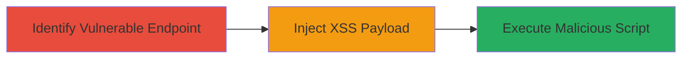

---
tags:
  - xss
  - dom-xss
  - web-vulnerability
  - client-side-execution
type: attack_chain
tools: []
tactics:
  - '[[Execution]]'
verified: false
platforms:
  - Web
submitted: true
complexity: low
procedures:
  - '[[procedures/Exploiting-DOM-based-XSS-in-Settings-Parameter]]'
step_count: 1
techniques:
  - '[[Exploit Public-Facing Application]]'
  - '[[JavaScript]]'
description: >-
  A single-stage attack exploiting a DOM-based XSS vulnerability in the
  'settings' parameter on ads.tiktok.com, allowing arbitrary JavaScript
  execution in the victim's browser context.
skill_level: intermediate
impact_level: high
id: f0d2d4b9-28f4-454c-a06c-682c845dc06f
created_at: '2025-12-13T23:55:38.315Z'
updated_at: '2025-12-13T23:55:38.315Z'
validated: true
mitre_tactics:
  - '[[Execution]]'
mitre_techniques:
  - '[[Exploit Public-Facing Application]]'
  - '[[JavaScript]]'
---
# DOM-based XSS Exploitation via Settings Parameter on ads.tiktok.com

Multi-stage attack chain demonstrating a complete attack workflow.

## Chain Metrics Dashboard

| Metric | Value |
|--------|-------|
| Chain Status | Unverified |
| Total Steps | 1 |
| Execution Time | ~5 minutes |
| Skill Level | Intermediate |
| Complexity | Low |
| Impact Level | High |

## Attack Flow Visualization



## Prerequisites & Requirements

### Required Tools

- Web browser with developer tools (e.g., Chrome DevTools)

### Target Environment

- Web platform
- Access to ads.tiktok.com
- No specific ports or services required beyond standard HTTPS (443)

### Initial Access Requirements

- Public access to the ads.tiktok.com domain
- No credentials needed for initial testing
- Victim must visit the crafted URL

## Detailed Attack Procedures

### Step 1: Inject and Execute XSS Payload
procedure: [[procedures/Exploiting-DOM-based-XSS-in-Settings-Parameter]]

**Objective**: Identify the vulnerable 'settings' parameter, craft a payload to reflect user input without escaping, and execute arbitrary JavaScript in the browser context of ads.tiktok.com.

**Instructions**: Navigate to the ads.tiktok.com endpoint and append a test payload to the 'settings' parameter. For example, use a URL like `https://ads.tiktok.com/page?settings=<script>alert('XSS')</script>`. Open the browser's developer console to observe execution. To simulate delivery, share the malicious URL via phishing or social engineering.

Use [[commands/curl-fetch-with-payload]] to initially test reflection server-side:

```bash
curl "https://ads.tiktok.com/page?settings=%3Cscript%3Ealert('XSS')%3C/script%3E" -v
```

Then load in browser to trigger DOM parsing and execution.

**Expected Output**: The page loads, and the JavaScript alert pops up, confirming arbitrary code execution. In a real attack, this could steal cookies or session data.

**Success Indicators**:
- Alert box or console log appears in the browser
- No server-side errors; reflection occurs client-side via DOM manipulation
- Script executes in the context of ads.tiktok.com domain

## Attack Chain Summary

### Key Achievements

1. Successful reflection of user input in the DOM without escaping
2. Arbitrary JavaScript execution leading to potential session hijacking or data theft
3. Bounty award of $2500 from TikTok for responsible disclosure

## Technique & Tactic Coverage

### MITRE ATT&CK Techniques

- [[Exploit Public-Facing Application]]
- [[JavaScript]]

### MITRE ATT&CK Tactics

- [[Execution]]

---
*Last updated: 2023-10-01*
