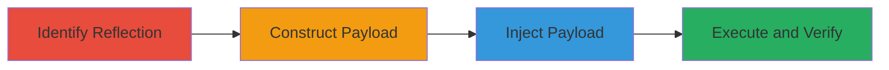

---
tags:
  - xss
  - dom-xss
  - unicode-bypass
  - javascript-injection
  - credential-theft
type: attack_chain
tools: []
tactics:
  - '[[Initial Access]]'
  - '[[Execution]]'
  - '[[Collection]]'
verified: false
platforms:
  - Web
submitted: true
complexity: medium
created_at: '2023-10-01T00:00:00Z'
procedures:
  - '[[procedures/Identify-and-Exploit-DOM-XSS-via-Unicode-Escapes]]'
step_count: 4
techniques:
  - '[[Exploit Public-Facing Application]]'
  - '[[JavaScript]]'
updated_at: '2025-12-13T23:55:06.167Z'
description: >-
  A multi-step attack chain exploiting a DOM-based XSS vulnerability in the
  Acronis partners login page through the '-back' parameter, using Unicode
  escapes to bypass HTML encoding and inject JavaScript for potential credential
  theft.
skill_level: intermediate
impact_level: high
id: 5f183cc3-7466-41aa-a3b9-b53cbbb6e357
validated: true
mitre_tactics:
  - '[[Initial Access]]'
  - '[[Execution]]'
  - '[[Collection]]'
mitre_techniques:
  - '[[Exploit Public-Facing Application]]'
  - '[[JavaScript]]'
---
# DOM-based XSS Exploitation via Unicode Escapes in Acronis Login Page

Multi-stage attack chain demonstrating the exploitation of a DOM-based XSS vulnerability in the login page of https://partners.acronis.com/, allowing arbitrary JavaScript execution for potential credential theft.

## Chain Metrics Dashboard

| Metric | Value |
|--------|-------|
| Chain Status | Unverified |
| Total Steps | 4 |
| Execution Time | ~5 minutes |
| Skill Level | Intermediate |
| Complexity | Medium |
| Impact Level | High |

## Attack Flow Visualization

## Prerequisites & Requirements

### Required Tools

- Web browser (e.g., Chrome Developer Tools for inspection)

### Target Environment

- Web platform
- Access to public-facing login page at https://partners.acronis.com/en-us/profile/login.html
- No authentication required for initial access

### Initial Access Requirements

- Internet access
- No prior credentials needed
- Victim must visit the crafted URL on the login page

## Detailed Attack Procedures

### Step 1: Identify Parameter Reflection
procedure: [[procedures/Identify-and-Exploit-DOM-XSS-via-Unicode-Escapess]]

**Objective**: Detect the reflection of the '-back' parameter in the page source to identify potential XSS entry point.

**Instructions**: Open the target URL with a test value in the browser and inspect the page source for reflection. Use browser developer tools to search for the parameter value.

**Expected Output**: Observation of the parameter value in JavaScript code, HTML encoded but used dynamically for element creation.

**Success Indicators**:
- Parameter '-back' reflected in 'var back = ' within the page source
- Evidence of dynamic HTML element appending without sanitization

### Step 2: Construct Unicode-Escaped Payload
procedure: [[procedures/Identify-and-Exploit-DOM-XSS-via-Unicode-Escapess]]

**Objective**: Build a payload that bypasses HTML encoding using Unicode escapes to inject malicious HTML and JavaScript.

**Instructions**: Manually craft the payload by replacing special characters with Unicode escapes: '"' to '\u0022', '>' to '\u003e', '<' to '\u003c'. Base payload: "><x y=" becomes \u0022\u003e\u003cimg src=x onerror=alert(1)\u003e\u003cx y=\u0022.

**Expected Output**: A URL-encoded string ready for injection into the '-back' parameter.

**Success Indicators**:
- Payload string correctly escaped to evade initial HTML encoding
- No syntax errors in the constructed escape sequence

### Step 3: Inject Payload into URL
procedure: [[procedures/Identify-and-Exploit-DOM-XSS-via-Unicode-Escapess]]

**Objective**: Deliver the payload via the vulnerable parameter to trigger the XSS.

**Instructions**: Append the escaped payload to the target URL: https://partners.acronis.com/en-us/profile/login.html?-back=\u0022\u003e\u003cimg+src=x+onerror=alert(1)\u003e\u003cx+y=\u0022 and load it in the browser.

**Expected Output**: The page loads with the injected script attempting execution.

**Success Indicators**:
- URL loads without errors
- Malicious script integrated into the DOM via the reflected parameter

### Step 4: Verify JavaScript Execution
procedure: [[procedures/Identify-and-Exploit-DOM-XSS-via-Unicode-Escapess]]

**Objective**: Confirm the success of the XSS by observing arbitrary code execution.

**Instructions**: Monitor the browser for the execution of the injected onerror handler after page load.

**Expected Output**: An alert dialog displaying '1' or custom message.

**Success Indicators**:
- Alert box pops up confirming JavaScript execution
- No blocking by browser security features

## Attack Chain Summary

### Key Achievements

1. Identified unsanitized reflection in DOM manipulation
2. Bypassed HTML encoding with Unicode escapes
3. Achieved arbitrary JavaScript execution on the login page
4. Demonstrated potential for credential theft via session hijacking or form manipulation

## Technique & Tactic Coverage

### MITRE ATT&CK Techniques

- [[Exploit Public-Facing Application]]
- [[JavaScript]]

### MITRE ATT&CK Tactics

- [[Initial Access]]
- [[Execution]]
- [[Collection]]

---
*Last updated: 2023-10-01T00:00:00Z*
