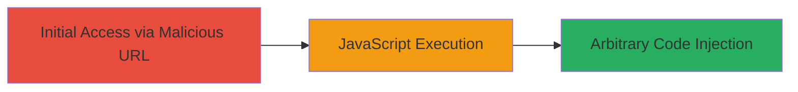

# DOM-based XSS Exploitation via Unsanitized URL Hash on genericons.com

Multi-stage attack chain demonstrating a complete attack workflow.

## Chain Metrics Dashboard

| Metric | Value |
|--------|-------|
| Chain Status | Unverified |
| Total Steps | 1 |
| Execution Time | ~1 minute |
| Skill Level | Beginner |
| Complexity | Low |
| Impact Level | Medium |

## Attack Flow Visualization



## Prerequisites & Requirements

### Required Tools

- Web browser (e.g., Chrome, Firefox)

### Target Environment

- Web platform
- Access to http://genericons.com/
- No specific services or ports required beyond standard HTTP/80

### Initial Access Requirements

- No credentials needed
- Direct network access to the target site
- Victim must visit the malicious URL (e.g., via phishing or direct link)

## Detailed Attack Procedures

### Step 1: Craft and Access Malicious URL
procedure: [[procedures/Exploit-DOM-based-XSS-via-URL-Hash]]

**Objective**: Inject arbitrary JavaScript into the DOM by appending a malicious payload to the URL hash, triggering execution when the page loads.

**Instructions**: Construct the malicious URL by appending the payload to the existing hash parameter on http://genericons.com/. For example, start with the base URL and modify the #bold parameter to include HTML injection followed by a script tag with an onerror handler.

Use a browser to navigate to the crafted URL:

```url
http://genericons.com/#bold"> 
```

This appends the payload "> to close the existing HTML attribute and inject an  tag that executes alert(1) on error.

**Expected Output**: Upon loading the page, a browser alert dialog pops up displaying "1", confirming JavaScript execution.

**Success Indicators**:
- Alert box appears in the browser
- Browser console shows no errors blocking execution
- Potential for further payloads like cookie theft via document.cookie

## Attack Chain Summary

### Key Achievements

1. Successful injection of arbitrary HTML and JavaScript via URL fragment
2. Demonstration of code execution in the site's browser context
3. Highlighted risks like session hijacking or data exfiltration

## Technique & Tactic Coverage

### MITRE ATT&CK Techniques

- [[JavaScript]]

### MITRE ATT&CK Tactics

- [[Execution]]

---

*Last updated: 2023-10-01T00:00:00Z*
