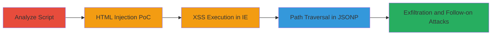

# DOM-based XSS and Path Traversal in Algolia GitHub Button Script

Multi-stage attack chain demonstrating exploitation of a DOM-based XSS vulnerability in the github-btn.html script hosted on github.algolia.com, where the 'user' parameter from the URL query string is directly inserted into innerHTML without sanitization. This allows HTML injection and JavaScript execution, particularly in older browsers like Internet Explorer. A secondary path traversal issue in JSONP requests to the GitHub API enables manipulation of API endpoints. The attack leads to arbitrary client-side script execution, cookie theft, and potential data exfiltration via altered API calls.

## Chain Metrics Dashboard

| Metric | Value |
|--------|-------|
| Chain Status | Unverified |
| Total Steps | 4 |
| Execution Time | ~10 minutes |
| Skill Level | Intermediate |
| Complexity | Medium |
| Impact Level | High |

## Attack Flow Visualization

## Prerequisites & Requirements

### Required Tools

- Web browser (Chrome, Internet Explorer for full impact)
- URL crafting tools (e.g., browser dev tools or text editor)

### Target Environment

- Web platform
- Access to https://github.algolia.com/github-btn.html
- No authentication required; public-facing

### Initial Access Requirements

- Internet access
- No credentials needed
- Victim must load the malicious URL in their browser

## Detailed Attack Procedures

### Step 1: Analyze Vulnerable Script
procedure: [[procedures/Analyze-JavaScript-for-Parameter-Handling-Vulnerabilities]]

**Objective**: Identify how URL parameters are parsed and inserted into the DOM without sanitization to confirm the XSS entry point.

**Instructions**: Load the github-btn.html page in a browser and inspect the JavaScript code. Look for query parameter parsing functions that handle 'user', 'repo', and 'type'. Note the direct concatenation into innerHTML, such as 'Follow @' + user.

**Expected Output**: Confirmation of unsanitized insertion points in the code.

**Success Indicators**:
- Vulnerable code lines identified
- Parameter flow traced to DOM manipulation

### Step 2: Craft HTML Injection PoC
procedure: [[procedures/Exploit-HTML-Injection-in-GitHub-Button]]

**Objective**: Demonstrate HTML injection by crafting a URL that renders custom HTML elements.

**Instructions**: Construct a URL with a malicious 'user' payload: https://github.algolia.com/github-btn.html?user=<h1><marquee>HTML HTML HTML HTML HTML HTML</marquee></h1>&type=follow. Load it in Chrome or IE to see the marquee text render.

**Expected Output**: Visible HTML elements like a scrolling marquee displaying repeated 'HTML' text.

**Success Indicators**:
- Injected HTML renders on the page
- No script blocking observed

### Step 3: Trigger XSS in IE
procedure: [[procedures/Trigger-XSS-in-Internet-Explorer-Compatibility-Mode]]

**Objective**: Execute JavaScript via XSS, stealing cookies or domain info, exploiting IE's parsing quirks.

**Instructions**: Create an iframe with IE=9 compatibility meta tag embedding the vulnerable URL: <meta http-equiv="X-UA-Compatible" content="IE=9"><iframe src='https://github.algolia.com/github-btn.html?#&user=yrdy<script>alert(document.domain);alert(document.cookie);//&type=follow'></iframe>. Load this in a browser to trigger alerts.

**Expected Output**: Alert boxes showing document.domain and document.cookie.

**Success Indicators**:
- JavaScript alerts fire
- Cookie data exposed in alert

### Step 4: Test Path Traversal in JSONP
procedure: [[procedures/Test-Path-Traversal-in-JSONP-API-Requests]]

**Objective**: Manipulate JSONP script src to traverse to arbitrary GitHub API endpoints for potential exfiltration.

**Instructions**: Examine the jsonp function and craft URL with traversal: https://github.algolia.com/github-btn.html?user=../../another/endpoint&repo=../../another/endpoint&type=fork. Observe the network request to https://api.github.com/another/endpoint?callback=callback.

**Expected Output**: Script request to unintended API path.

**Success Indicators**:
- Altered API endpoint requested
- JSONP callback executed from traversed path

## Attack Chain Summary

### Key Achievements

1. Confirmed DOM-based XSS via unsanitized 'user' parameter insertion.
2. Demonstrated HTML injection and full XSS in legacy browsers.
3. Exposed path traversal in JSONP, enabling API endpoint manipulation.
4. Highlighted risks of client-side parameter handling without validation.

## Technique & Tactic Coverage

### MITRE ATT&CK Techniques

- [[JavaScript]]
- [[Exploit Public-Facing Application]]

### MITRE ATT&CK Tactics

- [[Execution]]
- [[Collection]]

---
*Last updated: 2023-10-01T00:00:00Z*
