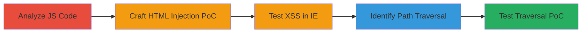

# DOM-based XSS and Path Traversal in GitHub Button Script via Unsanitized URL Parameters

Multi-stage attack chain demonstrating a complete attack workflow exploiting client-side vulnerabilities in the nutty.ubnt.com GitHub button script.

## Chain Metrics Dashboard

| Metric | Value |
|--------|-------|
| Chain Status | Unverified |
| Total Steps | 5 |
| Execution Time | ~15 minutes |
| Skill Level | Intermediate |
| Complexity | Medium |
| Impact Level | High |

## Attack Flow Visualization

## Prerequisites & Requirements

### Required Tools

- Web browser (Chrome, Internet Explorer)
- URL encoding tool (built-in browser dev tools)

### Target Environment

- Web platform
- Access to http://nutty.ubnt.com/github-btn.html
- No authentication required

### Initial Access Requirements

- Public internet access
- No credentials needed
- Victim browser context for XSS execution

## Detailed Attack Procedures

### Step 1: Analyze JavaScript for DOM XSS Vulnerability
procedure: [[procedures/Analyze-JavaScript-for-DOM-XSS-Vulnerability]]

**Objective**: Review client-side code to identify unsanitized insertion of URL parameters into DOM.

**Instructions**: Open the target page in a browser, inspect the github-btn.html script, and examine the params() function for parsing URL hash parameters like 'user'. Look for lines setting innerHTML without escaping, such as text.innerHTML = 'Follow @' + user.

**Expected Output**: Identification of vulnerable code snippet allowing arbitrary HTML/JS insertion.

**Success Indicators**:
- Vulnerable innerHTML assignment confirmed
- No sanitization functions (e.g., escapeHTML) present

### Step 2: Craft and Test HTML Injection PoC
procedure: [[procedures/Craft-and-Test-HTML-Injection-PoC]]

**Objective**: Demonstrate visual HTML injection to confirm lack of sanitization.

**Instructions**: Construct a URL with malicious 'user' parameter: http://nutty.ubnt.com/github-btn.html?#&user=<h1><marquee>HTML HTML HTML HTML HTML HTML &type=follow. Load in Chrome or IE and observe rendered marquee and headings.

**Expected Output**: Injected HTML elements (e.g., scrolling marquee) visible on the page.

**Success Indicators**:
- Custom HTML tags render without errors
- Injection persists in multiple browsers

### Step 3: Craft and Test XSS Execution PoC in IE
procedure: [[procedures/Craft-and-Test-XSS-Execution-PoC-in-IE]]

**Objective**: Execute JavaScript payload to prove full XSS capability.

**Instructions**: Create an iframe with X-UA-Compatible IE=9 meta tag. Use URL: http://nutty.ubnt.com/github-btn.html?%23%26user=yrdy%3Cscript%3Ealert(document.domain);alert(document.cookie);//%26type=follow (URL-encoded payload). Load and trigger alerts.

**Expected Output**: Browser alerts showing document.domain and document.cookie.

**Success Indicators**:
- JavaScript alert boxes pop up
- Cookie values exposed in alert

### Step 4: Identify Path Traversal in JSONP Script Loading
procedure: [[procedures/Identify-Path-Traversal-in-JSONP-Script-Loading]]

**Objective**: Spot directory traversal in API URL construction for JSONP requests.

**Instructions**: Inspect the jsonp() function in the script. Note how it builds src as 'https://api.github.com/users/' + user + '?callback=callback' without path validation, enabling traversal like user=../../another/endpoint.

**Expected Output**: Confirmation that user/repo params can manipulate API path.

**Success Indicators**:
- No input validation on user/repo
- Potential for arbitrary endpoint loading

### Step 5: Test Path Traversal PoC in API Endpoint
procedure: [[procedures/Test-Path-Traversal-PoC-in-API-Endpoint]]

**Objective**: Validate traversal by loading unintended API endpoint as JSONP.

**Instructions**: Use URL: http://nutty.ubnt.com/github-btn.html?#&user=../../another/endpoint&repo=../../another/endpoint&type=fork. Inspect network requests for script src: https://api.github.com/another/endpoint?callback=callback.

**Expected Output**: Browser loads JSONP from manipulated GitHub API path.

**Success Indicators**:
- Network tab shows altered API URL
- Script executes without 404 error

## Attack Chain Summary

### Key Achievements

1. Confirmed DOM-based XSS via unsanitized innerHTML insertion
2. Demonstrated HTML/JS injection across browsers
3. Identified and tested path traversal in JSONP loading
4. Highlighted potential for cookie theft and API abuse
5. No server-side impact, but high client-side risk

## Technique & Tactic Coverage

### MITRE ATT&CK Techniques

- [[JavaScript]]
- [[File and Directory Discovery]]

### MITRE ATT&CK Tactics

- [[Execution]]
- [[Discovery]]

---
*Last updated: 2023-10-01T00:00:00Z*
