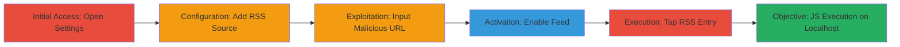

# DOM-based XSS in Brave iOS via Malicious Custom RSS Feed

Multi-stage attack chain demonstrating a complete attack workflow exploiting a DOM-based XSS in Brave iOS app's custom RSS feed feature.

## Chain Metrics Dashboard

| Metric | Value |
|--------|-------|
| Chain Status | Unverified |
| Total Steps | 8 |
| Execution Time | ~5 minutes |
| Skill Level | Intermediate |
| Complexity | Medium |
| Impact Level | High |

## Attack Flow Visualization

## Prerequisites & Requirements

### Required Tools

- None (app-based interaction)

### Target Environment

- iOS device with Brave Browser app installed
- Access to a malicious RSS feed (e.g., hosted at https://csrf.jp/brave/rss.php)
- No network restrictions

### Initial Access Requirements

- Physical access to the iOS device
- Brave app permissions enabled
- No prior credentials needed

## Detailed Attack Procedures

### Step 1: Open Settings
procedure: [[procedures/Add-Malicious-RSS-Feed-to-Brave-Today]]

**Objective**: Access the app's settings menu to begin configuring Brave Today.

**Instructions**: Launch the Brave iOS app and navigate to the settings menu via the bottom navigation bar or profile icon.

**Expected Output**: Settings menu opens, displaying various app options.

**Success Indicators**:
- Settings interface visible
- Navigation to Brave Today possible

### Step 2: Tap Brave Today in Settings menu
procedure: [[procedures/Add-Malicious-RSS-Feed-to-Brave-Today]]

**Objective**: Navigate to the Brave Today configuration section.

**Instructions**: In the settings menu, locate and tap on the "Brave Today" option.

**Expected Output**: Brave Today settings page loads, showing feed sources.

**Success Indicators**:
- Brave Today section active
- Option to add sources available

### Step 3: Tap Add Source
procedure: [[procedures/Add-Malicious-RSS-Feed-to-Brave-Today]]

**Objective**: Initiate the process of adding a new RSS feed source.

**Instructions**: On the Brave Today page, tap the "Add Source" button.

**Expected Output**: Search interface for RSS feeds appears.

**Success Indicators**:
- Add Source dialog open
- URL input field ready

### Step 4: Type the malicious RSS URL and tap Search
procedure: [[procedures/Add-Malicious-RSS-Feed-to-Brave-Today]]

**Objective**: Search for and locate the malicious RSS feed.

**Instructions**: Enter the URL `https://csrf.jp/brave/rss.php` into the search field and tap "Search". The feed named "PoC" should appear.

**Expected Output**: Search results display the PoC RSS feed.

**Success Indicators**:
- Malicious feed found in results
- Feed details visible

### Step 5: Tap Add after finding the RSS feed
procedure: [[procedures/Add-Malicious-RSS-Feed-to-Brave-Today]]

**Objective**: Select and integrate the malicious feed into Brave Today.

**Instructions**: Tap the "Add" button next to the PoC feed.

**Expected Output**: Feed is added to the sources list.

**Success Indicators**:
- Feed appears in the sources list
- No errors during addition

### Step 6: Enable the PoC feed
procedure: [[procedures/Add-Malicious-RSS-Feed-to-Brave-Today]]

**Objective**: Activate the malicious RSS feed to make it live in Brave Today.

**Instructions**: Toggle the switch to enable the newly added PoC feed.

**Expected Output**: Feed status changes to enabled.

**Success Indicators**:
- Feed is active and visible
- Content begins to load

### Step 7: Close Settings menu and open a new tab
procedure: [[procedures/Trigger-XSS-via-RSS-Entry-Tap]]

**Objective**: Exit configuration and prepare the browsing interface for exploitation.

**Instructions**: Close the settings menu and open a new tab in the Brave browser.

**Expected Output**: New tab opens, ready for Brave Today sidebar.

**Success Indicators**:
- Settings closed
- New tab active

### Step 8: Enable Brave Today and tap the XSS article entry
procedure: [[procedures/Trigger-XSS-via-RSS-Entry-Tap]]

**Objective**: View the malicious feed content and trigger the XSS payload.

**Instructions**: Enable the Brave Today sidebar, locate the "XSS" entry from the PoC feed, and tap it to open.

**Expected Output**: Alert box pops up executing `javascript:alert(document.domain)`, confirming execution on `http://localhost:65XX`.

**Success Indicators**:
- Alert dialog appears
- JavaScript executes without errors
- Domain confirms localhost privilege

## Attack Chain Summary

### Key Achievements

1. Successful addition of malicious RSS feed without validation
2. Bypassing URL scheme restrictions to inject javascript: payload
3. Arbitrary JS execution on privileged localhost domain, compromising internal features like reader-view

## Technique & Tactic Coverage

### MITRE ATT&CK Techniques

- [[Exploitation for Client Execution]] Exploitation for Client Execution
- [[JavaScript]] JavaScript

### MITRE ATT&CK Tactics

- [[Execution]] Execution
- [[Initial Access]] Initial Access

---

*Last updated: [TIMESTAMP]*
