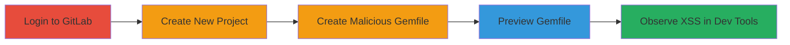

---
tags:
  - xss
  - dom-xss
  - gitlab
  - web-vulnerability
type: attack_chain
tools: []
tactics:
  - '[[Execution]]'
verified: false
platforms:
  - Web
submitted: true
complexity: medium
created_at: '2024-10-01T00:00:00Z'
procedures:
  - '[[procedures/Demonstrate-DOM-based-XSS-in-GitLab-Gemfile-Preview]]'
step_count: 5
techniques:
  - '[[Exploit Public-Facing Application]]'
  - '[[JavaScript]]'
updated_at: '2025-12-14T03:16:13.915Z'
description: >-
  A multi-step demonstration of a DOM-based Cross-Site Scripting vulnerability
  in GitLab's Gemfile preview feature, exploiting double conversion of URLs to
  links, resulting in improper HTML rendering. Limited to HTML/CSS injection on
  gitlab.com due to CSP, but enables full XSS in unpatched instances.
skill_level: intermediate
impact_level: high
id: 4110574e-6fd4-4996-92db-1fa26e181474
validated: true
mitre_tactics:
  - '[[Execution]]'
mitre_techniques:
  - '[[Exploit Public-Facing Application]]'
  - '[[JavaScript]]'
---
# DOM-based XSS in GitLab Gemfile Preview via Double URL Conversion

Multi-stage attack chain demonstrating a complete attack workflow for exploiting a DOM-based XSS vulnerability in GitLab's URL display during Gemfile preview. The issue arises from double conversion of URLs into links, leading to nested HTML tags without proper sanitization, allowing malicious payloads to render improperly. On gitlab.com, CSP blocks JavaScript, limiting impact to HTML/CSS injection, but in GitLab CE/EE without fixes, full XSS is possible, potentially leading to session hijacking or data theft.

## Chain Metrics Dashboard

| Metric | Value |
|--------|-------|
| Chain Status | Unverified |
| Total Steps | 5 |
| Execution Time | ~5 minutes |
| Skill Level | Intermediate |
| Complexity | Medium |
| Impact Level | High |

## Attack Flow Visualization

## Prerequisites & Requirements

### Required Tools

- Web browser with developer tools (e.g., Chrome DevTools)

### Target Environment

- GitLab instance (gitlab.com or self-hosted CE/EE)
- Web platform access

### Initial Access Requirements

- Valid GitLab user account with project creation permissions
- Network access to GitLab web interface

## Detailed Attack Procedures

### Step 1: Login to GitLab
procedure: [[procedures/Demonstrate-DOM-based-XSS-in-GitLab-Gemfile-Preview]]

**Objective**: Authenticate to the GitLab web interface to gain access for project creation.

**Instructions**: Navigate to the GitLab login page and enter your credentials to sign in as a user.

**Expected Output**: Successful login, redirect to the dashboard.

**Success Indicators**:
- User dashboard loads
- Profile indicator shows logged-in state

### Step 2: Create New Project
procedure: [[procedures/Demonstrate-DOM-based-XSS-in-GitLab-Gemfile-Preview]]

**Objective**: Set up a new repository to host the malicious file.

**Instructions**: From the dashboard, click 'New Project' and follow the UI prompts to create a blank project/repository.

**Expected Output**: New project page opens with empty repository.

**Success Indicators**:
- Project created successfully
- Repository URL visible

### Step 3: Create Malicious Gemfile
procedure: [[procedures/Demonstrate-DOM-based-XSS-in-GitLab-Gemfile-Preview]]

**Objective**: Upload a Gemfile containing a payload that triggers the double conversion vulnerability.

**Instructions**: In the project, create a new file named 'Gemfile' and add the content: `gem '','2'`. Commit the file to the repository.

**Expected Output**: File committed and visible in the project files.

**Success Indicators**:
- Gemfile appears in the repository
- No errors during commit

### Step 4: Preview the Gemfile
procedure: [[procedures/Demonstrate-DOM-based-XSS-in-GitLab-Gemfile-Preview]]

**Objective**: Trigger the preview feature to render the file and execute the double linking, injecting the malicious HTML.

**Instructions**: Open the Gemfile in the GitLab editor and click the 'Preview' tab to render the content as HTML.

**Expected Output**: Preview loads with improper HTML rendering, such as nested <a> tags around the  payload.

**Success Indicators**:
- Preview renders without errors
- Malicious payload visible in rendered HTML (inspect element)

### Step 5: Observe XSS in Developer Tools
procedure: [[procedures/Demonstrate-DOM-based-XSS-in-GitLab-Gemfile-Preview]]

**Objective**: Verify the XSS attempt and CSP blockage to assess impact.

**Instructions**: Open browser developer tools (F12), switch to the Console tab, and refresh the preview. Look for CSP violation errors related to the onerror JavaScript.

**Expected Output**: Console shows CSP blocking the alert() execution, confirming HTML injection but no JS.

**Success Indicators**:
- CSP error logged for JavaScript execution
- HTML elements like  rendered but inert

## Attack Chain Summary

### Key Achievements

1. Successful authentication and project setup in GitLab
2. Injection of XSS payload via Gemfile content
3. Triggering of DOM-based XSS through preview rendering
4. Confirmation of vulnerability impact limited by CSP

## Technique & Tactic Coverage

### MITRE ATT&CK Techniques

- [[Exploit Public-Facing Application]]
- [[JavaScript]]

### MITRE ATT&CK Tactics

- [[Execution]]

---
*Last updated: 2024-10-01T00:00:00Z*
