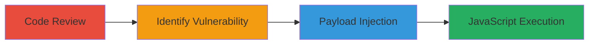

# DOM-based XSS in GoCD Analytics Plugin via Unescaped msg Parameter

Multi-stage attack chain demonstrating a complete attack workflow for exploiting a DOM-based Cross-Site Scripting (XSS) vulnerability in the GoCD Analytics Plugin.

## Chain Metrics Dashboard

| Metric | Value |
|--------|-------|
| Chain Status | Unverified |
| Total Steps | 3 |
| Execution Time | ~15 minutes |
| Skill Level | Intermediate |
| Complexity | Medium |
| Impact Level | High |

## Attack Flow Visualization

## Prerequisites & Requirements

### Required Tools

- Browser developer tools for code inspection
- GitHub access for repository review

### Target Environment

- GoCD Analytics Plugin deployed on a server
- Access to the plugin's info-message.js page
- Web platform with JavaScript enabled

### Initial Access Requirements

- Public access to the GoCD Analytics Plugin URL
- No credentials required for the vulnerable endpoint
- Network access to the target server

## Detailed Attack Procedures

### Step 1: Code Review
procedure: [[procedures/Review-GoCD-Analytics-Plugin-Source-Code]]

**Objective**: Examine the source code of the GoCD Analytics Plugin to understand its structure and identify potential vulnerabilities.

**Instructions**: Access the GitHub repository and navigate to the info-message.js file. Review the code around line 28 for handling of URL parameters.

**Expected Output**: Identification of the file and relevant code snippets showing parameter extraction and insertion.

**Success Indicators**:
- Repository accessed successfully
- Code lines related to URL parameter handling located

### Step 2: Identify Vulnerability
procedure: [[procedures/Identify-Vulnerable-Parameter-Handling-in-GoCD]]

**Objective**: Analyze the code to pinpoint the insecure handling of the msg URL parameter that leads to XSS.

**Instructions**: Inspect the JavaScript code that extracts, decodes, and inserts the msg parameter into the DOM without escaping. Note the use of window.location.search and .html() method.

**Expected Output**: Confirmation of the root cause: unescaped user input inserted via jQuery's .html().

**Success Indicators**:
- Vulnerable code pattern identified
- Potential for script injection confirmed

### Step 3: Payload Injection
procedure: [[procedures/Craft-and-Test-XSS-Payload-for-GoCD-msg-Parameter]]

**Objective**: Craft a URL-encoded payload and inject it to execute arbitrary JavaScript in the victim's browser context.

**Instructions**: Construct the URL with the encoded payload and access the endpoint. Observe the alert box or other execution indicators.

**Expected Output**: Successful execution of the payload, such as an alert("XSS") popping up.

**Success Indicators**:
- Payload decodes and injects correctly
- JavaScript code executes in the page context

## Attack Chain Summary

### Key Achievements

1. Discovered DOM-based XSS through static code analysis
2. Identified insecure URL parameter handling in info-message.js
3. Demonstrated exploitation with a working payload leading to code execution

## Technique & Tactic Coverage

### MITRE ATT&CK Techniques

- [[JavaScript]]

### MITRE ATT&CK Tactics

- [[Execution]]

---
*Last updated: 2023-10-01T00:00:00Z*
