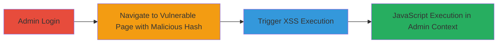

---
tags:
  - xss
  - dom-based-xss
  - wordpress
  - plugin-vulnerability
  - javascript-injection
type: attack_chain
tools: []
tactics:
  - '[[Execution]]'
  - '[[Collection]]'
verified: false
platforms:
  - Web
submitted: true
complexity: medium
procedures:
  - '[[procedures/Access-WordPress-Admin-Panel-as-Administrator]]'
  - '[[procedures/Navigate-to-Gallery-Options-with-Malicious-URL-Hash]]'
  - '[[procedures/Trigger-and-Verify-DOM-based-XSS-Execution]]'
step_count: 3
techniques:
  - '[[JavaScript]]'
  - '[[Exploit Public-Facing Application]]'
description: >-
  A multi-step attack exploiting a DOM-based XSS vulnerability in the Huge IT
  Image Gallery WordPress plugin version 1.9.55, allowing arbitrary JavaScript
  execution in the admin context through an unsanitized URL hash.
skill_level: intermediate
impact_level: high
id: e6941a71-55a0-4c7e-a23c-a4799542ec8b
created_at: '2025-12-14T03:15:26.772Z'
updated_at: '2025-12-14T03:15:26.772Z'
validated: true
mitre_tactics:
  - '[[Execution]]'
  - '[[Collection]]'
mitre_techniques:
  - '[[JavaScript]]'
  - '[[Exploit Public-Facing Application]]'
---
# DOM-based XSS in Huge IT Image Gallery WordPress Plugin via Unsanitized URL Hash

Multi-stage attack chain demonstrating exploitation of a DOM-based XSS vulnerability in the Huge IT Image Gallery WordPress plugin version 1.9.55, where the plugin's jQuery code unsafely uses the URL hash to select tabs without sanitization, enabling arbitrary JavaScript injection in the admin context.

## Chain Metrics Dashboard

| Metric | Value |
|--------|-------|
| Chain Status | Unverified |
| Total Steps | 3 |
| Execution Time | ~5 minutes |
| Skill Level | Intermediate |
| Complexity | Medium |
| Impact Level | High |

## Attack Flow Visualization

## Prerequisites & Requirements

### Required Tools

- Web browser (e.g., Chrome, Firefox, Safari)

### Target Environment

- WordPress site with Huge IT Image Gallery plugin version 1.9.55 installed and active
- Access to admin privileges
- Network access to the WordPress admin panel

### Initial Access Requirements

- Valid admin credentials for the target WordPress site
- Logged-in session to the admin area

## Detailed Attack Procedures

### Step 1: Admin Login
procedure: [[procedures/Access-WordPress-Admin-Panel-as-Administrator]]

**Objective**: Gain authenticated access to the WordPress admin panel to reach the vulnerable gallery options page.

**Instructions**: Use standard WordPress login procedures to authenticate as an administrator. Navigate to the admin dashboard at `/wp-admin/`.

**Expected Output**: Successful login redirect to the WordPress admin dashboard.

**Success Indicators**:
- Admin dashboard loads without errors
- User role confirmed as administrator

### Step 2: Navigate to Vulnerable Page
procedure: [[procedures/Navigate-to-Gallery-Options-with-Malicious-URL-Hash]]

**Objective**: Construct and access the gallery options page with a crafted URL hash that injects malicious JavaScript via the unsanitized `location.hash`.

**Instructions**: Append a malicious hash to the URL for the gallery options page, such as `#">`. The full URL would be `https://target.com/wp-admin/admin.php?page=Options_gallery_styles#">`. Load this URL in the browser while logged in.

**Expected Output**: The page loads, and the jQuery selector `jQuery('#gallery-view-tabs li a[href="'+strliID+'"]')` processes the hash, injecting the script into the DOM.

**Success Indicators**:
- Page renders without immediate errors
- URL hash is reflected in the page source or developer tools

### Step 3: Trigger XSS Execution
procedure: [[procedures/Trigger-and-Verify-DOM-based-XSS-Execution]]

**Objective**: Observe the execution of the injected JavaScript, confirming arbitrary code execution in the admin browser context.

**Instructions**: With the malicious URL loaded, interact with the page if needed (e.g., click tabs) to trigger DOM manipulation. The injected `` will execute on error, popping an alert.

**Expected Output**: Alert box displays '0wn3d' or equivalent payload, confirming XSS.

**Success Indicators**:
- JavaScript alert or console log appears
- No blocking by browser security (tested in Chrome, Firefox, Safari)

## Attack Chain Summary

### Key Achievements

1. Authenticated access to admin panel
2. Injection of arbitrary JavaScript via URL hash
3. Execution of code in admin context, enabling potential session hijacking or further exploits

## Technique & Tactic Coverage

### MITRE ATT&CK Techniques

- [[JavaScript]]
- [[Exploit Public-Facing Application]]

### MITRE ATT&CK Tactics

- [[Execution]]
- [[Collection]]

---
*Last updated: 2023-10-01*
