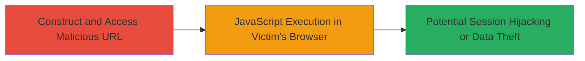

---
tags:
  - xss
  - dom-based-xss
  - javascript-injection
  - web-vulnerability
type: attack_chain
tools: []
tactics:
  - '[[Execution]]'
commands: []
platforms:
  - Web
complexity: low
procedures:
  - '[[procedures/Exploit-DOM-based-XSS-via-Profile-URL]]'
step_count: 1
techniques:
  - '[[JavaScript]]'
description: >-
  A single-stage attack exploiting a DOM-based XSS vulnerability in Khan
  Academy's profile discussion feature by injecting JavaScript via a crafted URL
  path, leading to arbitrary code execution in the victim's browser.
skill_level: beginner
impact_level: high
id: 1298b628-2997-4998-86b9-e4b8a6468ae2
created_at: '2025-12-14T03:15:53.309Z'
updated_at: '2025-12-14T03:15:53.309Z'
verified: false
validated: true
submitted: true
mitre_tactics:
  - '[[Execution]]'
mitre_techniques:
  - '[[JavaScript]]'
---
# DOM-based XSS in Khan Academy Profile Discussion via Malicious URL

Multi-stage attack chain demonstrating a complete attack workflow.

## Chain Metrics Dashboard

| Metric | Value |
|--------|-------|
| Chain Status | Unverified |
| Total Steps | 1 |
| Execution Time | ~1 minute |
| Skill Level | Beginner |
| Complexity | Low |
| Impact Level | High |

## Attack Flow Visualization

## Prerequisites & Requirements

### Required Tools

- Web browser (e.g., Chrome, Firefox)

### Target Environment

- Target Platform: Web application (Khan Academy)
- Required services/ports: HTTPS (port 443)
- Network access requirements: Internet access to khanacademy.org

### Initial Access Requirements

- No credentials required
- Victim must visit the malicious URL (e.g., via phishing or direct link)
- No prior access needed

## Detailed Attack Procedures

### Step 1: Trigger DOM-based XSS
procedure: [[procedures/Exploit-DOM-based-XSS-via-Profile-URL]]

**Objective**: Inject and execute arbitrary JavaScript in the victim's browser by exploiting improper URL path sanitization in the profile discussion feature.

**Instructions**: Construct a malicious URL that appends HTML and JavaScript payload to the profile path. For example, use the base URL https://www.khanacademy.org/profile/[username]/discussion/comments and inject the payload "> to break out of the DOM context and trigger script execution.

The full malicious URL would be: https://www.khanacademy.org/profile/LOL/discussion/comments">

Visit this URL in a browser to trigger the injection. The payload injects an  tag with an onerror handler that executes alert(4) when the invalid src is loaded, demonstrating arbitrary JavaScript execution.

**Expected Output**: An alert popup displaying "4" in the victim's browser, confirming successful XSS execution.

**Success Indicators**:
- Alert box appears with the payload message
- Browser console shows no errors blocking execution
- Potential for further payloads to steal cookies or session data
