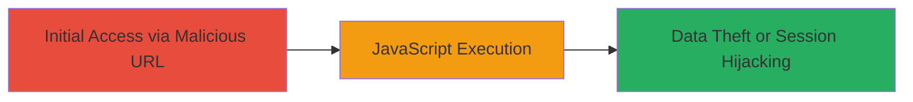

# DOM-based XSS in LeaseWeb Checkout Success Page via Malicious URL Fragment

Multi-stage attack chain demonstrating a complete attack workflow.

## Chain Metrics Dashboard

| Metric | Value |
|--------|-------|
| Chain Status | Unverified |
| Total Steps | 1 |
| Execution Time | ~1 minute |
| Skill Level | Beginner |
| Complexity | Low |
| Impact Level | High |

## Attack Flow Visualization

## Prerequisites & Requirements

### Required Tools

- Web browser (e.g., Chrome, Firefox)

### Target Environment

- Web platform
- Access to LeaseWeb checkout success page (e.g., /checkout-success/{id})
- No authentication required

### Initial Access Requirements

- Ability to craft and share URLs (e.g., via phishing or direct navigation)
- Victim must navigate to the malicious URL

## Detailed Attack Procedures

### Step 1: Trigger XSS via Malicious URL
procedure: [[procedures/Exploit-DOM-based-XSS-with-URL-Fragment-Injection]]

**Objective**: Inject and execute arbitrary JavaScript in the victim's browser by exploiting the unsanitized URL fragment on the checkout success page.

**Instructions**: Construct a malicious URL targeting the LeaseWeb checkout success endpoint, such as https://www.leaseweb.com/checkout-success/16893#">. Open this URL in a web browser to trigger the DOM-based XSS. The fragment breaks out of an HTML attribute context (e.g., href or id) and injects an img tag with an onerror handler that executes JavaScript.

**Expected Output**: A JavaScript alert dialog displaying the document domain (e.g., www.leaseweb.com) or, if modified, the document cookies.

**Success Indicators**:
- Alert box pops up with document domain or cookies
- Browser console shows JavaScript execution errors or logs if customized

## Attack Chain Summary

### Key Achievements

1. Successful injection of malicious JavaScript via URL fragment
2. Arbitrary code execution without authentication
3. Potential for session hijacking or client-side data theft

## Technique & Tactic Coverage

### MITRE ATT&CK Techniques

- [[Exploit Public-Facing Application]]
- [[JavaScript]]

### MITRE ATT&CK Tactics

- [[Initial Access]]
- [[Execution]]

---
*Last updated: 2023-10-01T12:00:00Z*
