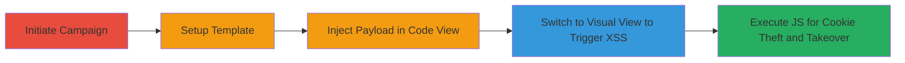

# DOM-based XSS in Lemlist Froala Editor for Session Cookie Theft and Account Takeover

Multi-stage attack chain demonstrating exploitation of a DOM-based XSS vulnerability in the Froala editor used for email campaigns in lemlist, leading to arbitrary JavaScript execution, session cookie theft, and potential account takeover due to missing HttpOnly flags on cookies.

## Chain Metrics Dashboard

| Metric | Value |
|--------|-------|
| Chain Status | Unverified |
| Total Steps | 4 |
| Execution Time | ~5 minutes |
| Skill Level | Intermediate |
| Complexity | Low |
| Impact Level | High |

## Attack Flow Visualization

## Prerequisites & Requirements

### Required Tools

- Web browser (e.g., Chrome with developer tools for inspection)

### Target Environment

- Lemlist web application (https://app.lemlist.com)
- Authenticated user session in lemlist
- No specific ports or services beyond standard HTTPS (443)

### Initial Access Requirements

- Valid lemlist account credentials for login
- Direct network access to lemlist domain
- No prior elevated access needed; exploits user-level permissions

## Detailed Attack Procedures

### Step 1: Initiate Campaign Creation

procedure: [[procedures/Initiate-Lemlist-Email-Campaign-Creation]]

**Objective**: Access the email campaign creation interface to reach the Froala editor.

**Instructions**: Log in to the lemlist dashboard, navigate to the campaigns section, and click to start a new email campaign. This loads the setup form where the editor will be available.

**Expected Output**: Campaign creation page with fields for campaign details and email body editor.

**Success Indicators**:
- Campaign setup interface is visible and editable
- Froala editor is accessible in the email body section

### Step 2: Fill Fields and Select Blank Template

procedure: [[procedures/Fill-Campaign-Fields-and-Select-Blank-Template]]

**Objective**: Complete basic campaign configuration to enable the email template editor without triggering any validations prematurely.

**Instructions**: Enter required details such as campaign name, recipient list (use a test list), and proceed to the email composition area. Select the blank email template to open the Froala WYSIWYG editor for the message body.

**Expected Output**: Blank template loaded in the Froala editor, ready for content input.

**Success Indicators**:
- All required fields are filled without errors
- Blank template is selected and editor is in visual mode

### Step 3: Inject Malicious Payload in Code View

procedure: [[procedures/Inject-Malicious-HTML-in-Froala-Code-View]]

**Objective**: Switch to code view and insert malicious HTML that will execute JavaScript upon rendering.

**Instructions**: In the Froala editor, toggle the view to "Code View" or equivalent (often via a <> button). Paste the following payload into the editor: `<iframe srcdoc=""></iframe>`. This injects an iframe with a srcdoc attribute containing an onload-triggering script. Save or apply the changes in code view.

**Expected Output**: Malicious HTML is accepted and displayed in the code view without immediate sanitization errors.

**Success Indicators**:
- Payload HTML is visible and editable in code view
- No immediate parsing errors or blocks from the editor

### Step 4: Trigger XSS by Switching to Visual View

procedure: [[procedures/Trigger-DOM-based-XSS-by-Switching-to-Visual-View]]

**Objective**: Render the injected HTML to execute the JavaScript payload in the DOM.

**Instructions**: Switch back from code view to the normal visual editor mode. The Froala editor parses the HTML, rendering the iframe and triggering the onerror event in the img tag, which executes the alert (or replace with actual exploit like cookie exfiltration).

**Expected Output**: JavaScript execution, e.g., alert box pops up showing the domain, confirming XSS. In a real attack, this could send cookies to an attacker-controlled server.

**Success Indicators**:
- Alert (or equivalent JS) executes upon view switch
- Browser console shows no blocking errors; DOM manipulation succeeds
- For impact validation: Inspect network tab for potential exfiltration requests

## Attack Chain Summary

### Key Achievements

1. Successful injection of unsanitized HTML via Froala's code-to-visual view transition
2. Arbitrary JavaScript execution in the context of the lemlist domain
3. Theft of session cookies (lacking HttpOnly flag) for account takeover
4. Potential for further DOM manipulation, such as injecting fake forms via iframes

## Technique & Tactic Coverage

### MITRE ATT&CK Techniques

- [[JavaScript]]

### MITRE ATT&CK Tactics

- [[Execution]]
- [[Collection]]

---
*Last updated: 2023-10-01T00:00:00Z*
