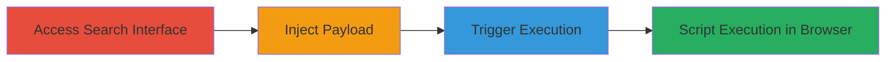

---
tags:
  - xss
  - dom-xss
  - nextcloud
  - client-side
  - session-theft
type: attack_chain
tools: []
tactics:
  - '[[Execution]]'
commands: []
platforms:
  - Web
complexity: low
procedures:
  - '[[procedures/Access-Nextcloud-Search-Interface]]'
  - '[[procedures/Inject-Malicious-Payload-into-Search]]'
  - '[[procedures/Trigger-DOM-XSS-via-Search-Submission]]'
step_count: 3
techniques:
  - '[[JavaScript]]'
description: >-
  A multi-step attack exploiting a DOM-based XSS vulnerability in Nextcloud's
  search module to inject and execute malicious JavaScript in the victim's
  browser, potentially leading to session cookie theft.
skill_level: intermediate
impact_level: low
id: 1752ab46-291a-4a5b-be6f-97d795c5599c
created_at: '2025-12-14T03:47:18.463Z'
updated_at: '2025-12-14T03:47:18.463Z'
verified: false
validated: true
submitted: true
mitre_tactics:
  - '[[Execution]]'
mitre_techniques:
  - '[[JavaScript]]'
---
# DOM-based XSS in Nextcloud Search Module for Client-Side Script Execution

## Overview

This attack chain demonstrates a DOM-based Cross-Site Scripting (XSS) vulnerability in Nextcloud's search module, where user input from the search dialogue is inadequately escaped and reflected into the DOM, allowing arbitrary JavaScript execution in the browser of a logged-in user. The attack requires the victim to enter or paste malicious input, leading to potential theft of session cookies or other client-side data. No server-side compromise is possible, and the impact is limited to the victim's browser session. Discovered in Nextcloud Server (report NC-SA-2017-007), this chain outlines the steps to access the interface, inject a payload, and trigger execution.

## Chain Metrics Dashboard

| Metric | Value |
|--------|-------|
| Chain Status | Unverified |
| Total Steps | 3 |
| Execution Time | ~1 minute |
| Skill Level | Intermediate |
| Complexity | Low |
| Impact Level | Low |

## Attack Flow Visualization

## Prerequisites & Requirements

### Required Tools

- None (manual browser interaction)

### Target Environment

- Nextcloud Server instance (web-based, PHP backend)
- Logged-in user session required
- No specific ports or services beyond standard HTTP/HTTPS access to the Nextcloud web interface

### Initial Access Requirements

- Valid user credentials for Nextcloud login
- Direct browser access to the Nextcloud instance
- No prior network compromise needed; assumes legitimate user context

## Detailed Attack Procedures

### Step 1: Access Search Interface
procedure: [[procedures/Access-Nextcloud-Search-Interface]]

**Objective**: Gain access to the vulnerable search dialogue as a logged-in user to prepare for payload injection.

**Instructions**: Log in to the Nextcloud instance using valid credentials, then navigate to the search feature via the top navigation bar or keyboard shortcut (e.g., Ctrl+K or Cmd+K). This opens the search dialogue where input will be reflected.

**Expected Output**: Search dialogue box appears, ready for input.

**Success Indicators**:
- Successful login and interface access
- Search dialogue opens without errors

### Step 2: Inject Malicious Payload
procedure: [[procedures/Inject-Malicious-Payload-into-Search]]

**Objective**: Enter unescaped JavaScript into the search field to exploit the lack of sanitization.

**Instructions**: In the search field, input a payload such as `` or more advanced like ``. This payload will be reflected without proper escaping when processed.

**Expected Output**: Payload entered into the field; no immediate execution.

**Success Indicators**:
- Payload accepted without validation errors
- Input visible in the search box

### Step 3: Trigger Execution
procedure: [[procedures/Trigger-DOM-XSS-via-Search-Submission]]

**Objective**: Submit the search to cause the payload to be rendered in the DOM and execute the JavaScript.

**Instructions**: Press Enter or click the search button to submit the query. The input is inserted into the DOM unsanitized, triggering script execution in the browser context.

**Expected Output**: JavaScript executes, e.g., alert box pops up or console logs session data.

**Success Indicators**:
- Script runs (e.g., alert fires)
- Browser console shows execution or cookie access

## Attack Chain Summary

### Key Achievements

1. Successful access to the vulnerable search module
2. Injection of executable JavaScript payload
3. DOM reflection leading to client-side code execution and potential session theft

## Technique & Tactic Coverage

### MITRE ATT&CK Techniques

- [[JavaScript]]

### MITRE ATT&CK Tactics

- [[Execution]]

---
*Last updated: 2023-10-01*
