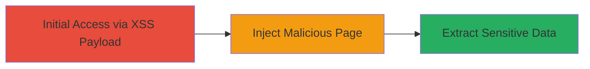

---
tags:
  - xss
  - dom-xss
  - shopify
  - postmessage
  - javascript
type: attack_chain
tools: []
tactics:
  - '[[Initial Access]]'
  - '[[Execution]]'
  - '[[Collection]]'
verified: false
platforms:
  - Web
submitted: true
complexity: medium
created_at: '2023-10-01T00:00:00Z'
procedures:
  - >-
    [[procedures/Inject-Malicious-Page-in-Shopify-Admin-via-postMessage-Manipulation]]
step_count: 1
techniques:
  - '[[Exploit Public-Facing Application]]'
  - '[[JavaScript]]'
updated_at: '2025-12-14T17:29:36.004Z'
description: >-
  A multi-stage attack exploiting a DOM-based XSS vulnerability in Shopify's
  admin panel by manipulating postMessage to Shopify.API.replaceState, allowing
  injection of arbitrary pages and extraction of sensitive admin session data.
skill_level: intermediate
impact_level: high
id: 0cc52cf1-3c24-4583-8486-58376fb428e3
validated: true
mitre_tactics:
  - '[[Initial Access]]'
  - '[[Execution]]'
  - '[[Collection]]'
mitre_techniques:
  - '[[Exploit Public-Facing Application]]'
  - '[[JavaScript]]'
---
---
id: 123e4567-e89b-12d3-a456-426614174000
name: DOM-based XSS in Shopify Admin Panel via postMessage to Inject Malicious Page
type: attack_chain
description: A multi-stage attack exploiting a DOM-based XSS vulnerability in Shopify's admin panel by manipulating postMessage to Shopify.API.replaceState, allowing injection of arbitrary pages and extraction of sensitive admin session data.
verified: false
submitted: false
step_count: 1
created_at: 2023-10-01T00:00:00Z
updated_at: 2023-10-01T00:00:00Z
procedures: [[procedures/Inject-Malicious-Page-in-Shopify-Admin-via-postMessage-Manipulation]]
techniques: [[Exploit Public-Facing Application]], [[JavaScript]]
tactics: [[Initial Access]], [[Execution]], [[Collection]]
tags: xss, dom-xss, shopify, postmessage, javascript
platforms: Web
tools: []
---

# DOM-based XSS in Shopify Admin Panel via postMessage to Inject Malicious Page

Multi-stage attack chain demonstrating a complete attack workflow exploiting a DOM-based XSS in Shopify's admin panel.

## Chain Metrics Dashboard

| Metric | Value |
|--------|-------|
| Chain Status | Unverified |
| Total Steps | 1 |
| Execution Time | ~2 minutes |
| Skill Level | Intermediate |
| Complexity | Medium |
| Impact Level | High |

## Attack Flow Visualization



## Prerequisites & Requirements

### Required Tools

- Browser developer tools for JavaScript execution
- Access to a victim with an active Shopify admin session

### Target Environment

- Shopify admin panel (web application)
- JavaScript-enabled browser
- No specific ports or services beyond standard HTTPS (443)

### Initial Access Requirements

- Victim must be tricked into executing the JavaScript payload (e.g., via phishing or another XSS vector)
- Attacker needs network access to the victim's browser context
- Active admin session in the target Shopify store

## Detailed Attack Procedures

### Step 1: Inject Malicious Page via postMessage Manipulation
procedure: [[procedures/Inject-Malicious-Page-in-Shopify-Admin-via-postMessage-Manipulation]]

**Objective**: Exploit the DOM-based XSS by opening a new window to the admin themes page and using postMessage to manipulate the URL pathname, injecting a malicious page that abuses the active admin session.

**Instructions**: Execute the JavaScript payload in the victim's browser context. This involves opening a new blank window to the admin themes endpoint and sending a crafted postMessage to trigger the replacement of the state with a malicious pathname.

The payload can be injected via an existing XSS vector. Here's the core JavaScript code:

```javascript
var win = window.open(location.origin + '/admin/themes', '_blank', 'noopener,noreferrer');
var data = JSON.stringify({ message: 'Shopify.API.replaceState', pathname: 'abc:d../pages/xss#//' });
win.postMessage(data, '*');
```

This opens the window, stringifies the data, and sends the postMessage, bypassing previous sanitization fixes.

**Expected Output**: A new window loads with the injected malicious page (e.g., /pages/xss), allowing arbitrary JavaScript execution in the admin context.

**Success Indicators**:
- New window opens to the manipulated URL without errors
- Malicious page content (e.g., alert or data extraction script) executes in the admin session
- Sensitive data like CSRF tokens can be observed in network requests or console

## Attack Chain Summary

### Key Achievements

1. Bypassed previous fix in report #868615 using a new payload with pathname manipulation
2. Injected arbitrary page in the Shopify admin panel, abusing the active session
3. Enabled extraction of sensitive data including CSRF tokens and store configurations

## Technique & Tactic Coverage

### MITRE ATT&CK Techniques

- [[Exploit Public-Facing Application]] Exploit Public-Facing Application
- [[JavaScript]] JavaScript

### MITRE ATT&CK Tactics

- [[Initial Access]] Initial Access
- [[Execution]] Execution
- [[Collection]] Collection

---
*Last updated: 2023-10-01T00:00:00Z*
