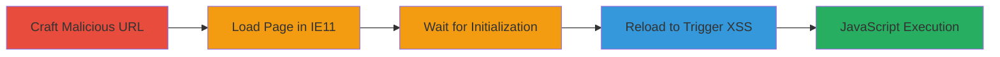

---
tags:
  - xss
  - dom-xss
  - ie11
  - javascript
  - jquery
type: attack_chain
tools: []
tactics:
  - '[[Execution]]'
verified: false
platforms:
  - Web
submitted: true
complexity: medium
created_at: '2023-10-01T00:00:00Z'
procedures:
  - '[[procedures/Trigger-DOM-XSS-via-Hash-Reload-on-IE11]]'
step_count: 4
techniques:
  - '[[JavaScript]]'
updated_at: '2025-12-14T03:47:18.639Z'
description: >-
  A multi-step attack exploiting a DOM-based XSS vulnerability in the Starbucks
  store website's _observeHistory function, allowing arbitrary JavaScript
  execution on IE11 through malicious hash payloads processed via
  jQuery.parseHTML.
skill_level: intermediate
impact_level: high
id: 6e4b7257-ea2a-48a5-9cb1-099a40225d68
validated: true
mitre_tactics:
  - '[[Execution]]'
mitre_techniques:
  - '[[JavaScript]]'
---
# DOM-based XSS in Starbucks Store via Unsanitized location.hash on IE11

Multi-stage attack chain demonstrating exploitation of a DOM-based XSS vulnerability in the Starbucks UK store website, targeting IE11 users. The attack leverages unsanitized processing of location.hash in the _observeHistory function, which uses jQuery's parseHTML to handle anchor clicks, enabling arbitrary JavaScript execution upon page reload.

## Chain Metrics Dashboard

| Metric | Value |
|--------|-------|
| Chain Status | Unverified |
| Total Steps | 4 |
| Execution Time | ~1 minute |
| Skill Level | Intermediate |
| Complexity | Medium |
| Impact Level | High |

## Attack Flow Visualization



## Prerequisites & Requirements

### Required Tools

- Internet Explorer 11 (target browser)
- JavaScript console or HTML page for PoC execution

### Target Environment

- Platform: Web (https://store.starbucks.co.uk)
- Required services/ports: Standard HTTPS (443)
- Network access requirements: Direct internet access to the target site

### Initial Access Requirements

- No credentials required
- User must be able to open URLs in IE11
- No prior access needed; social engineering to trick victim into clicking/reloading the URL

## Detailed Attack Procedures

### Step 1: Craft Malicious URL
procedure: [[procedures/Trigger-DOM-XSS-via-Hash-Reload-on-IE11]]

**Objective**: Create a URL with a payload in the hash fragment that will be processed as HTML by jQuery.parseHTML, triggering XSS on reload.

**Instructions**: Construct the URL using a payload like an img tag with an onerror handler. Use the following JavaScript to define the URL:

Execute [[commands/starbucks-xss-poc-setup]] to prepare the payload:

```javascript
function poc() {
  var url = 'https://store.starbucks.co.uk/#';
  // Further steps will use this URL
}
```

**Expected Output**: A valid URL string with the embedded XSS payload in the hash.

**Success Indicators**:
- URL is formed without syntax errors
- Hash contains executable JavaScript payload

### Step 2: Open URL in IE11
procedure: [[procedures/Trigger-DOM-XSS-via-Hash-Reload-on-IE11]]

**Objective**: Load the initial page in the vulnerable browser to initialize JavaScript, including the _observeHistory function and jQuery tabs.

**Instructions**: Use window.open to launch the URL in a new IE11 window. Integrate with the PoC:

Execute [[commands/starbucks-xss-poc-open]]:

```javascript
var url = 'https://store.starbucks.co.uk/#',
  win = window.open(url);
```

**Expected Output**: New browser window opens to the Starbucks store page, with initial load completing without errors.

**Success Indicators**:
- Page loads successfully in IE11
- No immediate JavaScript errors in console

### Step 3: Wait for Page Initialization
procedure: [[procedures/Trigger-DOM-XSS-via-Hash-Reload-on-IE11]]

**Objective**: Allow time for the page's JavaScript to fully initialize, ensuring _observeHistory and jQuery components are active before triggering the hash change.

**Instructions**: Introduce a delay using setTimeout to simulate natural loading time.

Execute [[commands/starbucks-xss-poc-wait]]:

```javascript
setTimeout(function(){win.location=url}, 5000);
```

**Expected Output**: After 5 seconds, the page remains stable, ready for hash processing.

**Success Indicators**:
- No page crashes or errors during wait
- Console shows jQuery and custom scripts loaded

### Step 4: Reload to Trigger XSS
procedure: [[procedures/Trigger-DOM-XSS-via-Hash-Reload-on-IE11]]

**Objective**: Force a location change to re-process the hash, invoking _observeHistory which parses the malicious hash via jQuery.parseHTML and executes the payload.

**Instructions**: Reload the same URL in the opened window to change location.hash and trigger the vulnerable function.

Execute [[commands/starbucks-xss-poc-reload]]:

```javascript
win.location=url;
```

**Expected Output**: Alert box with '1' appears due to onerror execution in the parsed HTML.

**Success Indicators**:
- Alert(1) pops up
- Arbitrary JavaScript executes in the page context

## Attack Chain Summary

### Key Achievements

1. Successful crafting and delivery of hash-based XSS payload
2. Bypassing initial load sanitization through reload trigger
3. Arbitrary code execution limited to IE11, enabling session theft or phishing

## Technique & Tactic Coverage

### MITRE ATT&CK Techniques

- [[JavaScript]]

### MITRE ATT&CK Tactics

- [[Execution]]

---

*Last updated: 2023-10-01T00:00:00Z*
