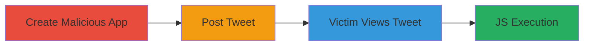

---
tags:
  - xss
  - dom-xss
  - tweetdeck
  - twitter
  - javascript
  - jquery
type: attack_chain
tools: []
tactics:
  - '[[Execution]]'
  - '[[Initial Access]]'
verified: false
platforms:
  - Web
submitted: true
complexity: medium
created_at: '2023-10-01T00:00:00Z'
procedures:
  - '[[procedures/Create-Malicious-Twitter-App-with-XSS-Payload]]'
  - '[[procedures/Post-Tweet-Using-Malicious-App]]'
  - '[[procedures/Induce-Victim-to-View-Tweet-in-TweetDeck]]'
  - '[[procedures/Trigger-JavaScript-Execution-via-jQuery-Parsing]]'
step_count: 4
techniques:
  - '[[JavaScript]]'
  - '[[Exploit Public-Facing Application]]'
updated_at: '2025-12-13T23:52:44.237Z'
description: >-
  A multi-stage attack exploiting unsanitized client app names in Twitter to
  inject and execute JavaScript in TweetDeck via DOM-based XSS.
skill_level: intermediate
impact_level: high
id: dd9b81af-6fce-4295-9a3f-365d1499b65e
validated: true
mitre_tactics:
  - '[[Execution]]'
  - '[[Initial Access]]'
mitre_techniques:
  - '[[JavaScript]]'
  - '[[Exploit Public-Facing Application]]'
---
# DOM-based XSS in TweetDeck via Malicious Twitter App Name

Multi-stage attack chain demonstrating a complete attack workflow exploiting a DOM-based XSS vulnerability in TweetDeck by injecting malicious HTML/JavaScript through a controllable Twitter app name.

## Chain Metrics Dashboard

| Metric | Value |
|--------|-------|
| Chain Status | Unverified |
| Total Steps | 4 |
| Execution Time | ~5 minutes |
| Skill Level | Intermediate |
| Complexity | Medium |
| Impact Level | High |

## Attack Flow Visualization

## Prerequisites & Requirements

### Required Tools

- Twitter Developer Account
- TweetDeck Client (victim side)

### Target Environment

- Web platform
- Twitter API for app creation and tweeting
- TweetDeck web application
- No specific ports; requires internet access

### Initial Access Requirements

- Valid Twitter developer credentials for app creation
- Ability to post tweets
- Victim must use TweetDeck and interact with tweet source info
- No prior network position needed; social engineering for victim interaction

## Detailed Attack Procedures

### Step 1: Create Malicious Twitter App
procedure: [[procedures/Create-Malicious-Twitter-App-with-XSS-Payload]]

**Objective**: Register a Twitter app with a name containing an XSS payload to embed malicious code in tweet metadata.

**Instructions**: Access the Twitter Developer Portal, create a new app, and set the app name to a payload like `<svg onload=alert(document.domain)>`. This injects the payload into the 'source' field of tweets posted via the app.

**Expected Output**: Twitter app created with the malicious name reflected in API responses.

**Success Indicators**:
- App name set successfully without sanitization
- API confirms the name in app details

### Step 2: Post Tweet Using Malicious App
procedure: [[procedures/Post-Tweet-Using-Malicious-App]]

**Objective**: Embed the malicious app name into a tweet's metadata as the client source.

**Instructions**: Use the Twitter API or client to post a tweet from the malicious app. The payload in the app name will be included in the tweet's source information.

**Expected Output**: Tweet posted with source metadata containing the unsanitized payload.

**Success Indicators**:
- Tweet visible on Twitter with app name as source
- Payload visible in tweet's raw metadata

### Step 3: Induce Victim to View Tweet in TweetDeck
procedure: [[procedures/Induce-Victim-to-View-Tweet-in-TweetDeck]]

**Objective**: Lure the victim to open the tweet in TweetDeck and interact with the source link.

**Instructions**: Share the tweet link via social engineering (e.g., bait text like 'Click here to get followers ❤️'). Victim expands the tweet in TweetDeck and clicks the client source info link, triggering `TD.util.openURL($(n.getMainTweet().source).attr('href'))`.

**Expected Output**: Victim's browser processes the source attribute via jQuery.

**Success Indicators**:
- Victim clicks the source link
- jQuery parses the source as HTML

### Step 4: Trigger JavaScript Execution
procedure: [[procedures/Trigger-JavaScript-Execution-via-jQuery-Parsing]]

**Objective**: Execute arbitrary JavaScript in the victim's TweetDeck context due to unsanitized HTML parsing.

**Instructions**: Upon jQuery `$()` processing the payload, the SVG onload executes, alerting the domain or performing further actions like session hijacking.

**Expected Output**: JavaScript alert or code execution in the browser console on tweetdeck.twitter.com.

**Success Indicators**:
- Alert box appears
- Console logs show execution on TweetDeck domain
- Potential for data theft or further exploitation

## Attack Chain Summary

### Key Achievements

1. Successful injection of XSS payload via Twitter app name
2. Embedding and delivery of payload through tweet metadata
3. Triggering DOM-based XSS in TweetDeck via user interaction
4. Arbitrary JS execution leading to high-impact attacks like session theft

## Technique & Tactic Coverage

### MITRE ATT&CK Techniques

- [[JavaScript]]
- [[Exploit Public-Facing Application]]

### MITRE ATT&CK Tactics

- [[Execution]]
- [[Initial Access]]

---
*Last updated: 2023-10-01T00:00:00Z*
