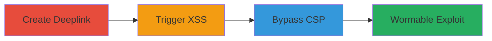

---
tags:
  - xss
  - dom-xss
  - csp-bypass
  - twitter
  - wormable
type: attack_chain
tools:
  - '[[tools/Browser-Console]]'
  - '[[tools/Internet-Explorer]]'
tactics:
  - '[[Initial Access]]'
  - '[[Execution]]'
  - '[[Lateral Movement]]'
commands:
  - '[[commands/unescape-and-rewrite-document]]'
platforms:
  - Web
complexity: medium
procedures:
  - '[[procedures/Craft-and-Distribute-Malicious-DM-Deeplink]]'
  - '[[procedures/Trigger-XSS-via-Twitter-Card]]'
  - '[[procedures/Bypass-CSP-for-JS-Execution]]'
  - '[[procedures/Exploit-for-Wormable-XSS-and-Account-Compromise]]'
step_count: 4
techniques:
  - '[[Drive-by Compromise]]'
  - '[[JavaScript]]'
description: >-
  Exploitation of a DOM-based XSS vulnerability in Twitter's Direct Message
  deeplinks to inject arbitrary HTML and JavaScript, bypass CSP, and enable
  wormable propagation across accounts.
skill_level: intermediate
impact_level: high
id: c66c3c9a-546e-4b6a-bc54-ee867d14e6f2
created_at: '2025-12-13T23:56:20.426Z'
updated_at: '2025-12-13T23:56:20.426Z'
verified: false
validated: true
submitted: true
mitre_tactics:
  - '[[Initial Access]]'
  - '[[Execution]]'
  - '[[Lateral Movement]]'
mitre_techniques:
  - '[[Drive-by Compromise]]'
  - '[[JavaScript]]'
---
# DOM-based XSS in Twitter DM Deeplinks Leading to Wormable Exploit

Multi-stage attack chain demonstrating exploitation of a DOM-based XSS in Twitter's DM deeplinks, leading to arbitrary code execution and potential worm propagation.

## Chain Metrics Dashboard

| Metric | Value |
|--------|-------|
| Chain Status | Unverified |
| Total Steps | 4 |
| Execution Time | ~10 minutes |
| Skill Level | Intermediate |
| Complexity | Medium |
| Impact Level | High |

## Attack Flow Visualization



## Prerequisites & Requirements

### Required Tools

- [[tools/Browser-Console]]
- [[tools/Internet-Explorer]]

### Target Environment

- Web platform
- Twitter Direct Messages, Cards, and Syndication API
- Network access to twitter.com

### Initial Access Requirements

- Twitter account for crafting and tweeting deeplinks
- No prior credentials needed beyond public access

## Detailed Attack Procedures

### Step 1: Craft and Distribute Malicious DM Deeplink
procedure: [[procedures/Craft-and-Distribute-Malicious-DM-Deeplink]]

**Objective**: Generate a deeplink with an XSS payload and distribute it via tweet to lure victims.

**Instructions**: Follow Twitter's developer guide to create a DM deeplink with parameters like recipient_id and welcome_message_id. Set the text parameter to a crafted payload such as '%3C%3C/%3Cx%3E/script/test000%3E%3C%3C/%3Cx%3Esvg%20onload%3Dalert%28%29%3E%3C/%3E%3Cscript%3E1%3C%5Cx%3E2'. Tweet the URL like 'https://twitter.com/messages/compose?recipient_id=988260476659404801&welcome_message_id=988274596427304964&text=%3C%3C/%3Cx%3E/script/test000%3E%3C%3C/%3Cx%3Esvg%20onload%3Dalert%28%29%3E%3C/%3E%3Cscript%3E1%3C%5Cx%3E2'.

**Expected Output**: A tweeted deeplink that victims can click.

**Success Indicators**:
- Deeplink generates without errors
- Tweet posts successfully

### Step 2: Trigger XSS via Twitter Card
procedure: [[procedures/Trigger-XSS-via-Twitter-Card]]

**Objective**: Access the malicious card to reflect the payload in the DOM and trigger XSS.

**Instructions**: Load the card URL like 'https://twitter.com/i/cards/tfw/v1/988278372894740480'. Use [[tools/Browser-Console]] to execute [[commands/unescape-and-rewrite-document]]:

```javascript
document.write(document.body.innerHTML.replace(/\\\\//g,'/'));
```

This unescapes and rewrites the document to test the injection.

**Expected Output**: Payload reflects in DOM, potentially executing alert().

**Success Indicators**:
- HTML tags inject without sanitization
- Alert triggers in vulnerable browsers like Internet Explorer

### Step 3: Bypass CSP for JS Execution
procedure: [[procedures/Bypass-CSP-for-JS-Execution]]

**Objective**: Manipulate syndication endpoint to bypass CSP and enable full JavaScript execution.

**Instructions**: Inject script tags sourcing from 'https://syndication.twimg.com/timeline/profile?callback=__twttr...' to leverage CSP allowance for *.twimg.com. This bypasses prefix restrictions by injecting element IDs like '__twttr'.

**Expected Output**: Arbitrary JS executes in twitter.com context.

**Success Indicators**:
- Script loads from allowed domain
- JS functions like alerts or form submissions execute

### Step 4: Exploit for Wormable XSS and Account Compromise
procedure: [[procedures/Exploit-for-Wormable-XSS-and-Account-Compromise]]

**Objective**: Use executed JS for worm propagation, forced retweets, or unauthorized app access.

**Instructions**: Deploy payloads to force retweets or load iframes for OAuth like 'https://twitter.com/oauth/authorize?oauth_token=...' and auto-submit forms. This propagates the exploit via automated tweets.

**Expected Output**: Victim accounts perform actions without interaction, spreading the worm.

**Success Indicators**:
- Forced retweets occur
- Malicious apps authorized
- Worm propagates to other accounts

## Attack Chain Summary

### Key Achievements

1. Arbitrary HTML and JS injection via DM deeplinks
2. CSP bypass for full execution
3. Wormable propagation and account compromise

## Technique & Tactic Coverage

### MITRE ATT&CK Techniques

- [[Drive-by Compromise]]
- [[JavaScript]]

### MITRE ATT&CK Tactics

- [[Initial Access]]
- [[Execution]]
- [[Lateral Movement]]

*Last updated: [TIMESTAMP]*
