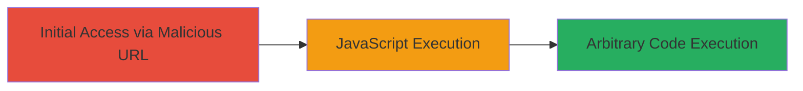

# DOM-based XSS in Ultimate VC Addons Plugin via Malicious URL Hash

Multi-stage attack chain demonstrating a complete attack workflow.

The attack targets a DOM-based Cross-Site Scripting (XSS) vulnerability in the Ultimate VC Addons plugin for WordPress, specifically in the minified JavaScript file ultimate.min.js. The plugin fails to sanitize the URL hash, allowing an attacker to inject and execute arbitrary JavaScript when a victim loads the malicious URL in their browser. This can lead to session hijacking, data theft, or phishing attacks. The vulnerability was reported on HackerOne for the site www.veris.in.

## Chain Metrics Dashboard

| Metric | Value |
|--------|-------|
| Chain Status | Unverified |
| Total Steps | 1 |
| Execution Time | ~1 minute |
| Skill Level | Beginner |
| Complexity | Low |
| Impact Level | High |

## Attack Flow Visualization

## Prerequisites & Requirements

### Required Tools

- Web browser (e.g., Chrome, Firefox)

### Target Environment

- WordPress site with Ultimate VC Addons plugin installed
- Vulnerable version of ultimate.min.js
- No specific ports; operates over HTTPS on port 443

### Initial Access Requirements

- Ability to trick victim into visiting the malicious URL (e.g., via phishing email or social engineering)
- No credentials required; client-side execution
- Network access to the target site (publicly accessible)

## Detailed Attack Procedures

### Step 1: Deliver Malicious URL and Trigger XSS
procedure: [[procedures/Exploit-DOM-based-XSS-via-URL-Hash]]

**Objective**: Inject and execute arbitrary JavaScript in the victim's browser by appending a malicious payload to the URL hash, exploiting the unsanitized location.hash processing in ultimate.min.js.

**Instructions**: Craft a URL with a payload in the hash fragment, such as an HTML img tag with an onerror handler. For testing, navigate to the target in a browser. In a real attack, send the URL to the victim via email or link.

Example payload: `# `

Full URL: `https://www.veris.in/?# `

Use a browser developer tools console to verify execution if testing locally.

**Expected Output**: An alert box pops up displaying '1' upon page load, confirming JavaScript execution.

**Success Indicators**:
- Alert or console log executes without errors
- No sanitization blocks the payload (e.g., no encoding or validation in JS)
- Victim's session cookies or data can be exfiltrated in advanced payloads

## Attack Chain Summary

### Key Achievements

1. Successful injection of JavaScript via URL hash without server-side interaction
2. Arbitrary code execution in the context of the victim's browser session
3. Potential for follow-on attacks like credential theft or keylogging

## Technique & Tactic Coverage

### MITRE ATT&CK Techniques

- [[JavaScript]]

### MITRE ATT&CK Tactics

- [[Execution]]

---
*Last updated: 2023-10-01T00:00:00Z*
